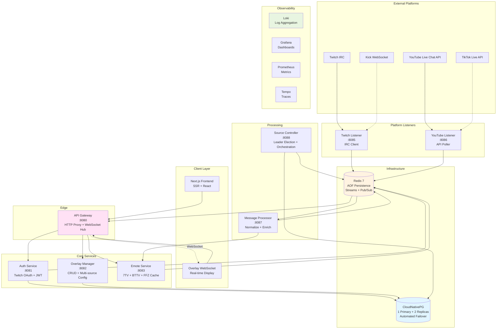
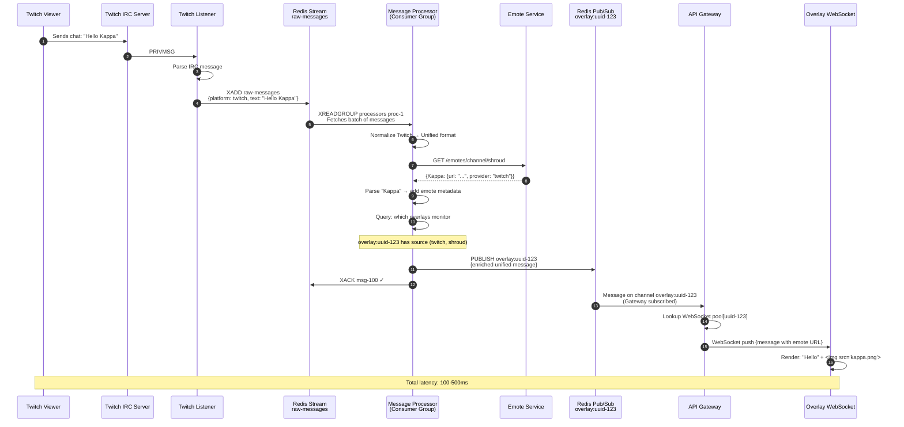
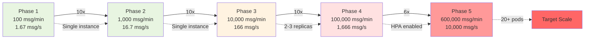
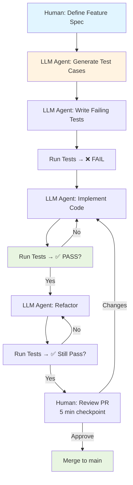
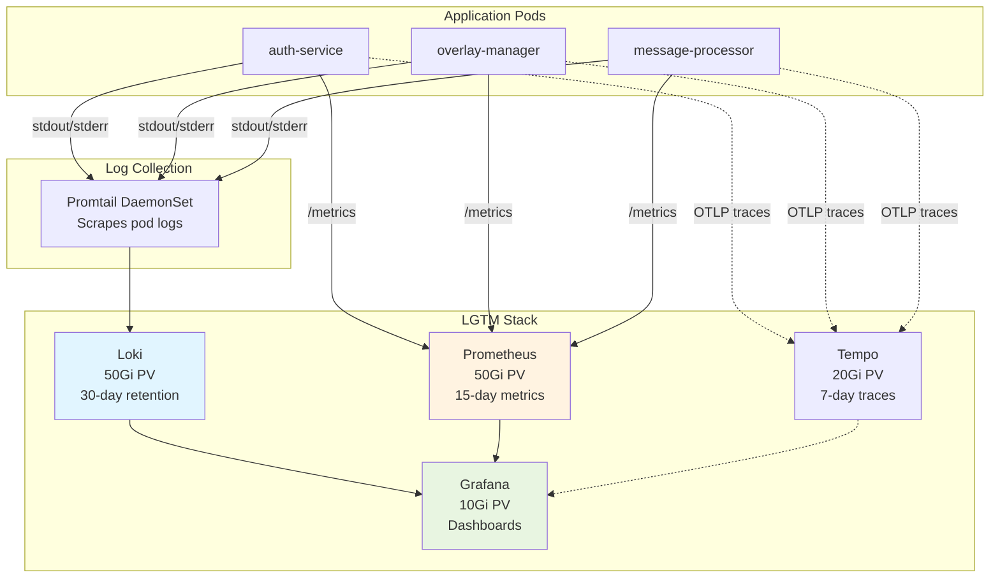

# All-Chat: Approved Architecture - Reset & Rebuild

**Version**: 2.0 (Architecture Reset)
**Date**: 2025-11-11
**Status**: ✅ APPROVED - Ready for Implementation
**Previous Implementation**: Deleted (built on false assumptions)

---

## Executive Summary

All-Chat is being rebuilt from scratch with an **LLM-first development approach**, optimized for:
- **Learning**: Go microservices + Kubernetes ecosystem (CNPG, LGTM, Ceph)
- **Scalability**: 100 messages/minute → 10,000 messages/second (6,000x growth)
- **Testability**: TDD with autonomous LLM agents
- **Production-grade**: CloudNativePG, LGTM stack from day one

**Key Change**: Architecture reset to use **Standard Go Layout** (not hexagonal) and **React + Next.js SSR** for LLM-friendly code generation.

---

## Critical Decisions Locked In

### ✅ Approved Tech Stack

| Component | Technology | Rationale |
|-----------|------------|-----------|
| **Backend** | Go 1.23+ | Scales 6000x, learning goal, LLM-friendly, microservices standard |
| **Frontend** | React + Next.js (App Router, SSR) | LLM generates 90% of code, minimal manual work |
| **Database** | CloudNativePG (PostgreSQL 16) | Team has experience, automated failover, PITR |
| **Cache/Queue** | Redis 7 (AOF enabled) | Streams + Pub/Sub, sufficient for 10K msg/s |
| **Observability** | LGTM Stack (Loki, Grafana, Tempo, Mimir) | Cost-effective, unified, cloud-native |
| **HTTP Framework** | Gin | LLM-friendly, fast, middleware support |
| **WebSocket** | gorilla/websocket | Standard Go library, well-tested |
| **ORM** | pgx/v5 (raw SQL) | High performance, connection pooling |
| **Logging** | Zap | Structured, high performance |
| **Testing** | Go testing stdlib + Testcontainers | TDD approach, autonomous LLM testing |
| **Deployment** | Kubernetes on Hetzner VPS | Cost-effective, production patterns |
| **Storage** | Hetzner Cloud Volumes (hcloud-csi) | Phase 1: local, Phase 5: object storage |

### ✅ Architectural Patterns

| Pattern | Decision | Rationale |
|---------|----------|-----------|
| **Architecture Style** | Standard Go Layout (NO hexagonal) | Less boilerplate, LLM-friendly |
| **Repository Structure** | Monorepo + Go Workspace | Atomic commits, easier learning |
| **Service Count** | 8 microservices (gradual rollout) | Clear boundaries, independent scaling |
| **Testing Strategy** | TDD with autonomous LLMs | Write tests first, high coverage |
| **Message Flow** | Redis Streams → Processor → Pub/Sub → WebSocket | Durable queue + low-latency broadcast |
| **Service Communication** | HTTP REST (via API Gateway) | Simple, standard, LLM-friendly |

---

## Architecture Overview

### Microservices (8 Services)



---

## Gradual Implementation Phases

### Phase 1: Foundation (Weeks 1-4) - 2 Services

**Services**:
1. Auth Service (Twitch OAuth + JWT)
2. Overlay Manager (CRUD + Multi-source config)

**Frontend**:
- Landing page
- Login with Twitch
- Dashboard (list overlays)

**Infrastructure**:
- Docker Compose (local dev)
- PostgreSQL + Redis (containers)

**Scale Target**: 100 messages/minute (1.67 msg/s)

**Learning Focus**:
- Go HTTP servers (Gin)
- PostgreSQL (pgx)
- Redis basics
- Table-driven tests
- Testcontainers

---

### Phase 2: Gateway & Emotes (Weeks 5-7) - 4 Services

**Add**:
3. API Gateway (HTTP reverse proxy)
4. Emote Service (7TV, BTTV, FFZ)

**Frontend**:
- Create/edit overlay forms
- Add chat sources UI
- Emote provider toggles

**Infrastructure**:
- Single-node Kubernetes (Hetzner)
- Hetzner Cloud Volumes

**Scale Target**: 1,000 messages/minute (16.7 msg/s)

**Learning Focus**:
- Service-to-service HTTP
- Caching strategies
- Kubernetes basics (Deployments, Services)

---

### Phase 3: Real-Time (Weeks 8-12) - 6 Services

**Add**:
5. Message Processor (Normalize + Enrich)
6. Twitch Listener (IRC client)
7. API Gateway (add WebSocket support)

**Frontend**:
- Overlay preview page
- WebSocket connection
- Real-time message rendering with emotes

**Infrastructure**:
- Same (single-node K8s)

**Scale Target**: 10,000 messages/minute (166 msg/s)

**Learning Focus**:
- WebSocket servers
- Redis Streams (XADD, XREADGROUP)
- Redis Pub/Sub
- Consumer groups
- IRC protocol

---

### Phase 4: Multi-Platform (Weeks 13-16) - 8 Services

**Add**:
8. YouTube Listener (API polling + OAuth)
9. Source Controller (orchestration + leader election)

**Frontend**:
- Multi-source selection
- Platform-specific config

**Infrastructure**:
- Same

**Scale Target**: 100,000 messages/minute (1,666 msg/s)

**Learning Focus**:
- Leader election (Redis)
- External API rate limiting
- YouTube API quota management
- Multi-platform message normalization

---

### Phase 5: Production Infrastructure (Weeks 17-20)

**Infrastructure Upgrades**:
- Deploy CloudNativePG (3 instances)
- Deploy LGTM Stack (Loki, Grafana, Prometheus, Tempo, Mimir)
- Multi-node Kubernetes (3+ nodes)
- Configure alerts (Prometheus + Alertmanager)
- Load testing

**Scale Target**: 600,000 messages/minute (10,000 msg/s)

**Learning Focus**:
- CNPG backup/restore
- PITR (Point-in-time recovery)
- Grafana dashboards
- Loki LogQL
- Production operations

---

## Project Structure (Monorepo)

```
all-chat/
├── go.work                          # Go workspace (links all modules)
│
├── services/
│   ├── auth-service/                # Phase 1
│   │   ├── cmd/main.go
│   │   ├── handlers/
│   │   │   ├── auth.go
│   │   │   ├── auth_test.go
│   │   │   └── health.go
│   │   ├── models/
│   │   │   ├── user.go
│   │   │   └── user_test.go
│   │   ├── repository/
│   │   │   ├── user_repo.go
│   │   │   └── user_repo_test.go
│   │   ├── oauth/
│   │   │   ├── twitch.go
│   │   │   └── twitch_test.go
│   │   ├── go.mod
│   │   └── Dockerfile
│   │
│   ├── overlay-manager/             # Phase 1
│   ├── api-gateway/                 # Phase 2
│   ├── emote-service/               # Phase 2
│   ├── message-processor/           # Phase 3
│   ├── twitch-listener/             # Phase 3
│   ├── youtube-listener/            # Phase 4
│   └── source-controller/           # Phase 4
│
├── shared/                          # Shared packages
│   ├── database/                    # PostgreSQL utilities
│   ├── redis/                       # Redis client + helpers
│   ├── logger/                      # Zap logging
│   ├── middleware/                  # HTTP middleware
│   ├── models/                      # Shared domain models
│   ├── auth/                        # JWT utilities
│   └── go.mod
│
├── frontend/                        # React + Next.js
│   ├── app/                         # App Router
│   │   ├── page.tsx                 # Landing
│   │   ├── dashboard/page.tsx       # Dashboard
│   │   ├── overlays/
│   │   │   ├── page.tsx             # List
│   │   │   ├── [id]/page.tsx        # Detail
│   │   │   └── new/page.tsx         # Create
│   │   └── auth/callback/page.tsx   # OAuth
│   ├── components/
│   │   ├── overlay-card.tsx
│   │   ├── overlay-preview.tsx      # WebSocket real-time
│   │   └── chat-source-form.tsx
│   ├── lib/
│   │   ├── api.ts
│   │   └── websocket.ts
│   ├── package.json
│   ├── next.config.js
│   └── Dockerfile
│
├── deployments/
│   ├── k8s/
│   │   ├── namespace.yaml
│   │   ├── cnpg/
│   │   │   └── cluster.yaml         # CloudNativePG
│   │   ├── redis/
│   │   │   └── statefulset.yaml     # Redis with AOF
│   │   ├── lgtm/
│   │   │   ├── loki.yaml
│   │   │   ├── grafana.yaml
│   │   │   ├── prometheus.yaml
│   │   │   ├── promtail.yaml
│   │   │   └── alertmanager.yaml
│   │   └── services/
│   │       ├── auth-service/
│   │       │   ├── deployment.yaml
│   │       │   ├── service.yaml
│   │       │   └── hpa.yaml
│   │       └── ...
│   └── docker-compose.yml           # Local development
│
├── migrations/
│   ├── 001_initial_schema.sql
│   └── 002_multi_source_support.sql
│
├── tests/
│   ├── integration/
│   └── e2e/
│
└── docs/
    └── architecture/
```

---

## Message Flow Architecture

### End-to-End Flow with Detailed Steps



### Scale Progression: 100 msg/min → 10,000 msg/s



**Resource Requirements by Phase**:

| Phase | Messages/Sec | Gateway Pods | Processor Pods | Listener Pods | Total Pods |
|-------|--------------|--------------|----------------|---------------|------------|
| **1** | 1.67 | 2 | 1 | 1 | ~10 (all services) |
| **2** | 16.7 | 2 | 1 | 1 | ~15 |
| **3** | 166 | 3 | 3 | 2 | ~20 |
| **4** | 1,666 | 6 | 5 | 3 | ~35 |
| **5** | 10,000 | 26 | 10 | 5 | ~60 |

---

## Critical Constraints & Limits

### 🚨 YouTube API Quota - MAJOR BOTTLENECK

**Problem**:
- Default quota: 10,000 units/day per GCP project
- `liveChatMessages.list`: 5 units per request
- Polling every 7.5s: 11,520 requests/day per stream
- **Units per stream**: 57,600 units/day → **EXCEEDS quota by 5.7x** ❌

**Solutions** (ALL required):
1. ✅ **Request quota increase** to 50,000 units/day (submit NOW, 2-4 week approval)
2. ✅ **Create 5 GCP projects** for quota pooling (50,000 total units)
3. ✅ **Adaptive polling**:
   ```go
   // High activity: 5s interval (17,280 req/day × 5 = 86,400 units) ❌
   // Medium activity: 15s interval (5,760 req/day × 5 = 28,800 units) ❌
   // Low activity: 30s interval (2,880 req/day × 5 = 14,400 units) ⚠️
   // Very low: 60s interval (1,440 req/day × 5 = 7,200 units) ✅
   ```
4. ✅ **Monitor quota** with Prometheus alert at 8,000 units

**Realistic Capacity**:
- With 50,000 units/day quota: ~3-4 high-activity streams OR ~7-8 medium-activity streams
- With 5 projects (250,000 units/day total): ~15-20 high-activity streams OR ~35-40 medium

### WebSocket Connection Limits

**Per Pod Limit**: 2,500 connections (enforced in code)
**Per Overlay Limit**: 1,000 connections (prevent monopolization)

```go
const (
    MaxConnectionsPerPod     = 2500
    MaxConnectionsPerOverlay = 1000
)
```

**Capacity Planning**:
- 10,000 concurrent overlays → 5 Gateway pods minimum
- 50,000 concurrent overlays → 26 Gateway pods

### Redis Stream MAXLEN

**Prevent unbounded growth**:
```go
redis.XAdd(ctx, &redis.XAddArgs{
    Stream: "stream:raw-messages",
    MaxLen: 50000,               // Max 50K messages (~25MB)
    Approx: true,                // Approximate trimming
    Values: message,
})
```

---

## Testing Strategy - TDD with Autonomous LLMs

### Test-Driven Development Workflow



### Test Coverage Requirements

| Test Type | Target Coverage | Purpose | Tools |
|-----------|----------------|---------|-------|
| **Unit Tests** | ≥ 80% | Test functions in isolation | Go `testing` stdlib |
| **Integration Tests** | ≥ 70% | Test with real DB/Redis | Testcontainers |
| **E2E Tests** | Critical paths | Full user flows | Go HTTP tests + Playwright |
| **Contract Tests** | All service APIs | Service boundaries | Custom or Pact |

**Example Test (LLM-Generated)**:
```go
func TestCreateOverlay(t *testing.T) {
    tests := []struct {
        name    string
        userID  string
        overlay string
        wantErr bool
    }{
        {"valid overlay", "user-123", "My Overlay", false},
        {"empty name", "user-123", "", true},
        {"name too long", "user-123", strings.Repeat("a", 101), true},
    }

    for _, tt := range tests {
        t.Run(tt.name, func(t *testing.T) {
            svc := setupTestService(t)
            _, err := svc.CreateOverlay(ctx, tt.userID, tt.overlay)
            if (err != nil) != tt.wantErr {
                t.Errorf("wanted error: %v, got: %v", tt.wantErr, err)
            }
        })
    }
}
```

---

## Infrastructure Configuration

### CloudNativePG - Production Setup

**Phase 1 (Single VPS)**:
```yaml
apiVersion: postgresql.cnpg.io/v1
kind: Cluster
metadata:
  name: allchat-pg
  namespace: all-chat
spec:
  instances: 3                         # 1 primary + 2 replicas

  storage:
    storageClass: hcloud-volumes       # Hetzner Cloud Volumes
    size: 50Gi

  backup:
    volumeSnapshot:                    # Local snapshots Phase 1
      className: hcloud-volumes
    retentionPolicy: "7d"

  # Phase 5: Migrate to object storage
  # backup:
  #   barmanObjectStore:
  #     destinationPath: s3://allchat-backups/pg
  #     retentionPolicy: "30d"

  connectionPooler:
    enabled: true
    type: pgbouncer
    instances: 3
```

**CNPG Benefits**:
- Automated failover (~30 seconds)
- Continuous WAL archiving
- Point-in-time recovery
- Built-in PgBouncer pooling
- Prometheus metrics

### Redis - AOF Persistence

```yaml
apiVersion: apps/v1
kind: StatefulSet
metadata:
  name: redis
spec:
  replicas: 1                          # Phase 5: Migrate to Redis Cluster (6 nodes)
  template:
    spec:
      containers:
        - name: redis
          args:
            - --appendonly
            - "yes"                    # AOF persistence
            - --appendfsync
            - everysec                 # 1-second RPO
            - --maxmemory
            - "768mb"
            - --maxmemory-policy
            - allkeys-lru
```

**Redis Benefits**:
- AOF provides durability (1-second data loss max)
- Streams support consumer groups
- Pub/Sub for low-latency broadcast
- Sufficient for 10K msg/s

---

## LGTM Stack - Local Storage (Phase 1)

### Components



**Storage Requirements**:
- Loki: 50Gi (30 days of logs)
- Prometheus: 50Gi (15 days of metrics)
- Grafana: 10Gi (dashboards + config)
- Tempo: 20Gi (7 days of traces) - Phase 2
- **Total**: 130Gi

**Cost (Hetzner Cloud Volumes)**: ~€13/month

---

## LLM Development Workflow

### Phase 1 - Week 1: Auth Service (LLM-Generated)

**Step 1: Human defines spec** (5 minutes)
```
Feature: User authentication with Twitch OAuth
- User clicks "Login with Twitch"
- Redirects to Twitch OAuth
- Exchanges code for token
- Stores user in PostgreSQL
- Returns JWT token

Acceptance Criteria:
- JWT expires after 24 hours
- OAuth tokens encrypted at rest
- User data includes: id, twitch_id, username, display_name
- Health check endpoints: /health/live, /health/ready
```

**Step 2: LLM generates project structure**
```bash
LLM Command: "Create auth-service with standard Go layout,
             Gin framework, pgx for PostgreSQL, go-redis for Redis"
```

**Step 3: LLM writes tests (TDD)**
```bash
LLM Command: "Write table-driven tests for:
             1. Twitch OAuth flow
             2. JWT generation/validation
             3. User repository CRUD
             4. Integration tests with Testcontainers"
```

**Step 4: Run tests → FAIL** ✅ (expected)

**Step 5: LLM implements code to pass tests**
```bash
LLM Command: "Implement handlers, OAuth client, JWT utilities,
             user repository to pass all tests"
```

**Step 6: Run tests → PASS** ✅

**Step 7: Human reviews** (5-10 minutes)
- Check test coverage (`go test -cover`)
- Review code for obvious issues
- Approve PR

**Step 8: Deploy to Docker Compose**
```bash
make docker-up
# Test manually: Login with Twitch
```

**Timeline**: 1-2 weeks (with learning Go)

---

## Critical Action Items - Phase 1

### Immediate (This Week)

- [ ] **Request YouTube API quota increase** (50,000 units/day)
  - Submit form NOW (2-4 week approval time)
  - Create 5 GCP projects for quota pooling

- [ ] **Set up development environment**
  - Install Go 1.23+
  - Install Docker + Docker Compose
  - Install kubectl (for later)
  - Register Twitch Developer App

- [ ] **Create monorepo structure**
  - Initialize Go workspace
  - Create shared module
  - Set up Makefile

- [ ] **Set up database**
  - Create PostgreSQL schema
  - Write migration files
  - Test with Docker Compose

### Week 1-2: Auth Service

- [ ] LLM: Generate project structure
- [ ] LLM: Write OAuth tests (TDD)
- [ ] LLM: Implement OAuth flow
- [ ] LLM: Write JWT tests
- [ ] LLM: Implement JWT utilities
- [ ] LLM: Write repository tests
- [ ] LLM: Implement user repository
- [ ] LLM: Generate Dockerfile
- [ ] Human: Review and deploy

### Week 3-4: Overlay Manager

- [ ] LLM: Generate service structure
- [ ] LLM: Write CRUD tests
- [ ] LLM: Implement overlay handlers
- [ ] LLM: Write multi-source tests
- [ ] LLM: Implement chat source management
- [ ] LLM: Integration tests
- [ ] Human: Review and deploy

---

## Success Metrics

### Phase 1 (Foundation)
- ✅ Auth Service: 100% test coverage, <50ms p95 latency
- ✅ Overlay Manager: 80% test coverage, <50ms p95 latency
- ✅ Users can log in and create overlays
- ✅ All code reviewed and approved

### Phase 2 (Gateway)
- ✅ API Gateway routes correctly
- ✅ Emote Service: 95% cache hit rate
- ✅ Frontend dashboard functional

### Phase 3 (Real-time)
- ✅ End-to-end message flow working
- ✅ Latency: <500ms (p95) from Twitch → Overlay
- ✅ Handles 1,000 msg/min sustained

### Phase 4 (Multi-platform)
- ✅ Twitch + YouTube simultaneous
- ✅ Dynamic source management
- ✅ Handles 10,000 msg/min

### Phase 5 (Production)
- ✅ CNPG failover tested (<30s)
- ✅ LGTM stack operational
- ✅ All alerts configured
- ✅ Handles 100,000 msg/min load test

---

## Next Steps - Ready to Start

**Approved Architecture**:
- ✅ Go microservices (standard layout)
- ✅ React + Next.js SSR
- ✅ CloudNativePG + LGTM (immediate)
- ✅ Monorepo + Go workspace
- ✅ TDD with autonomous LLMs
- ✅ Gradual service rollout (2→4→6→8)

**Immediate Actions**:
1. Request YouTube API quota increase
2. Set up development environment
3. Create repository structure
4. Generate Auth Service with LLM (Week 1)

**Timeline**: 20 weeks to production-ready with full learning path

**Estimated Costs**:
- Phase 1: €50/month (single VPS)
- Phase 3: €60/month (multi-node)
- Phase 5: €150/month (full scale)

---

**Document Status**: ✅ APPROVED
**Approved By**: Project Lead
**Last Updated**: 2025-11-11
**Next Review**: After Phase 1 completion
