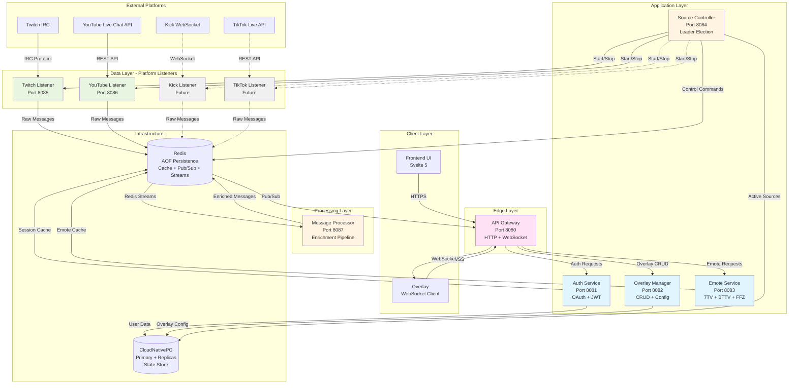
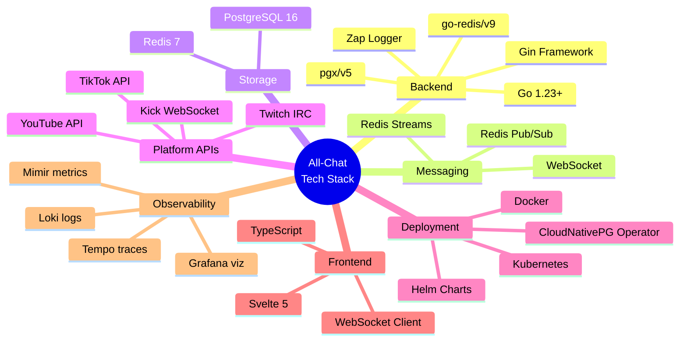
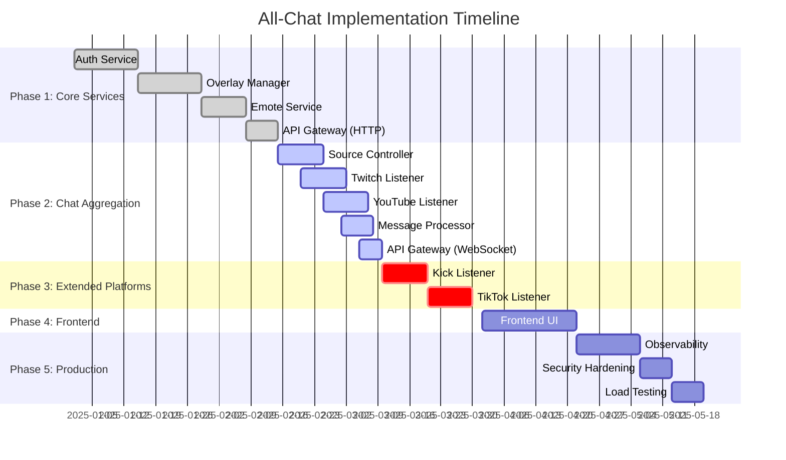
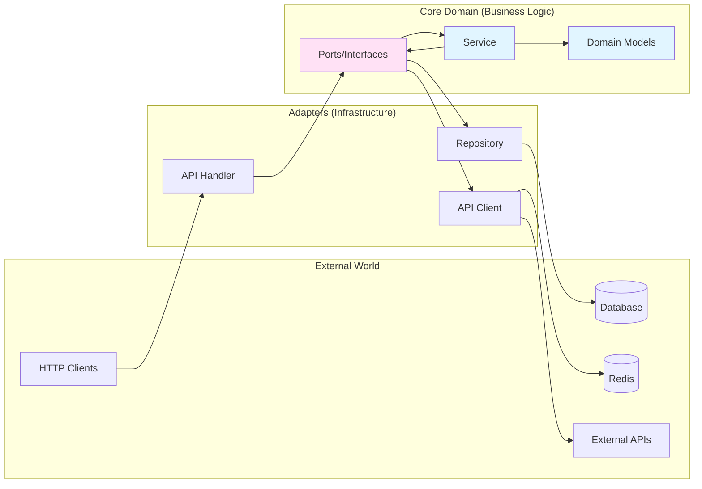
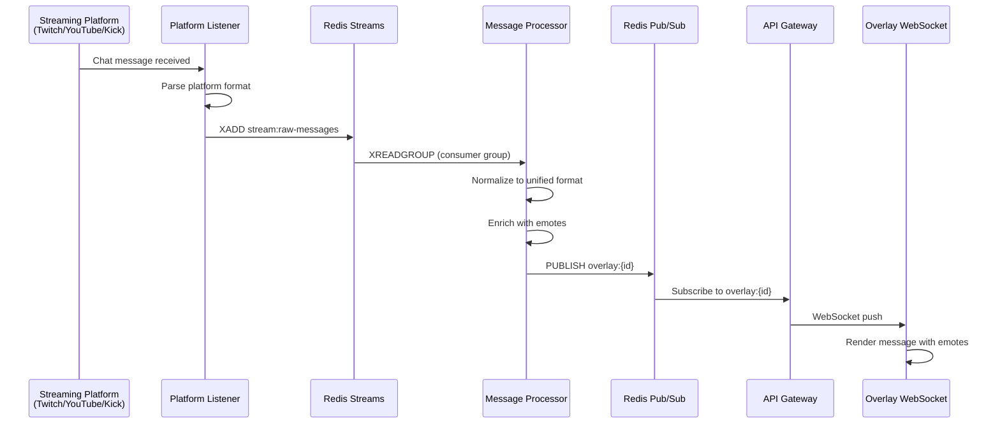
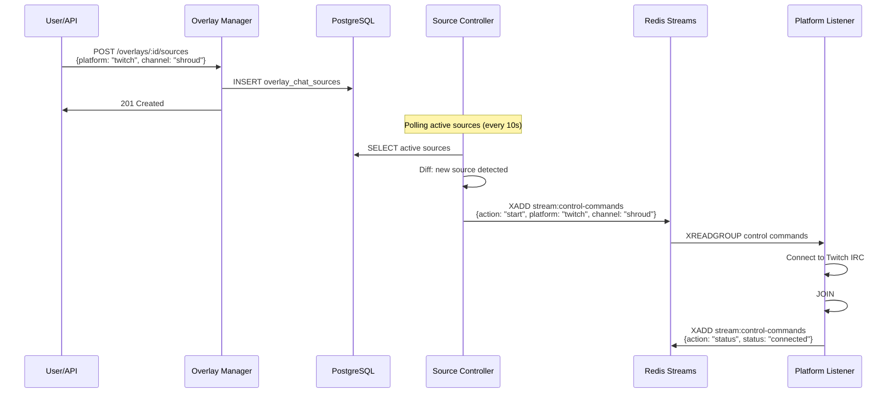
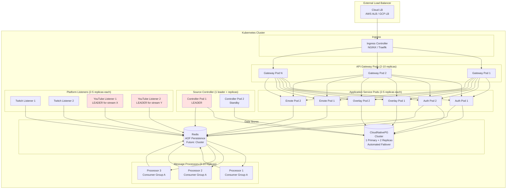

# All-Chat: Cloud-Native Architecture Overview

**Version:** 1.0
**Last Updated:** 2025-11-11
**Status:** In Development (~60% Complete)

---

## Table of Contents

1. [Executive Summary](#executive-summary)
2. [System Context](#system-context)
3. [High-Level Architecture](#high-level-architecture)
4. [Technology Stack](#technology-stack)
5. [Implementation Status](#implementation-status)
6. [Design Principles](#design-principles)
7. [Multi-Platform Support](#multi-platform-support)
8. [Data Flow Overview](#data-flow-overview)
9. [Deployment Topology](#deployment-topology)
10. [Key Architectural Decisions](#key-architectural-decisions)

---

## Executive Summary

**All-Chat** is a cloud-native microservices platform designed to aggregate live chat messages from multiple streaming platforms (Twitch, YouTube, Kick, TikTok) and display them in real-time on customizable streaming overlays. The system supports advanced emote rendering (7TV, BTTV, FFZ) and provides streamers with a unified chat experience across all platforms they stream to.

### Key Features
- **Multi-Platform Aggregation**: Unified chat from Twitch, YouTube, Kick, and TikTok
- **Real-Time Message Processing**: Sub-second latency from chat to overlay
- **Emote Enrichment**: Automatic integration of platform and third-party emotes
- **Flexible Overlay Configuration**: Multiple overlays per user, multiple sources per overlay
- **Cloud-Native**: Kubernetes-ready with horizontal scaling and high availability
- **Hexagonal Architecture**: Clean separation of business logic from infrastructure

### Current State
The platform is approximately **60% complete**:
- ✅ **Complete**: Auth Service, Overlay Manager, Emote Service, API Gateway (HTTP proxy)
- ⏳ **In Progress**: Source Controller, Platform Listeners (Twitch/YouTube), Message Processor
- 📋 **Planned**: Kick/TikTok support, Frontend UI, Production hardening with CNPG & LGTM stack

---

## System Context

### Problem Statement
Modern streamers often broadcast simultaneously to multiple platforms (multistreaming) but lack a unified way to monitor and display chat from all sources. Existing solutions are platform-specific, require complex setup, or don't support advanced emote rendering.

### Solution
All-Chat provides a **single overlay** that can aggregate messages from multiple streaming platforms, normalize them into a unified format, enrich them with emotes, and display them with customizable styling—all with cloud-native reliability and scalability.

### Target Users
- **Streamers**: Content creators who multistream or want unified chat display
- **Moderators**: Community managers monitoring multiple chat sources
- **Viewers**: Audience members who want to see cross-platform interactions

### Use Cases
1. **Multistreaming**: Display Twitch + YouTube + Kick chat in one overlay
2. **Single Platform**: Enhanced overlay for a single source with third-party emotes
3. **Moderation**: Monitor multiple channels simultaneously
4. **Analytics**: Track chat activity across platforms (future feature)

---

## High-Level Architecture

### System Component Diagram



### Architecture Layers

| Layer | Components | Responsibility |
|-------|------------|----------------|
| **Edge** | API Gateway | HTTP routing, WebSocket management, request authentication |
| **Application** | Auth, Overlay Manager, Emote, Source Controller | Business logic, configuration, orchestration |
| **Data** | Platform Listeners | Connect to external platforms, capture raw messages |
| **Processing** | Message Processor | Normalize, enrich, and route messages |
| **Infrastructure** | PostgreSQL, Redis | Persistence, caching, message queuing |

---

## Technology Stack

### Core Technologies



### Technology Choices & Rationale

| Technology | Purpose | Rationale |
|------------|---------|-----------|
| **Go 1.23** | Backend services | High performance, excellent concurrency, strong typing, fast compilation |
| **Gin** | HTTP framework | Lightweight, fast, middleware support, wide adoption |
| **pgx/v5** | PostgreSQL driver | Native Go driver, connection pooling, better performance than database/sql |
| **Redis** | Cache + messaging | In-memory speed, pub/sub, streams for message queuing, widely supported |
| **Kubernetes** | Orchestration | Industry standard, auto-scaling, self-healing, multi-cloud support |
| **WebSocket** | Real-time overlay | Bi-directional, low latency, browser native support |
| **Svelte 5** | Frontend UI | Reactive, compile-time optimization, smaller bundle size |
| **CloudNativePG** | PostgreSQL operator | Automated failover (~30s), PITR, backup automation, production-grade |
| **PostgreSQL** | Primary database | ACID compliance, JSONB support, mature ecosystem |
| **Loki** | Log aggregation | Object storage backend, cost-effective, LogQL queries |
| **Grafana** | Unified visualization | Logs + metrics + traces in single pane |
| **Tempo** | Distributed tracing | OpenTelemetry compatible, object storage backend |
| **Mimir** | Long-term metrics | Prometheus-compatible, 90-day retention, horizontal scaling |
| **Zap** | Structured logging | High performance, structured fields, log levels |

### External Service Dependencies

| Service | Provider | Purpose | Rate Limits |
|---------|----------|---------|-------------|
| Twitch IRC | Twitch | Chat message ingestion | 20 joins/10s, 100 auth'd msgs/30s |
| YouTube Live Chat API | Google | Chat message ingestion | 10,000 units/day (quotas apply) |
| Kick API | Kick.com | Chat message ingestion | TBD (unofficial API) |
| TikTok Live API | TikTok | Chat message ingestion | TBD (requires approval) |
| 7TV API | 7tv.io | Emote metadata | No published limits |
| BTTV API | BetterTTV | Emote metadata | No published limits |
| FFZ API | FrankerFaceZ | Emote metadata | No published limits |

---

## Implementation Status

### Feature Matrix



### Service Status

| Service | Status | Completeness | Key Features |
|---------|--------|--------------|--------------|
| **Auth Service** | ✅ Complete | 100% | Twitch OAuth, JWT generation, token refresh, user management |
| **Overlay Manager** | ✅ Complete | 100% | Overlay CRUD, multi-source configuration, display settings |
| **Emote Service** | ✅ Complete | 100% | 7TV/BTTV/FFZ fetching, Redis caching, channel-specific emotes |
| **API Gateway** | 🟡 Partial | 60% | HTTP routing ✅, WebSocket hub ⏳, rate limiting ❌, connection limits needed |
| **Source Controller** | 🟡 In Progress | 70% | Leader election ✅, control plane ✅, health monitoring ⏳ |
| **Twitch Listener** | 🟡 In Progress | 75% | IRC connection ✅, message parsing ✅, reconnection ⏳ |
| **YouTube Listener** | 🟡 In Progress | 60% | OAuth setup ✅, Live Chat API ⏳, polling ⏳, **CRITICAL: Quota limits** |
| **Message Processor** | 🟡 In Progress | 50% | Stream consumption ✅, enrichment ⏳, routing ⏳ |
| **Kick Listener** | ❌ Not Started | 0% | Planned for Phase 2 |
| **TikTok Listener** | ❌ Not Started | 0% | Planned for Phase 2 |
| **Frontend UI** | ❌ Not Started | 0% | Planned for Phase 3 |
| **CNPG Database** | ⏳ Planned | 0% | Deploy in Phase 1 (immediate) |
| **LGTM Stack** | ⏳ Planned | 0% | Deploy in Phase 1 (immediate) |

### Database Schema Status

| Schema Component | Status | Notes |
|------------------|--------|-------|
| Users table | ✅ Complete | OAuth tokens, user profiles |
| Overlays table | ✅ Complete | Overlay metadata, ownership |
| Overlay configs | ✅ Complete | Display settings, filters |
| Overlay chat sources | ✅ Complete | Multi-source support with platform-specific config |
| Supported platforms | ✅ Complete | Platform registry |
| Active channels (legacy) | ⚠️ Migrating | Being replaced by `active_platform_channels` |
| Active platform channels | 🟡 In Progress | New multi-platform tracking |

---

## Design Principles

### 1. Hexagonal Architecture (Ports & Adapters)

All services follow a strict hexagonal architecture pattern to ensure:
- **Testability**: Core business logic can be tested without external dependencies
- **Maintainability**: Infrastructure changes don't affect business logic
- **Flexibility**: Easy to swap implementations (e.g., PostgreSQL → MongoDB)



### 2. Cloud-Native Design

The system is designed from the ground up for cloud deployment:
- **Stateless Services**: All application state in PostgreSQL/Redis
- **Horizontal Scalability**: Services can scale independently
- **Health Checks**: Liveness and readiness probes for self-healing
- **Graceful Shutdown**: 25-second timeout for connection draining
- **Configuration**: Environment variables + ConfigMaps
- **Observability**: Structured logging, metrics, tracing (planned)

### 3. Microservices Best Practices

Each service is:
- **Single Responsibility**: One service, one concern
- **Independently Deployable**: No shared codebases (except `pkg/`)
- **API-First**: Well-defined REST interfaces
- **Data Ownership**: Each service owns its data (future: separate DBs)
- **Resilient**: Circuit breakers, timeouts, retries (planned)

### 4. Event-Driven Architecture

Real-time message flow uses event-driven patterns:
- **Redis Streams**: Durable message queues with consumer groups
- **Redis Pub/Sub**: Low-latency message broadcast to overlays
- **WebSocket**: Bi-directional real-time communication
- **Decoupling**: Producers and consumers are independent

### 5. Security-First

Security is embedded at every layer:
- **OAuth 2.0**: Industry-standard authentication
- **JWT**: Stateless authorization with short expiry
- **HTTPS/WSS**: Encrypted transport (TLS in production)
- **Secrets Management**: Kubernetes Secrets, no hardcoded credentials
- **Rate Limiting**: Prevent abuse (planned)
- **Input Validation**: All user inputs sanitized

---

## Multi-Platform Support

### Platform Support Matrix

| Platform | Status | Connection Method | Auth Required | Rate Limits | Priority |
|----------|--------|-------------------|---------------|-------------|----------|
| **Twitch** | 🟡 In Progress | IRC (gempir/go-twitch-irc) | OAuth (bot account) | 20 joins/10s, 100 msgs/30s | P0 |
| **YouTube** | 🟡 In Progress | Live Chat API v3 | OAuth (per user) | 10,000 units/day | P0 |
| **Kick** | 📋 Planned | WebSocket (unofficial) | No (public) | Unknown | P1 |
| **TikTok** | 📋 Planned | Live API (official) | API key (approval) | Unknown | P1 |
| **Discord** | 🔮 Future | Bot API | Bot token | 50 msgs/s | P2 |
| **IRC** | 🔮 Future | Custom IRC | Server config | Server-specific | P2 |

### Unified Message Format

All platforms normalize to this structure:

```json
{
  "id": "uuid-v4",
  "overlay_id": "uuid-v4",
  "platform": "twitch|youtube|kick|tiktok",
  "channel_id": "platform-specific-id",
  "channel_name": "display-name",
  "user": {
    "id": "platform-user-id",
    "username": "lowercase-username",
    "display_name": "Display Name",
    "avatar_url": "https://...",
    "badges": ["subscriber", "moderator", "vip"],
    "color": "#FF0000"
  },
  "message": {
    "text": "Hello world! Kappa",
    "emotes": [
      {
        "code": "Kappa",
        "provider": "twitch",
        "url": "https://static-cdn.jtvnw.net/emoticons/v2/25/default/dark/1.0",
        "positions": [[13, 18]]
      }
    ]
  },
  "timestamp": "2025-11-11T12:34:56.789Z",
  "metadata": {
    "is_subscriber": true,
    "is_moderator": false,
    "is_vip": false,
    "bits": 0,
    "super_chat_amount": 0,
    "membership_months": 12
  }
}
```

---

## Data Flow Overview

### High-Level Message Flow



### Control Plane Flow



---

## Deployment Topology

### Kubernetes Cluster Architecture



### Resource Allocation (Initial)

| Service | CPU Request | CPU Limit | Memory Request | Memory Limit | Replicas |
|---------|-------------|-----------|----------------|--------------|----------|
| API Gateway | 100m | 500m | 128Mi | 512Mi | 2-20 (revised capacity) |
| Auth Service | 50m | 200m | 64Mi | 256Mi | 2-5 |
| Overlay Manager | 50m | 200m | 64Mi | 256Mi | 2-5 |
| Emote Service | 50m | 200m | 64Mi | 256Mi | 2-5 |
| Source Controller | 50m | 200m | 64Mi | 256Mi | 2 (1 leader) |
| Twitch Listener | 100m | 500m | 128Mi | 512Mi | 2-5 |
| YouTube Listener | 100m | 500m | 128Mi | 512Mi | 2-5 (quota monitoring required) |
| Message Processor | 200m | 1000m | 256Mi | 1Gi | 3-10 |
| CloudNativePG | 500m | 2000m | 1Gi | 4Gi | 3 (1 primary + 2 replicas) |
| Redis | 100m | 500m | 256Mi | 1Gi | 1 (AOF enabled, cluster future) |
| Loki | 500m | 2000m | 1Gi | 4Gi | 3 (monolithic or distributed) |
| Tempo | 200m | 1000m | 512Mi | 2Gi | 2 (Phase 2) |
| Mimir | 500m | 2000m | 2Gi | 8Gi | 2 (Phase 2) |

---

## Key Architectural Decisions

### 1. CloudNativePG over StatefulSets
**Decision**: Use CloudNativePG operator for PostgreSQL instead of manual StatefulSets.

**Rationale**:
- **Team has experience**: Team already familiar with CNPG, removing learning curve concern
- **Automated failover**: ~30 seconds vs 5-15 minutes manual intervention
- **PITR built-in**: Point-in-time recovery with continuous WAL archiving to S3/GCS
- **Backup automation**: Scheduled backups with retention policies
- **Connection pooling**: Built-in PgBouncer sidecar option
- **ROI**: Saves ~$340/month in engineer time (automation benefits)

**Implementation**:
- Deploy in Phase 1 (immediate) with 1 primary + 2 read replicas
- Configure automated backups to S3 with 30-day retention
- Enable PITR with 5-minute RPO
- Use built-in connection pooler for application connections

### 2. LGTM Stack for Observability
**Decision**: Adopt Loki + Grafana + Tempo + Mimir (LGTM) observability stack.

**Rationale**:
- **Cost-effective**: Object storage backend (~$70/mo) vs EFK stack ($500-1000/mo)
- **Unified experience**: Single Grafana for logs, metrics, traces
- **Cloud-native design**: Built for Kubernetes from ground up
- **Team familiarity**: Grafana widely known, LogQL similar to PromQL

**Implementation**:
- **Phase 1**: Deploy Loki + Grafana + Mimir (logs + metrics)
- **Phase 2**: Add Tempo (distributed tracing after system stable)
- **Storage**: Use S3/GCS object storage for all components
- **Retention**: Logs 30d, Metrics 90d, Traces 7d

### 3. Redis Streams over Kafka
**Decision**: Use Redis Streams for message queuing instead of Apache Kafka.

**Rationale**:
- Simpler operational overhead (already using Redis for caching/pub-sub)
- Lower latency for small-to-medium message volumes
- Built-in consumer groups and persistence
- Sufficient throughput for expected scale (thousands of messages/second)
- Easier local development setup

**Trade-offs**:
- Less mature than Kafka for high-volume streaming
- No cross-datacenter replication (acceptable for single-region deployment)

### 2. Hexagonal Architecture for All Services
**Decision**: Enforce hexagonal architecture (ports & adapters) across all microservices.

**Rationale**:
- Clear separation between business logic and infrastructure
- Easier to test core domain without external dependencies
- Flexibility to swap implementations (databases, APIs)
- Consistent codebase structure across services

**Trade-offs**:
- More boilerplate code (interfaces, adapters)
- Steeper learning curve for new developers

### 3. Shared PostgreSQL Database (Transitional)
**Decision**: Start with a shared PostgreSQL database across services, plan migration to separate databases.

**Rationale**:
- Faster initial development (simpler schema management)
- Easier local development setup
- Clear migration path (schemas → databases)
- Sufficient for current scale

**Trade-offs**:
- Services share a single point of failure
- Harder to enforce data ownership boundaries
- Must migrate to separate DBs before scaling to production

### 4. Platform Listeners as Separate Services
**Decision**: Each streaming platform (Twitch, YouTube, Kick, TikTok) gets its own listener service.

**Rationale**:
- Platform-specific connection logic (IRC, REST API, WebSocket)
- Independent scaling based on platform load
- Isolated failures (Twitch downtime doesn't affect YouTube)
- Different rate limit handling per platform

**Trade-offs**:
- More services to deploy and monitor
- Duplicated connection management code (mitigated by shared `pkg/`)

### 5. Leader Election for Source Controller and YouTube
**Decision**: Use Redis-based leader election for Source Controller and YouTube Listener.

**Rationale**:
- Source Controller: Only one instance should manage control plane
- YouTube: Per-stream leadership to avoid duplicate API calls (quota limits)
- Redis provides simple distributed locking
- Automatic failover if leader crashes

**Trade-offs**:
- Adds complexity (leader election logic)
- Redis becomes a critical dependency for control plane

### 6. WebSocket for Overlay Communication
**Decision**: Use WebSocket over Server-Sent Events (SSE) or HTTP polling.

**Rationale**:
- Bi-directional communication (future: overlay → backend commands)
- Lower latency than polling
- Wide browser support
- Efficient for high-frequency messages

**Trade-offs**:
- Stateful connections (requires sticky sessions or broadcast)
- More complex to scale horizontally (solved with Redis pub/sub)

---

## Next Steps

Refer to the following detailed architecture documents:

1. **[COMPONENT_ARCHITECTURE.md](./COMPONENT_ARCHITECTURE.md)** - Detailed service designs
2. **[DATA_FLOW_INTEGRATION.md](./DATA_FLOW_INTEGRATION.md)** - Message flows and integrations
3. **[DEPLOYMENT_KUBERNETES.md](./DEPLOYMENT_KUBERNETES.md)** - Kubernetes deployment specs
4. **[SCALING_PERFORMANCE.md](./SCALING_PERFORMANCE.md)** - Scaling strategies and performance
5. **[OBSERVABILITY_MONITORING.md](./OBSERVABILITY_MONITORING.md)** - Monitoring and observability
6. **[SECURITY_ARCHITECTURE.md](./SECURITY_ARCHITECTURE.md)** - Security design and OAuth flows
7. **[IMPLEMENTATION_ROADMAP.md](./IMPLEMENTATION_ROADMAP.md)** - Phased implementation plan

---

## Critical Issues & Action Items

### 🚨 HIGH PRIORITY - Must Address Immediately

#### 1. YouTube API Quota Ceiling (P0 - CRITICAL)
- **Issue**: Single GCP project quota (10,000 units/day) = ~231 streams max
- **Impact**: 10K users with 10% YouTube usage = 1,000 streams → **EXCEEDS BY 4X**
- **Actions**:
  - ✅ **NOW**: Request 50,000 units/day quota increase from Google (2-4 week approval)
  - ✅ **NOW**: Create 5 GCP projects for quota pooling
  - ⏳ **Week 1**: Implement adaptive polling (increase interval when quota low)
  - ⏳ **Week 1**: Add Prometheus alert: `youtube_api_quota_used > 8000`

#### 2. API Gateway WebSocket Connection Limits (P0 - HIGH)
- **Issue**: Documentation claims 10K connections/pod, but 512Mi limit = only 4,000 max (2,500 safe)
- **Impact**: Gateway pod OOMKilled → 2,500 users disconnected
- **Actions**:
  - ⏳ **Week 1**: Implement connection limit (2,500 per pod) in code
  - ⏳ **Week 1**: Add graceful rejection (503 "retry at capacity") vs crashes
  - ⏳ **Week 1**: Increase HPA maxReplicas from 10 → 20
  - ⏳ **Week 1**: Add per-overlay connection limits (1,000 max per overlay)

#### 3. Redis AOF Persistence (P1 - MEDIUM)
- **Issue**: Single Redis instance without persistence = 15-minute recovery on failure
- **Impact**: All message processing stops, potential message loss
- **Actions**:
  - ✅ **Phase 1**: Enable Redis AOF persistence (`appendonly yes`)
  - ⏳ **Phase 5**: Migrate to Redis Cluster (6 nodes) when CPU > 70%

### 📋 Implementation Checklist - Phase 1 (Immediate)

- [ ] Deploy CloudNativePG operator to Kubernetes cluster
- [ ] Create CNPG Cluster resource (1 primary + 2 replicas)
- [ ] Configure S3 backups with 30-day retention
- [ ] Enable PITR with 5-minute RPO
- [ ] Deploy Loki for log aggregation (Promtail DaemonSet + Loki server)
- [ ] Deploy Grafana for visualization
- [ ] Deploy Mimir for long-term metrics (Prometheus remote write)
- [ ] Configure Prometheus to scrape all services
- [ ] Create critical alerts (ServiceDown, HighErrorRate, YouTubeQuotaHigh)
- [ ] Implement API Gateway connection limits in code
- [ ] Enable Redis AOF persistence
- [ ] Request YouTube API quota increase
- [ ] Create 5 additional GCP projects

---

**Document Maintainers**: Development Team
**Review Frequency**: Quarterly or after major architectural changes
**Feedback**: Submit architecture proposals via GitHub issues or PRs
**Last Major Update**: 2025-11-11 - Added CNPG & LGTM stack, critical issues identified
