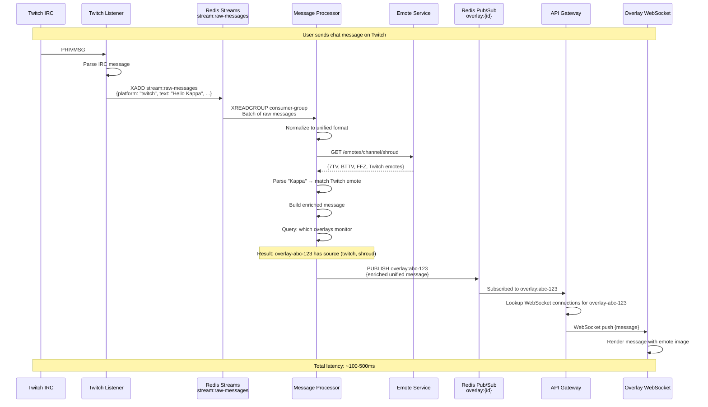
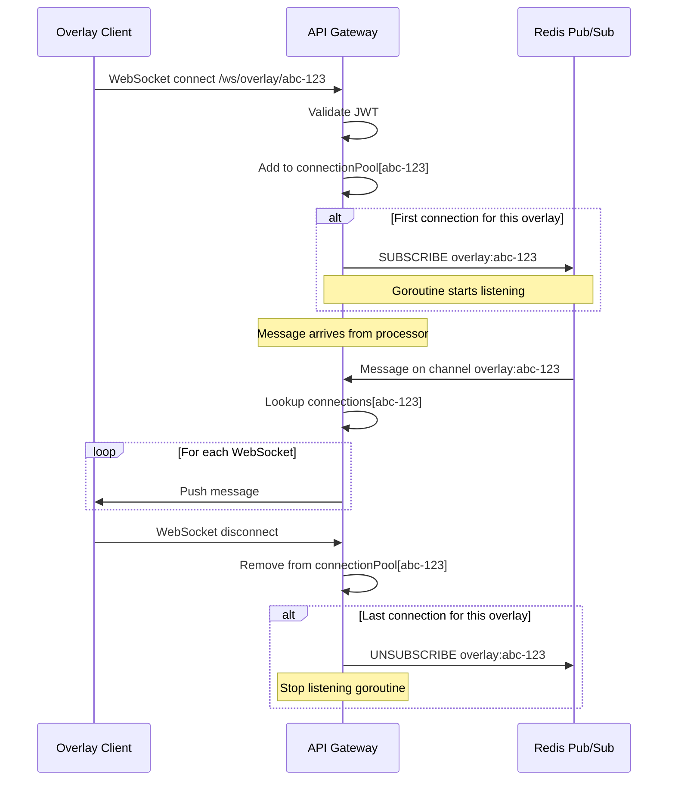
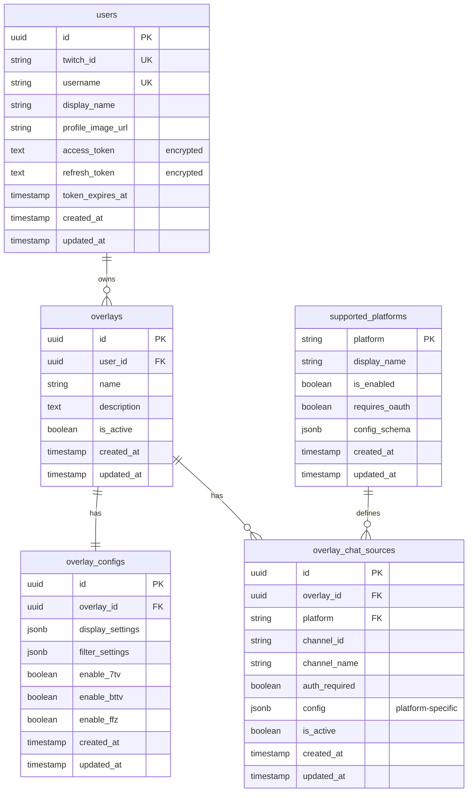
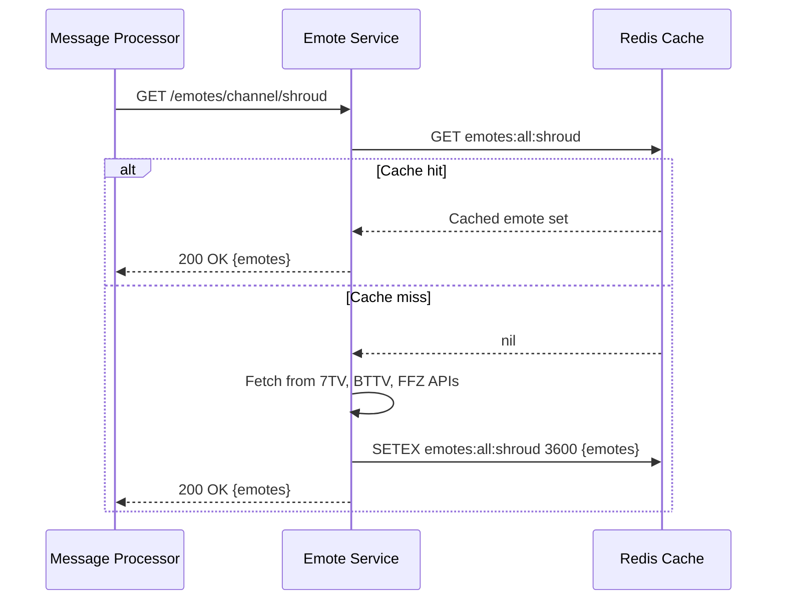
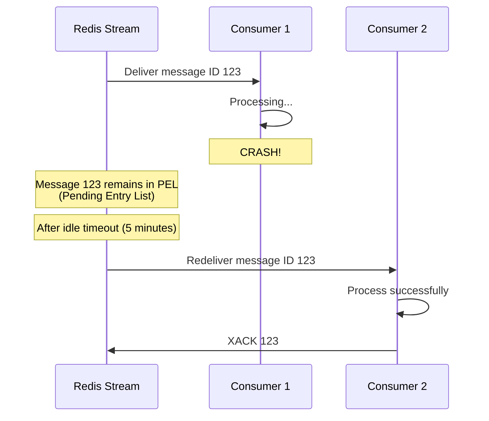

# All-Chat: Data Flow & Integration Architecture

**Version:** 1.0
**Last Updated:** 2025-11-11
**Related Docs**: [Approved Architecture](./APPROVED_ARCHITECTURE.md), [Approved Architecture](./APPROVED_ARCHITECTURE.md)

---

## Table of Contents

1. [Introduction](#introduction)
2. [End-to-End Message Flow](#end-to-end-message-flow)
3. [Redis Streams Architecture](#redis-streams-architecture)
4. [Redis Pub/Sub Architecture](#redis-pubsub-architecture)
5. [Database Schema](#database-schema)
6. [Unified Message Format](#unified-message-format)
7. [Integration Patterns](#integration-patterns)
8. [Error Handling & Retry Logic](#error-handling--retry-logic)
9. [Performance Considerations](#performance-considerations)

---

## Introduction

All-Chat uses a **hybrid messaging architecture** combining:
- **Redis Streams**: Durable message queues for reliable processing
- **Redis Pub/Sub**: Low-latency message broadcast to WebSocket clients
- **PostgreSQL**: Persistent state and configuration storage

This document details how messages flow from streaming platforms through the system to overlay displays, and how services integrate with each other.

---

## End-to-End Message Flow

### Complete System Flow



### Flow Stages Breakdown

| Stage | Component | Input | Output | Latency | Purpose |
|-------|-----------|-------|--------|---------|---------|
| **1. Capture** | Platform Listener | Platform-specific message | Raw message struct | ~10-50ms | Connect to platform, parse protocol |
| **2. Queue** | Redis Streams | Raw message | Queued message | ~5ms | Durable storage, decoupling |
| **3. Normalize** | Message Processor | Raw message | Unified format | ~20ms | Platform-agnostic format |
| **4. Enrich** | Message Processor + Emote Service | Unified message | Enriched with emotes | ~30-100ms | Add emote URLs |
| **5. Route** | Message Processor | Enriched message | Overlay-specific messages | ~10ms | Determine target overlays |
| **6. Broadcast** | Redis Pub/Sub | Enriched message | Pub/Sub event | ~5ms | Low-latency distribution |
| **7. Push** | API Gateway | Pub/Sub event | WebSocket frame | ~10ms | Deliver to connected clients |
| **8. Render** | Overlay Client | WebSocket message | Rendered HTML/CSS | ~20-50ms | Display in browser |

**Total End-to-End Latency**: ~100-500ms (varies by emote cache hits and network)

---

## Redis Streams Architecture

### Stream: `stream:raw-messages`

**Purpose**: Queue raw messages from all platform listeners for processing.

#### Schema

```json
{
  "message_id": "1699999999999-0",  // Redis auto-generated
  "fields": {
    "platform": "twitch",            // "twitch", "youtube", "kick", "tiktok"
    "channel_id": "shroud",          // Platform-specific channel identifier
    "channel_name": "shroud",        // Display name
    "user_id": "12345",              // Platform user ID
    "username": "viewer123",         // Lowercase username
    "display_name": "Viewer123",     // Display name
    "text": "Hello world! Kappa",    // Message text
    "raw_emotes": "25:13-17",        // Platform-specific emote data (optional)
    "badges": "subscriber/12",       // Platform-specific badges (optional)
    "color": "#FF0000",              // User color (optional)
    "timestamp": "2025-11-11T12:34:56.789Z",
    "metadata": "{...}"              // JSON string with platform-specific data
  }
}
```

#### Producer: Platform Listeners

```go
// Example: Twitch Listener producing raw message
func (l *TwitchListener) handleMessage(twitchMsg *twitch.PrivateMessage) {
    rawMsg := map[string]interface{}{
        "platform":     "twitch",
        "channel_id":   twitchMsg.RoomID,
        "channel_name": twitchMsg.Channel,
        "user_id":      twitchMsg.User.ID,
        "username":     strings.ToLower(twitchMsg.User.Name),
        "display_name": twitchMsg.User.DisplayName,
        "text":         twitchMsg.Message,
        "raw_emotes":   twitchMsg.Emotes.String(),
        "badges":       twitchMsg.User.Badges.String(),
        "color":        twitchMsg.User.Color,
        "timestamp":    time.Now().Format(time.RFC3339Nano),
        "metadata":     marshalMetadata(twitchMsg),
    }

    // Add to Redis Stream
    l.redisClient.XAdd(ctx, &redis.XAddArgs{
        Stream: "stream:raw-messages",
        Values: rawMsg,
    })
}
```

#### Consumer: Message Processor

```go
// Message Processor consuming with consumer group
func (p *MessageProcessor) consumeRawMessages(ctx context.Context) {
    for {
        // XREADGROUP GROUP processor-group consumer-1 COUNT 10 BLOCK 1000 STREAMS stream:raw-messages >
        streams, err := p.redisClient.XReadGroup(ctx, &redis.XReadGroupArgs{
            Group:    "processor-group",
            Consumer: "consumer-1",
            Streams:  []string{"stream:raw-messages", ">"},
            Count:    10,
            Block:    1 * time.Second,
        }).Result()

        for _, stream := range streams {
            for _, message := range stream.Messages {
                // Process message
                enriched := p.processMessage(message)
                p.publishToOverlays(enriched)

                // ACK message
                p.redisClient.XAck(ctx, "stream:raw-messages", "processor-group", message.ID)
            }
        }
    }
}
```

#### Consumer Group Benefits

- **Load Balancing**: Multiple processor instances share workload
- **Fault Tolerance**: Unacknowledged messages are redelivered
- **Exactly-Once Processing**: Each message processed by one consumer
- **Monitoring**: Track pending messages with `XPENDING`

---

### Stream: `stream:control-commands`

**Purpose**: Coordinate platform listener lifecycle (start/stop/status).

#### Schema

```json
{
  "message_id": "1699999999999-0",
  "fields": {
    "command_id": "uuid-v4",
    "action": "start",                // "start", "stop", "status"
    "platform": "twitch",             // "twitch", "youtube", "kick", "tiktok"
    "channel_id": "shroud",
    "overlay_id": "uuid-overlay",     // Associated overlay
    "config": "{...}",                // JSON string: platform-specific config
    "timestamp": "2025-11-11T12:34:56.789Z"
  }
}
```

#### Producer: Source Manager

```go
// Source Manager detects new active source
func (c *SourceController) handleNewSource(source *domain.ChatSource) {
    command := map[string]interface{}{
        "command_id": uuid.New().String(),
        "action":     "start",
        "platform":   source.Platform,
        "channel_id": source.ChannelID,
        "overlay_id": source.OverlayID,
        "config":     marshalConfig(source.Config),
        "timestamp":  time.Now().Format(time.RFC3339Nano),
    }

    c.redisClient.XAdd(ctx, &redis.XAddArgs{
        Stream: "stream:control-commands",
        Values: command,
    })
}
```

#### Consumer: Platform Listeners

```go
// Twitch Listener consuming control commands
func (l *TwitchListener) consumeControlCommands(ctx context.Context) {
    for {
        streams, _ := l.redisClient.XReadGroup(ctx, &redis.XReadGroupArgs{
            Group:    "twitch-listener-group",
            Consumer: l.instanceID,
            Streams:  []string{"stream:control-commands", ">"},
            Count:    5,
            Block:    2 * time.Second,
        }).Result()

        for _, stream := range streams {
            for _, message := range stream.Messages {
                action := message.Values["action"].(string)
                platform := message.Values["platform"].(string)

                if platform != "twitch" {
                    continue // Not for this listener
                }

                switch action {
                case "start":
                    l.joinChannel(message.Values["channel_id"].(string))
                case "stop":
                    l.partChannel(message.Values["channel_id"].(string))
                }

                l.redisClient.XAck(ctx, "stream:control-commands", "twitch-listener-group", message.ID)
            }
        }
    }
}
```

---

### Stream Monitoring

```bash
# Check stream length
XLEN stream:raw-messages

# View pending messages
XPENDING stream:raw-messages processor-group

# View stream info
XINFO STREAM stream:raw-messages

# View consumer group info
XINFO GROUPS stream:raw-messages

# Manually read latest messages
XREAD COUNT 10 STREAMS stream:raw-messages 0
```

---

## Redis Pub/Sub Architecture

### Channel Pattern: `overlay:{overlay_id}`

**Purpose**: Broadcast enriched messages to all connected WebSocket clients for a specific overlay.

#### Why Pub/Sub Instead of Streams?

| Requirement | Redis Streams | Redis Pub/Sub | Winner |
|-------------|---------------|---------------|--------|
| **Durability** | ✅ Persisted | ❌ Ephemeral | Streams |
| **Latency** | ~10ms | **~2ms** | **Pub/Sub** |
| **Delivery** | Exactly-once | At-most-once | Streams |
| **Fan-out** | Manual | **Built-in** | **Pub/Sub** |
| **Use Case** | Processing pipeline | **Real-time broadcast** | **Pub/Sub** |

**Decision**: Use **Pub/Sub** for overlay broadcast because:
- Ultra-low latency is critical for chat display
- Messages are already processed (durability not needed)
- Multiple API Gateway instances need to receive same message
- Ephemeral nature is acceptable (clients reconnect on disconnect)

#### Publisher: Message Processor

```go
// After enrichment, publish to overlay-specific channel
func (p *MessageProcessor) publishToOverlay(overlayID string, message *domain.UnifiedMessage) {
    messageJSON, _ := json.Marshal(message)

    // PUBLISH overlay:abc-123 {json}
    p.redisClient.Publish(ctx, fmt.Sprintf("overlay:%s", overlayID), messageJSON)
}
```

#### Subscriber: API Gateway

```go
// API Gateway subscribes to overlay channels
func (g *Gateway) subscribeToOverlay(overlayID string) {
    pubsub := g.redisClient.Subscribe(ctx, fmt.Sprintf("overlay:%s", overlayID))
    defer pubsub.Close()

    ch := pubsub.Channel()
    for msg := range ch {
        // msg.Payload contains JSON message
        g.broadcastToWebSockets(overlayID, msg.Payload)
    }
}

func (g *Gateway) broadcastToWebSockets(overlayID string, messageJSON string) {
    connections := g.connectionPool[overlayID]
    for _, conn := range connections {
        conn.WriteMessage(websocket.TextMessage, []byte(messageJSON))
    }
}
```

#### Subscription Lifecycle



---

## Database Schema

### Entity Relationship Diagram



### Table: `users`

```sql
CREATE TABLE users (
    id UUID PRIMARY KEY DEFAULT gen_random_uuid(),
    twitch_id VARCHAR(50) UNIQUE NOT NULL,
    username VARCHAR(50) UNIQUE NOT NULL,
    display_name VARCHAR(100) NOT NULL,
    profile_image_url TEXT,
    access_token TEXT NOT NULL,      -- Encrypted OAuth token
    refresh_token TEXT NOT NULL,     -- Encrypted refresh token
    token_expires_at TIMESTAMP NOT NULL,
    created_at TIMESTAMP DEFAULT NOW(),
    updated_at TIMESTAMP DEFAULT NOW()
);

CREATE INDEX idx_users_twitch_id ON users(twitch_id);
CREATE INDEX idx_users_username ON users(username);
```

### Table: `overlays`

```sql
CREATE TABLE overlays (
    id UUID PRIMARY KEY DEFAULT gen_random_uuid(),
    user_id UUID NOT NULL REFERENCES users(id) ON DELETE CASCADE,
    name VARCHAR(100) NOT NULL,
    description TEXT,
    is_active BOOLEAN DEFAULT TRUE,
    created_at TIMESTAMP DEFAULT NOW(),
    updated_at TIMESTAMP DEFAULT NOW()
);

CREATE INDEX idx_overlays_user_id ON overlays(user_id);
CREATE INDEX idx_overlays_is_active ON overlays(is_active);
```

### Table: `overlay_configs`

```sql
CREATE TABLE overlay_configs (
    id UUID PRIMARY KEY DEFAULT gen_random_uuid(),
    overlay_id UUID NOT NULL UNIQUE REFERENCES overlays(id) ON DELETE CASCADE,
    display_settings JSONB DEFAULT '{}',  -- Font, colors, animations
    filter_settings JSONB DEFAULT '{}',   -- Banned words, user filters
    enable_7tv BOOLEAN DEFAULT TRUE,
    enable_bttv BOOLEAN DEFAULT TRUE,
    enable_ffz BOOLEAN DEFAULT TRUE,
    created_at TIMESTAMP DEFAULT NOW(),
    updated_at TIMESTAMP DEFAULT NOW()
);

CREATE INDEX idx_overlay_configs_overlay_id ON overlay_configs(overlay_id);
```

**Example `display_settings`**:
```json
{
  "font_family": "Inter",
  "font_size": 18,
  "text_color": "#FFFFFF",
  "background_color": "#00000080",
  "animation": "slide-in-left",
  "message_duration": 10
}
```

### Table: `overlay_chat_sources`

```sql
CREATE TABLE overlay_chat_sources (
    id UUID PRIMARY KEY DEFAULT gen_random_uuid(),
    overlay_id UUID NOT NULL REFERENCES overlays(id) ON DELETE CASCADE,
    platform VARCHAR(50) NOT NULL REFERENCES supported_platforms(platform),
    channel_id VARCHAR(100) NOT NULL,     -- Platform-specific ID
    channel_name VARCHAR(100) NOT NULL,   -- Display name
    auth_required BOOLEAN DEFAULT FALSE,
    config JSONB DEFAULT '{}',            -- Platform-specific settings
    is_active BOOLEAN DEFAULT TRUE,
    created_at TIMESTAMP DEFAULT NOW(),
    updated_at TIMESTAMP DEFAULT NOW(),
    UNIQUE(overlay_id, platform, channel_id)  -- Prevent duplicate sources
);

CREATE INDEX idx_overlay_chat_sources_overlay_id ON overlay_chat_sources(overlay_id);
CREATE INDEX idx_overlay_chat_sources_platform ON overlay_chat_sources(platform);
CREATE INDEX idx_overlay_chat_sources_is_active ON overlay_chat_sources(is_active);
```

**Example `config` (YouTube-specific)**:
```json
{
  "live_stream_id": "abc123xyz",
  "oauth_user_id": "google-user-123",
  "polling_interval": 5
}
```

### Table: `supported_platforms`

```sql
CREATE TABLE supported_platforms (
    platform VARCHAR(50) PRIMARY KEY,    -- "twitch", "youtube", "kick", "tiktok"
    display_name VARCHAR(100) NOT NULL,  -- "Twitch", "YouTube", "Kick", "TikTok"
    is_enabled BOOLEAN DEFAULT FALSE,    -- Feature flag
    requires_oauth BOOLEAN DEFAULT FALSE,
    config_schema JSONB DEFAULT '{}',    -- JSON Schema for platform-specific config
    created_at TIMESTAMP DEFAULT NOW(),
    updated_at TIMESTAMP DEFAULT NOW()
);

-- Initial data
INSERT INTO supported_platforms (platform, display_name, is_enabled, requires_oauth) VALUES
    ('twitch', 'Twitch', TRUE, FALSE),
    ('youtube', 'YouTube', TRUE, TRUE),
    ('kick', 'Kick', FALSE, FALSE),
    ('tiktok', 'TikTok', FALSE, TRUE);
```

---

## Unified Message Format

### Complete Specification

```typescript
interface UnifiedMessage {
  // Message identity
  id: string;          // UUID v4
  overlay_id: string;  // Target overlay UUID

  // Source information
  platform: 'twitch' | 'youtube' | 'kick' | 'tiktok';
  channel_id: string;  // Platform-specific identifier
  channel_name: string; // Display name

  // User information
  user: {
    id: string;           // Platform user ID
    username: string;     // Lowercase, unique
    display_name: string; // Display name (may differ from username)
    avatar_url: string;   // Profile picture URL
    badges: string[];     // ["subscriber", "moderator", "vip", "partner"]
    color: string;        // Hex color (#RRGGBB)
  };

  // Message content
  message: {
    text: string;         // Plain text message
    emotes: Emote[];      // Parsed emotes
  };

  // Timing
  timestamp: string;      // ISO 8601 timestamp

  // Platform-specific metadata
  metadata: {
    is_subscriber: boolean;
    is_moderator: boolean;
    is_vip: boolean;
    is_partner: boolean;
    bits: number;              // Twitch bits (0 if not applicable)
    super_chat_amount: number; // YouTube Super Chat (0 if not applicable)
    membership_months: number; // Subscription months (0 if not applicable)
  };
}

interface Emote {
  code: string;         // "Kappa", "KEKW", "PogChamp"
  provider: string;     // "twitch", "youtube", "7tv", "bttv", "ffz"
  url: string;          // Image URL (1x size)
  urls?: {              // Multiple sizes (optional)
    "1x": string;       // 28x28
    "2x": string;       // 56x56
    "4x": string;       // 112x112
  };
  positions: [number, number][]; // [[start, end]] indices in text
}
```

### Platform Mapping

#### Twitch → Unified

| Twitch Field | Unified Field | Transformation |
|--------------|---------------|----------------|
| `user.id` | `user.id` | Direct |
| `user.name` | `user.username` | `strings.ToLower()` |
| `user.displayName` | `user.display_name` | Direct |
| `user.color` | `user.color` | Default to `#FFFFFF` if empty |
| `badges` | `user.badges` | Parse badge string → array |
| `emotes` | `message.emotes` | Parse positions, add provider="twitch" |

#### YouTube → Unified

| YouTube Field | Unified Field | Transformation |
|---------------|---------------|----------------|
| `authorDetails.channelId` | `user.id` | Direct |
| `authorDetails.displayName` | `user.display_name` | Direct |
| `authorDetails.displayName` | `user.username` | `strings.ToLower()` |
| `authorDetails.profileImageUrl` | `user.avatar_url` | Direct |
| `snippet.textMessageDetails.messageText` | `message.text` | Direct |
| `authorDetails.isChatModerator` | `metadata.is_moderator` | Direct |
| `snippet.superChatDetails.amountMicros` | `metadata.super_chat_amount` | Divide by 1,000,000 |

---

## Integration Patterns

### Pattern 1: Synchronous HTTP (Service-to-Service)

**Use Case**: Message Processor fetching emotes from Emote Service



**Circuit Breaker** (planned):
```go
type CircuitBreaker struct {
    failures      int
    lastFailure   time.Time
    state         string // "closed", "open", "half-open"
    threshold     int
    timeout       time.Duration
}

func (mp *MessageProcessor) fetchEmotes(channel string) ([]Emote, error) {
    if mp.circuitBreaker.state == "open" {
        if time.Since(mp.circuitBreaker.lastFailure) < mp.circuitBreaker.timeout {
            return nil, ErrCircuitOpen
        }
        mp.circuitBreaker.state = "half-open"
    }

    emotes, err := mp.emoteClient.GetChannelEmotes(channel)
    if err != nil {
        mp.circuitBreaker.failures++
        mp.circuitBreaker.lastFailure = time.Now()
        if mp.circuitBreaker.failures >= mp.circuitBreaker.threshold {
            mp.circuitBreaker.state = "open"
        }
        return nil, err
    }

    mp.circuitBreaker.failures = 0
    mp.circuitBreaker.state = "closed"
    return emotes, nil
}
```

---

### Pattern 2: Asynchronous Messaging (Redis Streams)

**Use Case**: Platform Listener → Message Processor

- **Decoupling**: Listener and processor are independent
- **Durability**: Messages survive crashes
- **Load Balancing**: Multiple processors share workload
- **Exactly-Once**: Consumer groups ensure no duplicate processing

---

### Pattern 3: Event Broadcasting (Redis Pub/Sub)

**Use Case**: Message Processor → API Gateway → Overlays

- **Fan-Out**: One message, many receivers
- **Low Latency**: ~2ms propagation
- **Ephemeral**: No storage overhead
- **Dynamic Subscriptions**: Subscribe/unsubscribe on WebSocket connect/disconnect

---

## Error Handling & Retry Logic

### Redis Streams Failure Scenarios

#### Scenario 1: Consumer Crashes Before ACK



**Implementation**:
```go
// Claim idle messages
func (p *MessageProcessor) claimIdleMessages(ctx context.Context) {
    pending, _ := p.redisClient.XPendingExt(ctx, &redis.XPendingExtArgs{
        Stream: "stream:raw-messages",
        Group:  "processor-group",
        Idle:   5 * time.Minute,
        Count:  10,
    }).Result()

    for _, msg := range pending {
        // Claim message
        claimed, _ := p.redisClient.XClaim(ctx, &redis.XClaimArgs{
            Stream:   "stream:raw-messages",
            Group:    "processor-group",
            Consumer: p.instanceID,
            MinIdle:  5 * time.Minute,
            Messages: []string{msg.ID},
        }).Result()

        for _, claimedMsg := range claimed {
            p.processMessage(claimedMsg)
            p.redisClient.XAck(ctx, "stream:raw-messages", "processor-group", claimedMsg.ID)
        }
    }
}
```

#### Scenario 2: Processing Fails (Business Logic Error)

```go
func (p *MessageProcessor) processMessage(msg redis.XMessage) error {
    defer func() {
        if r := recover(); r != nil {
            // Panic recovery
            logger.Error("Panic processing message", zap.Any("panic", r), zap.String("message_id", msg.ID))
            // Do NOT ACK - message will be redelivered
        }
    }()

    enrichedMsg, err := p.enrichMessage(msg)
    if err != nil {
        logger.Error("Failed to enrich message", zap.Error(err), zap.String("message_id", msg.ID))

        // Check retry count
        retryCount := getRetryCount(msg)
        if retryCount >= 3 {
            // Move to dead letter queue
            p.redisClient.XAdd(ctx, &redis.XAddArgs{
                Stream: "stream:dead-letter-queue",
                Values: msg.Values,
            })
            // ACK original message
            p.redisClient.XAck(ctx, "stream:raw-messages", "processor-group", msg.ID)
            return nil
        }

        // Do NOT ACK - will be redelivered after idle timeout
        return err
    }

    p.publishToOverlays(enrichedMsg)
    p.redisClient.XAck(ctx, "stream:raw-messages", "processor-group", msg.ID)
    return nil
}
```

---

### HTTP Request Retries

```go
type RetryableHTTPClient struct {
    client      *http.Client
    maxRetries  int
    retryDelay  time.Duration
}

func (c *RetryableHTTPClient) Get(url string) (*http.Response, error) {
    var resp *http.Response
    var err error

    for attempt := 0; attempt <= c.maxRetries; attempt++ {
        resp, err = c.client.Get(url)
        if err == nil && resp.StatusCode < 500 {
            return resp, nil
        }

        if attempt < c.maxRetries {
            time.Sleep(c.retryDelay * time.Duration(math.Pow(2, float64(attempt))))
        }
    }

    return nil, fmt.Errorf("failed after %d retries: %w", c.maxRetries, err)
}
```

---

## Performance Considerations

### Throughput Estimates

| Component | Throughput | Bottleneck | Scaling Strategy |
|-----------|------------|------------|------------------|
| **Twitch Listener** | ~500 msgs/s per instance | IRC connection limit | Horizontal: 1 instance per 500 channels |
| **YouTube Listener** | ~50 API calls/s per project | API quota | Horizontal: Multiple projects, leader per stream |
| **Message Processor** | ~2,000 msgs/s per instance | CPU (emote parsing) | Horizontal: Consumer group (3-10 instances) |
| **Redis Streams** | ~100,000 msgs/s | Redis CPU | Vertical: More Redis CPU cores |
| **Redis Pub/Sub** | ~500,000 msgs/s | Network bandwidth | Vertical: Redis Cluster (planned) |
| **API Gateway WebSocket** | ~10,000 connections per instance | Memory (connection pool) | Horizontal: Sticky sessions + Redis pub/sub |

### Latency Optimization

#### 1. Emote Caching
- **Problem**: Fetching emotes adds 50-200ms per message
- **Solution**: Redis cache with 1-hour TTL
- **Impact**: 95% cache hit rate → ~5ms average lookup

#### 2. Batch Processing
```go
// Instead of processing one message at a time
for msg := range msgChan {
    process(msg)
}

// Process in batches
batch := []Message{}
for msg := range msgChan {
    batch = append(batch, msg)
    if len(batch) >= 10 || time.Since(lastFlush) > 100*time.Millisecond {
        processBatch(batch)
        batch = batch[:0]
    }
}
```

#### 3. Connection Pooling
```go
// PostgreSQL connection pool (via pgx)
config, _ := pgxpool.ParseConfig(os.Getenv("DATABASE_URL"))
config.MaxConns = 20
config.MinConns = 5
config.MaxConnLifetime = 1 * time.Hour
config.MaxConnIdleTime = 10 * time.Minute

pool, _ := pgxpool.NewWithConfig(ctx, config)
```

---

## Summary

This document provides a comprehensive overview of data flow and integration patterns in All-Chat:

1. **End-to-End Flow**: Messages flow from platforms → listeners → streams → processor → pub/sub → gateway → overlays
2. **Redis Streams**: Durable queues for reliable message processing
3. **Redis Pub/Sub**: Low-latency broadcast for real-time delivery
4. **Database Schema**: Relational model supporting multi-source overlays
5. **Unified Format**: Platform-agnostic message structure
6. **Integration Patterns**: HTTP, streams, pub/sub
7. **Error Handling**: Retries, dead letter queues, circuit breakers
8. **Performance**: Caching, batching, connection pooling

**Next Steps**:
- [DEPLOYMENT_KUBERNETES.md](./DEPLOYMENT_KUBERNETES.md) - Kubernetes deployment specifications
- [SCALING_PERFORMANCE.md](./SCALING_PERFORMANCE.md) - Detailed scaling strategies
- [OBSERVABILITY_MONITORING.md](./OBSERVABILITY_MONITORING.md) - Monitoring and alerting

---

**Document Maintainers**: Development Team
**Last Review**: 2025-11-11
