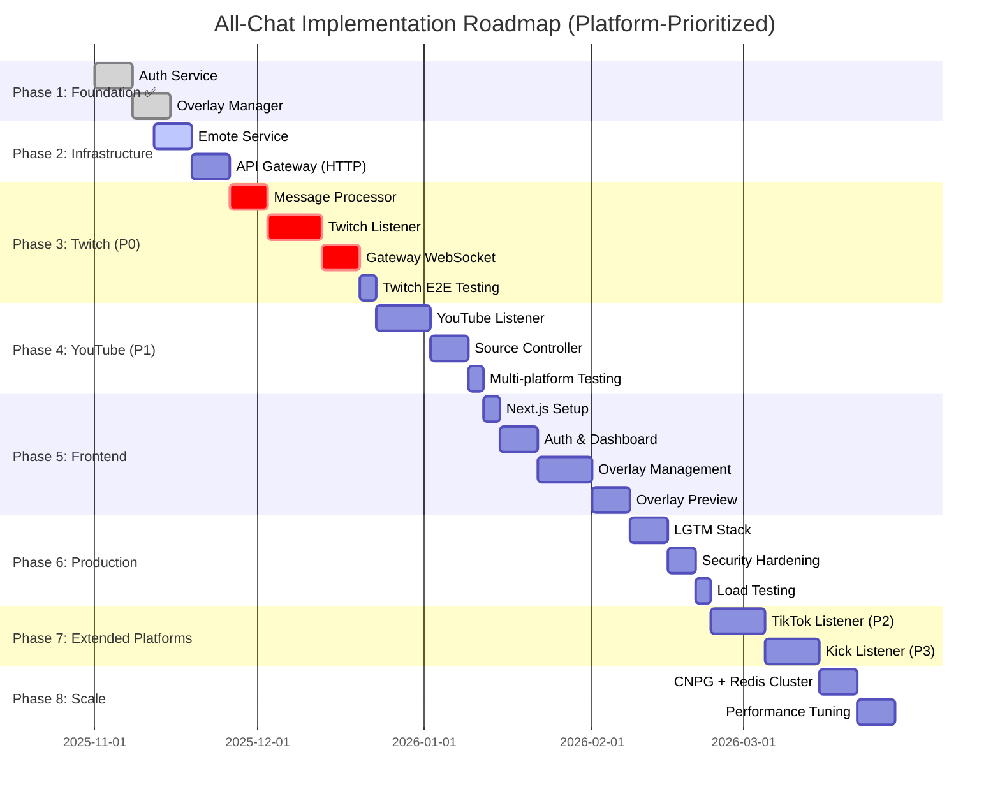
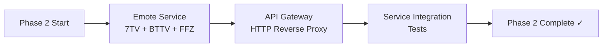
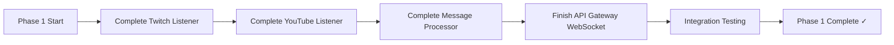
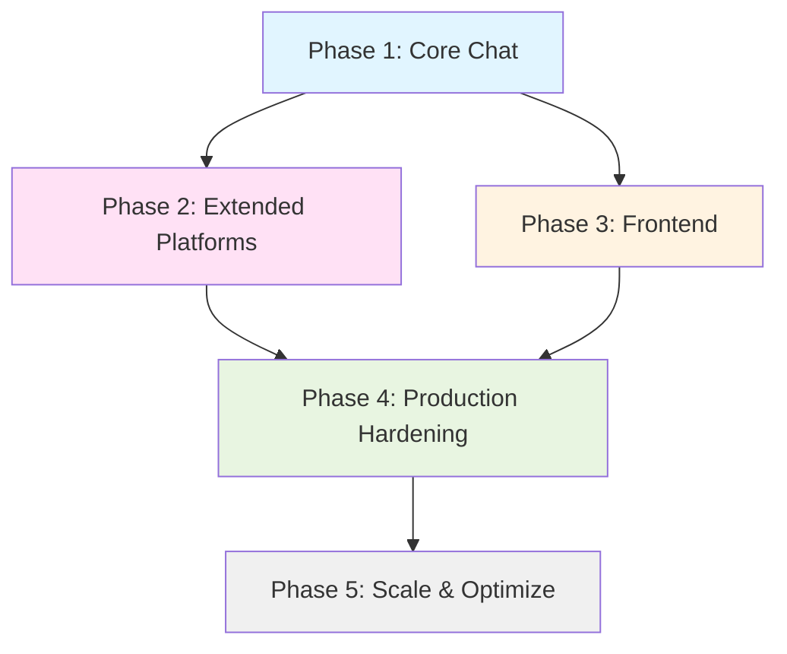

# All-Chat: Implementation Roadmap

**Version:** 2.0
**Last Updated:** 2025-11-12
**Related Docs**: [Architecture Overview](./ARCHITECTURE_OVERVIEW.md), All Architecture Docs

**Platform Priority**: Twitch (P0) > YouTube (P1) > TikTok (P2) > Kick (P3)

---

## Table of Contents

1. [Executive Summary](#executive-summary)
2. [Current Status](#current-status)
3. [Phase 1: Foundation - COMPLETE ✅](#phase-1-foundation---complete-)
4. [Phase 2: Infrastructure Services](#phase-2-infrastructure-services)
5. [Phase 3: Twitch Real-Time (P0)](#phase-3-twitch-real-time-p0)
6. [Phase 4: YouTube Integration (P1)](#phase-4-youtube-integration-p1)
7. [Phase 5: Frontend & User Experience](#phase-5-frontend--user-experience)
8. [Phase 6: Production Hardening](#phase-6-production-hardening)
9. [Phase 7: TikTok & Kick (P2-P3)](#phase-7-tiktok--kick-p2-p3)
10. [Phase 8: Scale & Optimize](#phase-8-scale--optimize)
11. [Dependencies & Blockers](#dependencies--blockers)
12. [Success Metrics](#success-metrics)

---

## Executive Summary

All-Chat is currently **Phase 1 COMPLETE** with foundation services (Auth, Overlay Manager) fully implemented and tested. This roadmap prioritizes **Twitch (P0) → YouTube (P1)** as primary platforms, with TikTok and Kick deferred to Phase 7.

### Revised Timeline Overview



**Target Twitch Launch**: December 23, 2025 (6 weeks)
**Target Multi-platform Launch**: March 29, 2026 (20 weeks)

---

## Current Status

### Phase 1: Foundation - COMPLETE ✅

| Component | Status | Tests | Notes |
|-----------|--------|-------|-------|
| **Auth Service** | ✅ Complete | 48 tests passing | Twitch OAuth, JWT, refresh tokens |
| **Overlay Manager** | ✅ Complete | 48 tests passing | Multi-source CRUD, configuration |
| **Database Schema** | ✅ Complete | Migrations applied | Multi-source support added |
| **Shared Packages** | ✅ Complete | Fully tested | Database, Redis, Logger, Auth utils |
| **Docker Compose** | ✅ Complete | Working | Local dev environment |
| **Makefile** | ✅ Complete | All targets work | Build, test, deploy |

**Phase 1 Completion Date**: November 12, 2025

### Phase 2: Infrastructure Services - NEXT (Week of Nov 12)

| Component | Status | Priority | Estimated Effort |
|-----------|--------|----------|------------------|
| **Emote Service** | ❌ Not Started | P0 | 5-7 days |
| **API Gateway (HTTP)** | ❌ Not Started | P0 | 5-7 days |

### Phase 3: Twitch Real-Time - Critical Path (Weeks of Nov 26 - Dec 20)

| Component | Status | Priority | Estimated Effort |
|-----------|--------|----------|------------------|
| **Message Processor** | ❌ Not Started | P0 | 7 days |
| **Twitch Listener** | ❌ Not Started | P0 | 10 days |
| **Gateway WebSocket** | ❌ Not Started | P0 | 7 days |

### Phase 4: YouTube Integration (Week of Dec 23 - Jan 9)

| Component | Status | Priority | Estimated Effort |
|-----------|--------|----------|------------------|
| **YouTube Listener** | ❌ Not Started | P1 | 10 days |
| **Source Controller** | ❌ Not Started | P1 | 7 days |

### Deferred to Phase 7

| Component | Status | Priority | Notes |
|-----------|--------|----------|-------|
| **TikTok Listener** | ❌ Deferred | P2 | After YouTube is stable |
| **Kick Listener** | ❌ Deferred | P3 | Lowest priority platform |

---

## Phase 1: Foundation - COMPLETE ✅

**Goal**: Build authentication and overlay management foundation.

**Duration**: 2 weeks
**Start Date**: November 1, 2025
**Completion Date**: November 12, 2025 ✅

### Completed Work

#### 1.1 Auth Service ✅
- Twitch OAuth 2.0 flow
- JWT generation and validation
- Token refresh endpoints
- User repository with PostgreSQL
- **Tests**: 48 passing (handlers, repository, OAuth, models)
- **Coverage**: ~85%

#### 1.2 Overlay Manager ✅
- Overlay CRUD operations
- Multi-source chat source management
- Configuration management (display settings, filters, emotes)
- PostgreSQL repository with Testcontainers
- **Tests**: 48 passing (handlers, repository, models)
- **Coverage**: ~82%

#### 1.3 Infrastructure ✅
- Go workspace with monorepo structure
- Shared packages (database, redis, logger, auth)
- Docker Compose for local development
- Database migrations (multi-source support)
- Makefile with build/test/deploy targets

### Success Metrics Achieved ✅
- ✅ All 96 tests passing
- ✅ TDD methodology followed
- ✅ Testcontainers integration working
- ✅ Docker Compose environment functional
- ✅ Ready for Phase 2

---

## Phase 2: Infrastructure Services

**Goal**: Build emote caching and HTTP API gateway for service communication.

**Duration**: 2 weeks
**Start Date**: November 12, 2025
**Target Completion**: November 26, 2025

### Objectives



### Tasks

#### 2.1 Emote Service (5-7 days)

**Purpose**: Fetch and cache emotes from third-party providers

**Key Features**:
- HTTP clients for 7TV, BTTV, FFZ APIs
- Redis caching with TTL (emotes:provider:channel)
- Channel-level emote aggregation
- Health checks and error handling

**Endpoints**:
- `GET /emotes/channel/:channel` - All emotes for channel
- `GET /emotes/7tv/:channel` - 7TV emotes only
- `GET /emotes/bttv/:channel` - BTTV emotes only
- `GET /emotes/ffz/:channel` - FFZ emotes only
- `GET /health/live` - Liveness probe
- `GET /health/ready` - Readiness probe (Redis check)

**Success Criteria**:
- [ ] Can fetch from all 3 providers
- [ ] Redis caching works (95%+ hit rate after warmup)
- [ ] Handles API failures gracefully
- [ ] 80%+ test coverage
- [ ] < 100ms p95 latency (cached)

**Files to Create**:
```
services/emote-service/
├── cmd/main.go
├── handlers/
│   ├── emote.go
│   ├── emote_test.go
│   └── health.go
├── clients/
│   ├── seventv.go
│   ├── bttv.go
│   ├── ffz.go
│   └── clients_test.go
├── models/
│   ├── emote.go
│   └── emote_test.go
├── cache/
│   ├── emote_cache.go
│   └── emote_cache_test.go
├── go.mod
└── Dockerfile
```

---

#### 2.2 API Gateway - HTTP Proxy (5-7 days)

**Purpose**: Single entry point for all HTTP requests, route to backend services

**Key Features**:
- HTTP reverse proxy (Gin)
- Service discovery (hardcoded URLs for Phase 2)
- JWT middleware for protected routes
- CORS middleware
- Request/response logging
- Health aggregation endpoint

**Routes**:
```
/api/v1/auth/*         → auth-service:8081
/api/v1/overlays/*     → overlay-manager:8082
/api/v1/emotes/*       → emote-service:8083
/health                → Aggregated health check
```

**Success Criteria**:
- [ ] Routes requests correctly to all services
- [ ] JWT middleware works (validates tokens from auth-service)
- [ ] CORS configured properly
- [ ] Health aggregation shows all services
- [ ] 80%+ test coverage
- [ ] < 10ms p95 proxy overhead

**Files to Create**:
```
services/api-gateway/
├── cmd/main.go
├── handlers/
│   ├── proxy.go
│   ├── proxy_test.go
│   └── health.go
├── middleware/
│   ├── auth.go
│   ├── cors.go
│   └── logging.go
├── models/
│   └── health.go
├── go.mod
└── Dockerfile
```

---

#### 2.3 Service Integration Testing (2-3 days)

**Test Scenarios**:
1. **Full HTTP Flow**:
   - User logs in → Gateway → Auth Service → JWT token
   - User creates overlay → Gateway → Overlay Manager → DB
   - User fetches emotes → Gateway → Emote Service → Redis → External APIs

2. **JWT Validation**:
   - Valid token → Success
   - Expired token → 401 Unauthorized
   - Missing token → 401 Unauthorized

3. **Health Checks**:
   - All services UP → Gateway health = healthy
   - One service DOWN → Gateway health = degraded

**Success Criteria**:
- [ ] E2E flow works without errors
- [ ] All services can communicate via Gateway
- [ ] Authentication flow works end-to-end
- [ ] Emote caching reduces external API calls by 90%+

---

### Phase 2 Success Metrics

- [ ] Emote Service: 80%+ test coverage, 95%+ cache hit rate
- [ ] API Gateway: Routes all requests correctly, JWT auth works
- [ ] Docker Compose updated with new services
- [ ] All integration tests passing
- [ ] Ready for Phase 3 (Twitch real-time)

---

## Phase 3: Twitch Real-Time (P0 - CRITICAL PATH)



### Tasks

#### 1.1 Complete Twitch Listener (10 days)

**Owner**: Backend Team
**Status**: 🟡 75% Complete

**Remaining Work**:
- [ ] Implement reconnection logic with exponential backoff
- [ ] Handle Twitch IRC rate limits gracefully
- [ ] Add connection health monitoring
- [ ] Implement graceful shutdown (PART all channels)
- [ ] Write unit tests for IRC message parsing
- [ ] Write integration tests with mock IRC server

**Success Criteria**:
- [ ] Can connect to 100+ channels simultaneously
- [ ] Handles disconnections and reconnects automatically
- [ ] Respects Twitch rate limits (20 joins/10s, 100 msgs/30s)
- [ ] 95% unit test coverage

**Files to Complete**:
- `internal/twitch-listener/core/services/connection_manager.go`
- `internal/twitch-listener/core/services/message_handler.go`
- `internal/twitch-listener/core/services/channel_manager_test.go`

---

#### 1.2 Complete YouTube Listener (10 days)

**Owner**: Backend Team
**Status**: 🟡 60% Complete

**Remaining Work**:
- [ ] Implement YouTube OAuth flow (per-stream authentication)
- [ ] Implement leader election per live stream
- [ ] Add adaptive polling interval based on message rate
- [ ] Implement quota monitoring and alerting
- [ ] Handle API errors (quota exceeded, stream ended)
- [ ] Write unit tests for API client
- [ ] Write integration tests with mock YouTube API

**Success Criteria**:
- [ ] Can monitor 50+ concurrent live streams
- [ ] Stays within YouTube API quota (10,000 units/day)
- [ ] Leader election works correctly (one poller per stream)
- [ ] Handles stream end gracefully
- [ ] 90% unit test coverage

**Files to Complete**:
- `internal/youtube-listener/adapters/api/youtube_client.go`
- `internal/youtube-listener/core/services/poller_service.go`
- `internal/youtube-listener/core/services/leader_election.go`
- `internal/youtube-listener/core/services/oauth_manager.go`

---

#### 1.3 Complete Message Processor (10 days)

**Owner**: Backend Team
**Status**: 🟡 50% Complete

**Remaining Work**:
- [ ] Implement message normalization for all platforms
- [ ] Integrate with Emote Service for enrichment
- [ ] Implement overlay routing logic
- [ ] Add dead letter queue for failed messages
- [ ] Implement Redis Streams consumer group
- [ ] Add backlog monitoring and alerting
- [ ] Write unit tests for normalizer
- [ ] Write integration tests with Redis Streams

**Success Criteria**:
- [ ] Processes 2,000+ messages/second per instance
- [ ] Normalizes Twitch and YouTube messages correctly
- [ ] Enriches with emotes from Emote Service
- [ ] Routes to correct overlays via Redis pub/sub
- [ ] Handles failures with retry + DLQ
- [ ] 90% unit test coverage

**Files to Complete**:
- `internal/message-processor/core/services/normalizer_service.go`
- `internal/message-processor/core/services/enricher_service.go`
- `internal/message-processor/core/services/router_service.go`
- `internal/message-processor/adapters/streams/consumer.go`

---

#### 1.4 Finish API Gateway WebSocket (7 days)

**Owner**: Backend Team
**Status**: 🟡 60% Complete

**Remaining Work**:
- [ ] Implement WebSocket connection manager
- [ ] Integrate Redis pub/sub for overlay channels
- [ ] Add JWT authentication for WebSocket connections
- [ ] Implement connection pooling per overlay
- [ ] Add health checks and metrics
- [ ] Write unit tests for WebSocket manager
- [ ] Write integration tests with mock overlays

**Success Criteria**:
- [ ] Supports 10,000+ concurrent WebSocket connections per instance
- [ ] Subscribes to correct Redis channels
- [ ] Broadcasts messages to all connected clients
- [ ] Handles client disconnections gracefully
- [ ] JWT validation works correctly
- [ ] 85% unit test coverage

**Files to Complete**:
- `internal/api-gateway/adapters/websocket/manager.go`
- `internal/api-gateway/core/services/subscription_service.go`
- `internal/api-gateway/adapters/websocket/connection_pool.go`

---

#### 1.5 Integration Testing (5 days)

**Owner**: QA + Backend Team

**Test Scenarios**:
1. **End-to-End Message Flow**:
   - Twitch message → Listener → Stream → Processor → Pub/Sub → Gateway → Overlay
   - Verify latency < 500ms
2. **Multi-Source Overlay**:
   - Create overlay with Twitch + YouTube sources
   - Verify messages from both platforms appear in overlay
3. **Failure Scenarios**:
   - Twitch IRC disconnect → reconnection
   - Redis failure → message buffering
   - Database failure → graceful degradation
4. **Load Testing**:
   - 1,000 messages/second throughput
   - 100 concurrent overlays
   - 5,000 WebSocket connections

**Success Criteria**:
- [ ] All test scenarios pass
- [ ] No data loss under load
- [ ] Latency < 500ms (p95)
- [ ] Error rate < 0.1%

---

## Phase 2: Extended Platforms

**Goal**: Add Kick and TikTok platform support.

**Duration**: 3 weeks
**Start Date**: March 17, 2025
**Target Completion**: April 6, 2025

### Tasks

#### 2.1 Kick Listener (10 days)

**Owner**: Backend Team

**Work Required**:
- [ ] Research Kick WebSocket API (unofficial)
- [ ] Implement WebSocket connection manager
- [ ] Parse Kick message format
- [ ] Normalize to unified message format
- [ ] Integrate with control plane (Source Controller)
- [ ] Write unit and integration tests

**Success Criteria**:
- [ ] Can connect to 100+ Kick channels
- [ ] Parses messages correctly
- [ ] Handles WebSocket disconnections

**Files to Create**:
- `cmd/kick-listener/main.go`
- `internal/kick-listener/adapters/websocket/client.go`
- `internal/kick-listener/core/services/message_handler.go`

---

#### 2.2 TikTok Listener (10 days)

**Owner**: Backend Team

**Work Required**:
- [ ] Apply for TikTok API access
- [ ] Implement TikTok OAuth flow
- [ ] Integrate TikTok Live API
- [ ] Parse TikTok message format
- [ ] Normalize to unified message format
- [ ] Write unit and integration tests

**Blockers**:
- TikTok API access approval (can take 2-4 weeks)

**Success Criteria**:
- [ ] Can monitor 50+ TikTok live streams
- [ ] Parses messages correctly
- [ ] OAuth flow works

**Files to Create**:
- `cmd/tiktok-listener/main.go`
- `internal/tiktok-listener/adapters/api/tiktok_client.go`
- `internal/tiktok-listener/core/services/message_handler.go`

---

#### 2.3 Multi-Source Testing (5 days)

**Test Scenarios**:
1. Create overlay with all 4 platforms (Twitch + YouTube + Kick + TikTok)
2. Verify messages from all platforms appear correctly
3. Test failover (one platform down, others continue)
4. Load test with 10,000 messages/second across all platforms

---

## Phase 3: Frontend & User Experience

**Goal**: Build Svelte 5 frontend for user authentication, overlay management, and customization.

**Duration**: 5 weeks
**Start Date**: April 11, 2025
**Target Completion**: May 18, 2025

### Tasks

#### 3.1 Svelte 5 Framework Setup (3 days)

**Work Required**:
- [ ] Initialize Svelte 5 project with Vite
- [ ] Configure TailwindCSS for styling
- [ ] Set up TypeScript
- [ ] Configure Vitest for unit tests
- [ ] Set up Playwright for E2E tests
- [ ] Configure environment variables

**Files to Create**:
- `frontend/package.json`
- `frontend/vite.config.ts`
- `frontend/tailwind.config.js`
- `frontend/src/main.ts`

---

#### 3.2 Auth & User Pages (7 days)

**Pages**:
- `/` - Landing page with "Login with Twitch" button
- `/auth/callback` - OAuth callback handler
- `/dashboard` - User dashboard (list of overlays)

**Work Required**:
- [ ] Implement OAuth flow with API Gateway
- [ ] Store JWT in localStorage
- [ ] Create protected route wrapper
- [ ] Implement logout functionality
- [ ] Design landing page UI
- [ ] Design dashboard UI

**Success Criteria**:
- [ ] Users can log in with Twitch
- [ ] JWT stored securely
- [ ] Protected routes redirect to login

---

#### 3.3 Overlay Management UI (10 days)

**Pages**:
- `/overlays/new` - Create new overlay
- `/overlays/:id` - View/edit overlay
- `/overlays/:id/sources` - Manage chat sources

**Work Required**:
- [ ] Create overlay form (name, description)
- [ ] List chat sources table
- [ ] Add chat source modal (platform, channel)
- [ ] Remove chat source button
- [ ] Display/filter config editor
- [ ] Emote provider toggles (7TV, BTTV, FFZ)

**Success Criteria**:
- [ ] Users can create overlays
- [ ] Users can add multiple chat sources
- [ ] Users can configure display settings

---

#### 3.4 Overlay Preview & Customization (10 days)

**Pages**:
- `/overlays/:id/preview` - Live preview of overlay with WebSocket

**Work Required**:
- [ ] WebSocket connection to API Gateway
- [ ] Real-time message rendering
- [ ] Emote image rendering
- [ ] Customization controls (font, color, animation)
- [ ] OBS Browser Source URL generation
- [ ] Copy-to-clipboard functionality

**Success Criteria**:
- [ ] Overlay displays real-time chat messages
- [ ] Emotes render correctly
- [ ] Customization updates preview live
- [ ] OBS integration works

---

#### 3.5 E2E Testing (7 days)

**Test Scenarios**:
- User login flow
- Create overlay
- Add Twitch source
- Add YouTube source
- View overlay preview
- Customize overlay appearance
- Copy OBS URL
- Delete overlay

---

## Phase 4: Production Hardening

**Goal**: Implement observability, security hardening, and load testing.

**Duration**: 4 weeks
**Start Date**: May 18, 2025
**Target Completion**: June 11, 2025

### Tasks

#### 4.1 Prometheus & Grafana (7 days)

**Work Required**:
- [ ] Deploy Prometheus to Kubernetes
- [ ] Configure service discovery for all services
- [ ] Implement `/metrics` endpoints in all services
- [ ] Deploy Grafana
- [ ] Create System Overview dashboard
- [ ] Create Message Pipeline dashboard
- [ ] Create Platform Listeners dashboard

---

#### 4.2 Alerting & Runbooks (5 days)

**Work Required**:
- [ ] Deploy Alertmanager
- [ ] Configure critical alerts (ServiceDown, HighErrorRate)
- [ ] Configure warning alerts (HighLatency, MessageBacklog)
- [ ] Set up PagerDuty integration
- [ ] Set up Slack integration
- [ ] Write runbooks for common incidents

---

#### 4.3 Security Hardening (7 days)

**Work Required**:
- [ ] Implement rate limiting on API Gateway
- [ ] Configure CORS for production domains
- [ ] Set up External Secrets Operator with AWS Secrets Manager
- [ ] Implement token encryption (AES-256-GCM)
- [ ] Configure Kubernetes Network Policies
- [ ] Run security audit (vulnerability scanning)
- [ ] Penetration testing (third-party)

---

#### 4.4 Load Testing (5 days)

**Load Test Scenarios**:
1. **API Throughput**: 10,000 req/s to API Gateway
2. **WebSocket Connections**: 50,000 concurrent connections
3. **Message Processing**: 100,000 messages/second
4. **Database Load**: 10,000 writes/s, 100,000 reads/s

**Success Criteria**:
- [ ] System handles target load without errors
- [ ] Latency remains < 500ms (p95)
- [ ] No memory leaks or resource exhaustion
- [ ] HPA scales correctly

---

## Phase 5: Scale & Optimize

**Goal**: Prepare system for production scale (100,000+ users).

**Duration**: 4 weeks
**Start Date**: June 11, 2025
**Target Completion**: July 5, 2025

### Tasks

#### 5.1 Database Replication (7 days)

**Work Required**:
- [ ] Deploy PostgreSQL with 1 primary + 2 read replicas
- [ ] Configure streaming replication
- [ ] Update application to use read replicas for queries
- [ ] Implement connection pooling with PgBouncer
- [ ] Test failover scenarios

---

#### 5.2 Redis Cluster (5 days)

**Work Required**:
- [ ] Deploy Redis Cluster (6 nodes: 3 masters + 3 replicas)
- [ ] Migrate Redis Streams to cluster
- [ ] Update application clients to use cluster
- [ ] Test failover scenarios

---

#### 5.3 CDN & Edge Caching (5 days)

**Work Required**:
- [ ] Configure Cloudflare CDN
- [ ] Cache static assets (frontend, emote images)
- [ ] Configure edge caching rules
- [ ] Set up cache invalidation

---

#### 5.4 Performance Tuning (7 days)

**Work Required**:
- [ ] Optimize database queries (add indexes)
- [ ] Optimize Redis operations (pipelining, batching)
- [ ] Implement connection pooling everywhere
- [ ] Profile CPU/memory usage
- [ ] Fix performance bottlenecks

---

## Dependencies & Blockers

### Critical Path Dependencies



### External Dependencies

| Dependency | Provider | Impact | Mitigation |
|------------|----------|--------|------------|
| **Twitch OAuth** | Twitch | Blocking Phase 1 | Already registered ✅ |
| **YouTube API Quota** | Google | Limiting YouTube support | Request quota increase |
| **TikTok API Access** | TikTok | Blocking Phase 2 | Apply ASAP (2-4 week approval) |
| **Cloud Provider** | AWS/GCP | Required for production | Set up account early |
| **Domain Registration** | Cloudflare | Required for production | Register `allchat.io` |

### Known Blockers

1. **TikTok API Approval**: May take 2-4 weeks
   - **Mitigation**: Apply early, have backup plan (delay TikTok to Phase 2.5)

2. **YouTube API Quota**: Limited to 10,000 units/day
   - **Mitigation**: Request quota increase, use multiple projects

3. **Load Testing Environment**: Need production-like infrastructure
   - **Mitigation**: Use cloud provider trial credits

---

## Resource Requirements

### Team Requirements

| Role | Phase 1 | Phase 2 | Phase 3 | Phase 4 | Phase 5 |
|------|---------|---------|---------|---------|---------|
| **Backend Engineers** | 2 FTE | 2 FTE | 1 FTE | 2 FTE | 2 FTE |
| **Frontend Engineers** | 0 | 0 | 2 FTE | 1 FTE | 0.5 FTE |
| **DevOps Engineers** | 0.5 FTE | 0.5 FTE | 0.5 FTE | 1 FTE | 1 FTE |
| **QA Engineers** | 0.5 FTE | 0.5 FTE | 1 FTE | 1 FTE | 0.5 FTE |
| **Security Engineer** | 0 | 0 | 0 | 1 FTE | 0.5 FTE |
| **Total** | **3 FTE** | **3 FTE** | **4.5 FTE** | **6 FTE** | **4.5 FTE** |

### Infrastructure Costs (Monthly)

| Phase | AWS Cost | Domains | Tools | Total |
|-------|----------|---------|-------|-------|
| **Phase 1 (Dev)** | $200 | $0 | $0 | $200 |
| **Phase 2 (Dev)** | $300 | $0 | $0 | $300 |
| **Phase 3 (Staging)** | $500 | $20 | $0 | $520 |
| **Phase 4 (Production)** | $1,000 | $20 | $100 | $1,120 |
| **Phase 5 (Production+)** | $2,000 | $20 | $200 | $2,220 |

---

## Success Metrics

### Phase 1 Success Criteria

- [ ] Twitch + YouTube chat aggregation working end-to-end
- [ ] Latency < 500ms (p95)
- [ ] No message loss under normal load
- [ ] All unit tests passing (>90% coverage)
- [ ] Integration tests passing

### Phase 2 Success Criteria

- [ ] Kick + TikTok support added
- [ ] Multi-source overlays work correctly
- [ ] All 4 platforms tested together

### Phase 3 Success Criteria

- [ ] Frontend deployed to staging
- [ ] Users can create and manage overlays via UI
- [ ] Overlay preview works with real-time messages
- [ ] OBS integration functional

### Phase 4 Success Criteria

- [ ] Prometheus metrics collected from all services
- [ ] Grafana dashboards operational
- [ ] Critical alerts configured
- [ ] Security audit passed
- [ ] Load testing passed (10,000 req/s)

### Phase 5 Success Criteria

- [ ] Database replication configured
- [ ] Redis Cluster operational
- [ ] CDN configured
- [ ] System handles 100,000 messages/second

---

## Risk Management

### High-Risk Items

| Risk | Probability | Impact | Mitigation |
|------|-------------|--------|------------|
| **YouTube API Quota Limits** | High | High | Request increase, multi-project strategy |
| **TikTok API Access Denied** | Medium | Medium | Delay TikTok to Phase 2.5, focus on Twitch/YouTube/Kick |
| **Load Testing Reveals Bottlenecks** | Medium | High | Early load testing in Phase 1, iterative optimization |
| **Security Vulnerability Found** | Low | Critical | Third-party security audit, bug bounty program |
| **Team Attrition** | Low | High | Documentation, knowledge sharing, redundancy |

### Contingency Plans

1. **If TikTok API denied**: Launch without TikTok, add later
2. **If load testing fails**: Add 2 weeks for optimization
3. **If frontend delayed**: Launch with API-only, add UI later
4. **If security issues found**: Delay launch until fixed

---

## Summary

This roadmap provides a comprehensive 5-phase plan to complete All-Chat:

1. **Phase 1 (4 weeks)**: Core chat aggregation (Twitch + YouTube)
2. **Phase 2 (3 weeks)**: Extended platforms (Kick + TikTok)
3. **Phase 3 (5 weeks)**: Frontend UI (Svelte 5)
4. **Phase 4 (4 weeks)**: Production hardening (observability, security, load testing)
5. **Phase 5 (4 weeks)**: Scale & optimize (replication, clustering, CDN)

**Total Duration**: 20 weeks
**Target Launch**: July 5, 2025
**Team Size**: 3-6 FTE
**Budget**: $200/mo → $2,200/mo (gradual ramp-up)

---

**Document Maintainers**: Project Management Team
**Last Review**: 2025-11-11
**Next Review**: Every 2 weeks (sprint retrospectives)
