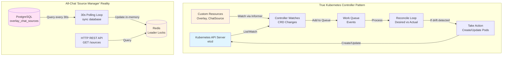
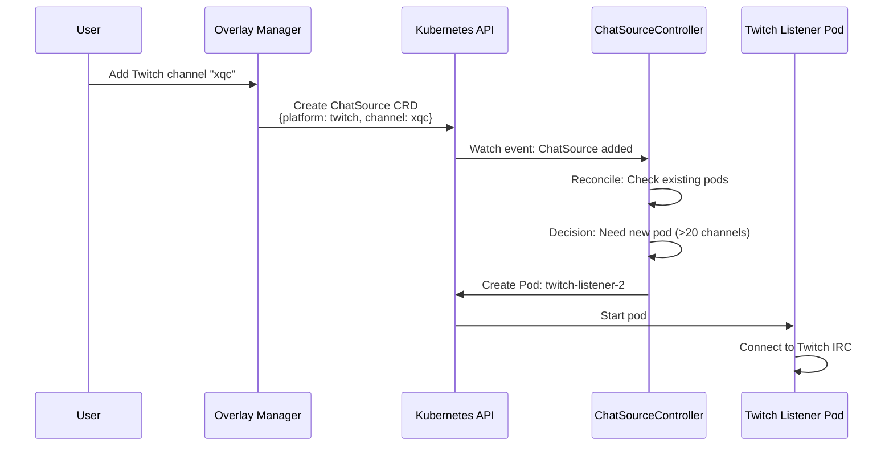
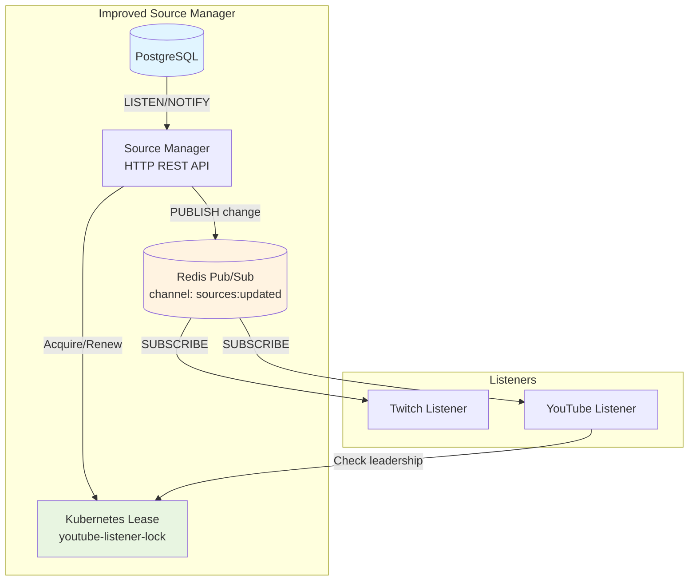
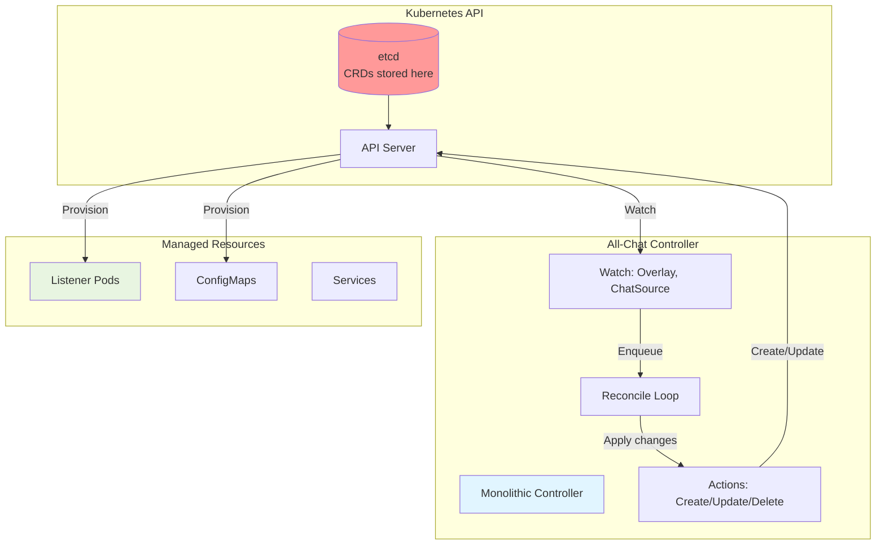
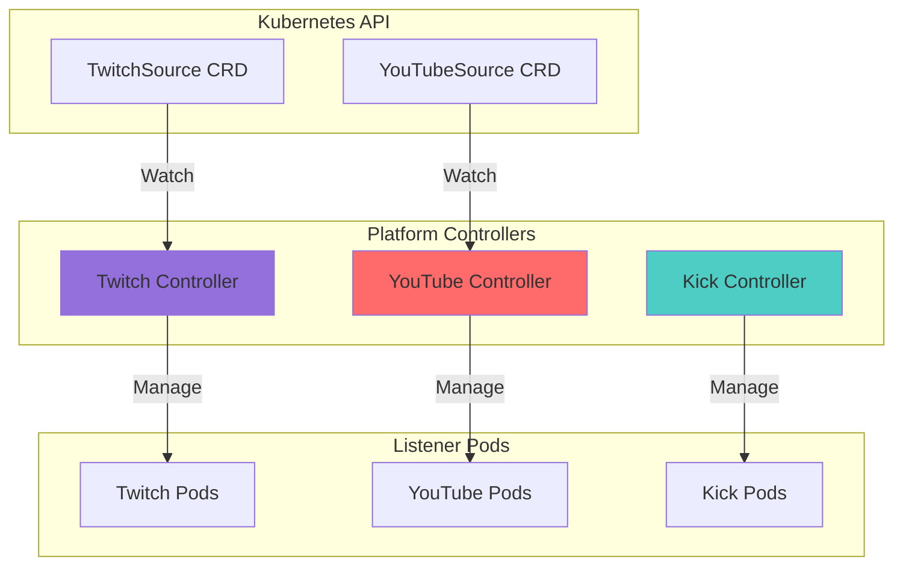
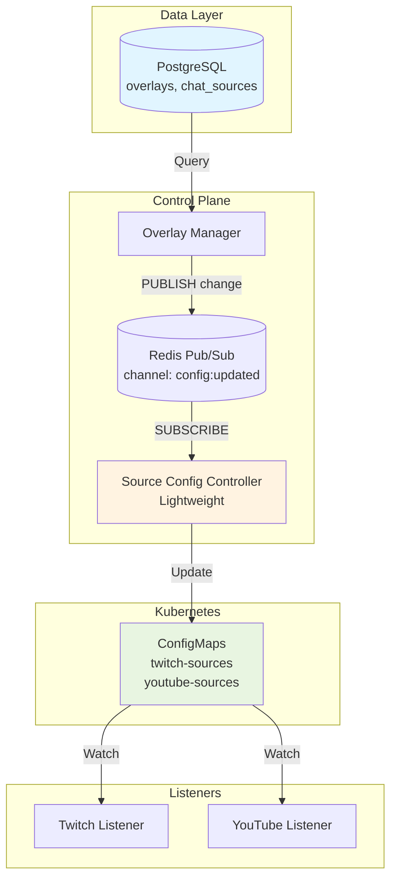
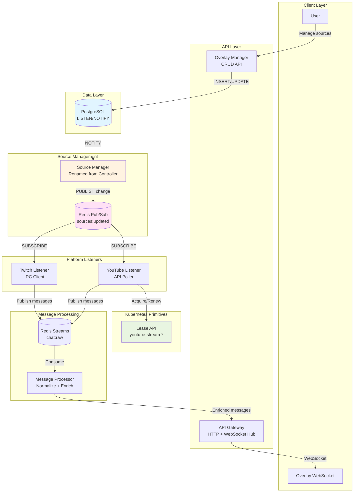

# Kubernetes Controller/Operator Analysis for All-Chat

**Date**: 2025-11-13
**Question**: Do we need a Kubernetes controller, and where would it fit?
**Architecture Version**: 2.0 (Phase 4 - 90% Complete)
**Reviewer**: Claude Code Cloud-Native Architect Agent

---

## Executive Summary

**Recommendation: NO - A Kubernetes Controller/Operator is NOT needed for All-Chat**

After comprehensive analysis of the All-Chat architecture, codebase, and requirements, I conclude that:

1. **The "Source Manager" is fundamentally misnamed** - it is a standard HTTP REST service with database polling and Redis-based leader election, NOT a Kubernetes controller/operator in any sense
2. **A real Kubernetes controller would add unnecessary complexity** with minimal benefit for the project's scale and use case
3. **The current problems can be solved with simpler patterns** - event-driven updates, Kubernetes-native leader election, and reactive configuration watching
4. **User data belongs in PostgreSQL, not etcd** - Creating CRDs for overlays and chat sources would be an architectural mistake

The "Source Manager" should be **renamed to "Source Manager"** to eliminate confusion, and the architecture should be improved using lightweight patterns rather than full controller/operator machinery.

---

## 1. What a K8s Controller Would Do

### 1.1 Definition: What IS a Kubernetes Controller?

A Kubernetes controller is a control loop that:

1. **Watches Kubernetes resources** via the API Server (Deployments, Pods, CRDs)
2. **Compares desired state vs. actual state** (reconciliation loop)
3. **Takes action to converge** actual state toward desired state
4. **Uses client-go libraries** (`Informers`, `WorkQueues`, `Listers`)
5. **Manages Kubernetes resources** (creates/updates/deletes Pods, Services, etc.)



**Key Insight**: All-Chat's "Source Manager" does NONE of these things - it's a REST API with database polling.

---

### 1.2 What Would a Real Controller Do for All-Chat?

If we actually built a Kubernetes controller, it would:

#### Option 1: Manage Listener Pods Dynamically

**Behavior**:
- Watch `ChatSource` custom resources
- When user adds a Twitch channel → Controller creates a Twitch Listener pod
- When user removes source → Controller deletes the pod
- Scale listener pods based on active sources (1 pod per 20 channels)

**Example Flow**:


**Problems with this approach**:
- 🔴 **Over-engineering**: Creating a pod per channel/group is overkill (Twitch IRC can handle hundreds in one connection)
- 🔴 **Pod churn**: Every channel add/remove = pod lifecycle event = slow
- 🔴 **Resource waste**: Minimum pod overhead ~100MB, listener connections are lightweight

#### Option 2: Manage Configuration as ConfigMaps

**Behavior**:
- Watch `Overlay` and `ChatSource` CRDs
- Generate ConfigMaps with active sources
- Listeners watch ConfigMaps (filesystem or K8s API)
- Update ConfigMaps when sources change

**Example**:
```yaml
apiVersion: v1
kind: ConfigMap
metadata:
  name: active-twitch-sources
data:
  sources.json: |
    [
      {"channel": "xqc", "overlay_id": "uuid-123"},
      {"channel": "shroud", "overlay_id": "uuid-456"}
    ]
```

**Problems**:
- 🟡 **Moderate complexity**: Simpler than pod management but still adds controller machinery
- 🟡 **Eventual consistency**: ConfigMap updates take 1-2 seconds (kubelet sync)
- 🟢 **Better than polling**: Event-driven vs 30-second poll

#### Option 3: Use K8s Leader Election Only

**Behavior**:
- Keep current architecture (REST service)
- Replace Redis locks with Kubernetes `Lease` API
- No CRDs, no resource management
- Just use `k8s.io/client-go/tools/leaderelection`

**This is NOT a controller** - it's just using Kubernetes-native primitives.

---

### 1.3 CRD Design (If We Were to Build One)

**Potential Custom Resource Definitions**:

```yaml
---
apiVersion: allchat.io/v1alpha1
kind: Overlay
metadata:
  name: streamer-xqc-main
  namespace: allchat
spec:
  userId: user-abc123
  displayName: "xQc Main Overlay"
  config:
    displaySettings:
      fontSize: 16
      showBadges: true
    filterSettings:
      blockedWords: ["spam", "bot"]
    emoteProviders:
      - 7tv
      - bttv
      - ffz
status:
  activeConnections: 3
  lastSync: "2025-11-13T14:30:00Z"
  phase: "Active"

---
apiVersion: allchat.io/v1alpha1
kind: ChatSource
metadata:
  name: xqc-twitch
  namespace: allchat
  ownerReferences:
    - apiVersion: allchat.io/v1alpha1
      kind: Overlay
      name: streamer-xqc-main
spec:
  overlayRef: streamer-xqc-main
  platform: twitch
  channelId: "xqc"
  channelName: "xQcOW"
  authRequired: false
  config:
    priority: 1
status:
  connected: true
  lastMessage: "2025-11-13T14:29:55Z"
  messageCount: 12453
  listenerPod: "twitch-listener-0"
```

**Critical Issue with CRDs**:

🔴 **User data does NOT belong in Kubernetes etcd**

- etcd is for **infrastructure state**, not application data
- CRDs are for **cluster resources**, not user content
- Overlays are user-generated data → belongs in PostgreSQL
- Thousands of overlays = thousands of CRDs = etcd bloat
- Backup/restore becomes complex (need both DB and etcd)
- **Verdict**: CRDs for overlays would be an anti-pattern

---

## 2. Current Problems Analysis

### 2.1 Problems with Current "Source Manager"

From the critical analysis document, these issues exist:

| Problem | Severity | Current Implementation | Impact |
|---------|----------|----------------------|---------|
| **Misleading Name** | 🔴 CRITICAL | Named "controller" but isn't one | Confusing for developers, wrong expectations |
| **Database Polling** | 🟠 HIGH | Queries PostgreSQL every 30s | Inefficient, 30s latency for changes |
| **Redis Leader Election** | 🟡 MEDIUM | Uses Redis locks (SPOF) | Redis failure = leader election failure |
| **No Event-Driven Updates** | 🟡 MEDIUM | Listeners poll Source Manager | Additional latency, unnecessary load |
| **Manual Scaling** | 🟢 LOW | HPA exists but based on CPU only | Could use custom metrics |

### 2.2 Would a Controller Fix These?

| Problem | Controller Solution? | Better Alternative? |
|---------|---------------------|-------------------|
| **Misleading Name** | ❌ No (renaming is the fix) | ✅ Rename to "Source Manager" |
| **Database Polling** | ⚠️ Partially (watch ConfigMaps instead) | ✅ PostgreSQL LISTEN/NOTIFY + Redis Pub/Sub |
| **Redis Leader Election** | ✅ Yes (use K8s Lease API) | ✅ K8s leader election (no full controller needed) |
| **No Event-Driven Updates** | ⚠️ Partially (ConfigMap watching) | ✅ Redis Pub/Sub for source changes |
| **Manual Scaling** | ⚠️ Maybe (custom metrics) | ✅ HPA with Redis metrics (stream lag) |

**Verdict**: A controller solves some problems but simpler solutions exist for all of them.

---

## 3. Architecture Options Comparison

### Option A: No Controller (Status Quo with Improvements)

**Changes**:
1. Rename "Source Manager" → "Source Manager"
2. Replace database polling with PostgreSQL LISTEN/NOTIFY
3. Publish source changes to Redis Pub/Sub
4. Listeners subscribe to Redis channel for instant updates
5. Use K8s Lease API for leader election (replace Redis locks)

**Pros**:
- ✅ Simple, minimal changes to existing code
- ✅ No new dependencies (K8s client-go for Lease only)
- ✅ Event-driven (instant updates, no 30s delay)
- ✅ User data stays in PostgreSQL (correct separation)
- ✅ Fast to implement (1-2 weeks)

**Cons**:
- ❌ Not "Kubernetes-native" (still uses REST API)
- ❌ Source Manager is still required (not removed)

**Architecture Diagram**:


**Verdict**: ⭐ **8/10** - Best balance of simplicity and improvement

---

### Option B: Single Monolithic Controller

**Implementation**:
- One controller binary: `all-chat-controller`
- Manages all custom resources: `Overlay`, `ChatSource`, `StreamListener`
- Reconciles desired state (CRDs) vs actual state (pods, listeners)
- Single reconciliation loop for everything

**Pros**:
- ✅ Fully Kubernetes-native (kubectl apply overlays)
- ✅ Declarative management (GitOps friendly)
- ✅ Automatic reconciliation (self-healing)
- ✅ Unified observability (controller metrics)

**Cons**:
- 🔴 **User data in etcd** (anti-pattern)
- 🔴 **High complexity** (1,500+ lines of controller code)
- 🔴 **Long development time** (4-6 weeks)
- 🔴 **Tight coupling** to Kubernetes (no Docker Compose dev)
- 🔴 **Over-engineering** for this use case

**Architecture Diagram**:


**Verdict**: 🔴 **3/10** - Over-engineered, violates user data separation

---

### Option C: Controller per Platform

**Implementation**:
- `TwitchListenerController` - manages Twitch IRC connections
- `YouTubeListenerController` - manages YouTube API pollers
- Each controller is platform-specific
- Separate CRDs: `TwitchSource`, `YouTubeSource`

**Pros**:
- ✅ Better separation of concerns
- ✅ Platform-specific logic isolated
- ✅ Independent deployment (update Twitch without YouTube)
- ✅ Easier testing (smaller controllers)

**Cons**:
- 🔴 **Even more complexity** (multiple controllers)
- 🔴 **User data still in etcd**
- 🔴 **Operational overhead** (4+ controllers to manage)
- 🔴 **Longest development time** (8-10 weeks)

**Architecture Diagram**:


**Verdict**: 🔴 **2/10** - Extreme over-engineering, most complex option

---

### Option D: Hybrid Approach (ConfigMap Controller)

**Implementation**:
- One lightweight controller: `source-config-controller`
- Watches PostgreSQL changes (via Overlay Manager events)
- Updates ConfigMaps with active sources
- Listeners watch ConfigMaps (K8s API or filesystem)
- **NO CRDs** (user data stays in PostgreSQL)

**Pros**:
- ✅ Event-driven (no polling)
- ✅ User data stays in PostgreSQL
- ✅ Kubernetes-native config distribution
- ✅ Moderate complexity (500 lines of code)
- ✅ Doesn't require CRDs

**Cons**:
- 🟡 Still requires K8s client-go (adds dependency)
- 🟡 ConfigMap updates have 1-2s latency (kubelet sync)
- 🟡 Adds a new component (controller)

**Architecture Diagram**:


**Verdict**: 🟡 **6/10** - Good compromise but adds new component

---

## 4. Detailed Analysis: Problems Solved vs. Complexity Added

| Current Problem | Option A<br/>(Improved Manager) | Option B<br/>(Monolith Controller) | Option C<br/>(Per-Platform) | Option D<br/>(ConfigMap Hybrid) |
|----------------|-------------------------------|----------------------------------|---------------------------|------------------------------|
| **Database Polling** | ✅ PostgreSQL LISTEN/NOTIFY | ✅ Watch CRDs | ✅ Watch CRDs | ✅ Watch Pub/Sub |
| **Leader Election** | ✅ K8s Lease API | ✅ K8s Lease API | ✅ K8s Lease API | ✅ K8s Lease API |
| **Event Latency** | ✅ Instant (Redis) | ✅ Instant (K8s watch) | ✅ Instant (K8s watch) | 🟡 1-2s (ConfigMap sync) |
| **Listener Scaling** | 🟡 HPA + custom metrics | ✅ Controller-managed | ✅ Controller-managed | 🟡 HPA + custom metrics |
| **User Data Location** | ✅ PostgreSQL (correct) | 🔴 etcd (wrong) | 🔴 etcd (wrong) | ✅ PostgreSQL (correct) |
| **Development Time** | ✅ 1-2 weeks | 🔴 4-6 weeks | 🔴 8-10 weeks | 🟡 3-4 weeks |
| **Complexity** | ✅ Low (small changes) | 🔴 High (new controller) | 🔴 Very High (4+ controllers) | 🟡 Medium (new component) |
| **Local Dev (Docker)** | ✅ Works | 🔴 Requires K8s | 🔴 Requires K8s | 🔴 Requires K8s |
| **Operational Burden** | ✅ Low (same services) | 🔴 High (controller + CRDs) | 🔴 Very High (many controllers) | 🟡 Medium (+ controller) |

**Winner**: Option A (Improved Source Manager) - Best ROI

---

## 5. Implementation Plan (Option A Recommended)

### Phase 1: Rename and Refactor (Week 1)

**Goal**: Fix naming and improve event-driven architecture

#### Tasks:
- [ ] **Rename "Source Manager" → "Source Manager"**
  - Update all code, docs, Dockerfiles, K8s manifests
  - Search/replace: `source-manager` → `source-manager`
  - Effort: 2 hours

- [ ] **Implement PostgreSQL LISTEN/NOTIFY**
  - Add trigger to `overlay_chat_sources` table
  - Notify on INSERT/UPDATE/DELETE
  - Source Manager listens for notifications
  - Effort: 4 hours

  ```sql
  CREATE OR REPLACE FUNCTION notify_source_change()
  RETURNS TRIGGER AS $$
  BEGIN
      PERFORM pg_notify('source_changes',
          json_build_object(
              'action', TG_OP,
              'source_id', COALESCE(NEW.id, OLD.id),
              'platform', COALESCE(NEW.platform, OLD.platform)
          )::text
      );
      RETURN NEW;
  END;
  $$ LANGUAGE plpgsql;

  CREATE TRIGGER source_change_trigger
  AFTER INSERT OR UPDATE OR DELETE ON overlay_chat_sources
  FOR EACH ROW EXECUTE FUNCTION notify_source_change();
  ```

- [ ] **Add Redis Pub/Sub for source changes**
  - Source Manager publishes to `sources:updated` channel
  - Listeners subscribe to channel
  - Instant updates (no 30s delay)
  - Effort: 6 hours

#### Outcome:
- ✅ No more database polling (event-driven)
- ✅ Instant updates to listeners (<1s)
- ✅ Clear naming (no "controller" confusion)

---

### Phase 2: Kubernetes Leader Election (Week 2)

**Goal**: Replace Redis locks with K8s-native leader election

#### Tasks:
- [ ] **Add K8s client-go dependency**
  - `go get k8s.io/client-go@latest`
  - Configure in-cluster or kubeconfig
  - Effort: 2 hours

- [ ] **Implement K8s Lease-based leader election**
  - Replace `election/leader.go` with K8s leaderelection
  - Use `resourcelock.LeaseLock`
  - Effort: 8 hours

  ```go
  import (
      "k8s.io/client-go/tools/leaderelection"
      "k8s.io/client-go/tools/leaderelection/resourcelock"
      metav1 "k8s.io/apimachinery/pkg/apis/meta/v1"
  )

  // YouTube Listener leader election
  lock := &resourcelock.LeaseLock{
      LeaseMeta: metav1.ObjectMeta{
          Name:      fmt.Sprintf("youtube-stream-%s", streamID),
          Namespace: "allchat",
      },
      Client: kubeClient.CoordinationV1(),
      LockConfig: resourcelock.ResourceLockConfig{
          Identity: podName, // Unique pod name
      },
  }

  leaderelection.RunOrDie(ctx, leaderelection.LeaderElectionConfig{
      Lock:          lock,
      LeaseDuration: 10 * time.Second,
      RenewDeadline: 5 * time.Second,
      RetryPeriod:   2 * time.Second,
      Callbacks: leaderelection.LeaderCallbacks{
          OnStartedLeading: func(ctx context.Context) {
              log.Info("Acquired leadership", zap.String("stream_id", streamID))
              startPolling(streamID)
          },
          OnStoppedLeading: func() {
              log.Warn("Lost leadership", zap.String("stream_id", streamID))
              stopPolling(streamID)
          },
      },
  })
  ```

- [ ] **Update YouTube Listener to use K8s leader election**
  - Remove REST calls to Source Manager for leadership
  - Directly use leaderelection library
  - Effort: 4 hours

- [ ] **Remove Redis leader election code**
  - Delete `election/leader.go`
  - Remove Redis dependency from Source Manager
  - Effort: 2 hours

#### Outcome:
- ✅ No Redis dependency for leader election
- ✅ Kubernetes-native (visible with `kubectl get lease`)
- ✅ Better split-brain prevention
- ✅ Automatic cleanup on pod crash

---

### Phase 3: Testing and Documentation (Week 3)

**Goal**: Validate changes and update documentation

#### Tasks:
- [ ] **Unit tests for PostgreSQL LISTEN/NOTIFY**
  - Test trigger fires on INSERT/UPDATE/DELETE
  - Test Source Manager receives notifications
  - Effort: 4 hours

- [ ] **Integration tests for leader election**
  - Test leadership acquisition
  - Test leadership renewal
  - Test leadership loss (simulate pod crash)
  - Effort: 6 hours

- [ ] **Load testing**
  - Test with 100 concurrent source changes
  - Verify <1s latency for updates
  - Effort: 4 hours

- [ ] **Update documentation**
  - Remove "controller" terminology
  - Document event-driven architecture
  - Update diagrams in APPROVED_ARCHITECTURE.md
  - Effort: 4 hours

#### Outcome:
- ✅ Verified improvements work
- ✅ Documentation accurate
- ✅ No regressions

---

### Total Effort: 2-3 Weeks

**Timeline**:
- Week 1: Rename + PostgreSQL LISTEN/NOTIFY + Redis Pub/Sub
- Week 2: K8s leader election implementation
- Week 3: Testing + documentation

**Team**: 1 developer (learning K8s + Go)

**Estimated LOC**:
- Add: ~300 lines (LISTEN/NOTIFY, K8s leader election)
- Remove: ~250 lines (Redis locks, polling logic)
- Net change: +50 lines

**Risk**: Low (incremental changes, can rollback easily)

---

## 6. Alternatives to K8s Controller (If Option A Not Chosen)

### Alternative 1: Keep Status Quo (Just Rename)

**What to do**:
- Rename "Source Manager" → "Source Manager"
- Keep database polling (30s interval)
- Keep Redis leader election
- NO architectural changes

**Pros**:
- ✅ Zero risk (no code changes)
- ✅ Immediate (1 day)

**Cons**:
- ❌ Still inefficient (polling)
- ❌ Still confusing name
- ❌ No improvement

**When to choose**: If you're risk-averse and current system works "good enough"

---

### Alternative 2: Message Queue (Kafka/NATS)

**What to do**:
- Replace Redis Pub/Sub with Kafka or NATS Streaming
- Source Manager publishes to `sources.updated` topic
- Listeners consume from topic
- Durable, partitioned, replay-able

**Pros**:
- ✅ Production-grade message queue
- ✅ Better scalability (partitions)
- ✅ Message replay (for debugging)
- ✅ Solves Redis Pub/Sub bottleneck (from critical analysis)

**Cons**:
- 🔴 High complexity (new infrastructure)
- 🔴 Operational overhead (Kafka/NATS cluster)
- 🔴 Long development time (3-4 weeks)

**When to choose**: If you're already planning Kafka for Phase 5 (10K msg/s)

---

### Alternative 3: Service Mesh (Istio/Linkerd)

**What to do**:
- Deploy Istio or Linkerd
- Use traffic management for leader election
- Use sidecar injection for observability

**Pros**:
- ✅ Unified observability (traces, metrics)
- ✅ mTLS for service-to-service auth
- ✅ Traffic control (canary, A/B)

**Cons**:
- 🔴 Extreme complexity (service mesh learning curve)
- 🔴 High resource overhead (sidecar per pod)
- 🔴 Doesn't solve core problems (polling, leader election)

**When to choose**: If you're deploying service mesh anyway for other reasons

---

## 7. Decision Matrix

| Criteria | Weight | Option A<br/>(Improved) | Option B<br/>(Monolith) | Option C<br/>(Per-Platform) | Option D<br/>(Hybrid) |
|----------|--------|----------------------|---------------------|--------------------------|-------------------|
| **Simplicity** | 0.30 | 5 | 2 | 1 | 3 |
| **Scalability** | 0.20 | 4 | 5 | 5 | 4 |
| **Maintainability** | 0.20 | 5 | 3 | 2 | 4 |
| **K8s-Native** | 0.10 | 3 | 5 | 5 | 4 |
| **Dev Speed** | 0.10 | 5 | 2 | 1 | 3 |
| **User Data Separation** | 0.10 | 5 | 1 | 1 | 5 |
| **Total Score** | 1.00 | **4.60** | **2.90** | **2.20** | **3.60** |

**Winner**: **Option A (Improved Source Manager)** - 4.60/5.0

**Scoring Explanation**:
- **Option A**: Best balance of simplicity, speed, and correctness
- **Option D**: Second best, but adds unnecessary complexity
- **Option B**: Over-engineered, user data in etcd is a fatal flaw
- **Option C**: Most complex, longest to implement

---

## 8. Recommendation

### Final Answer: NO - All-Chat Does NOT Need a Kubernetes Controller

**Reasoning**:

1. **The "Source Manager" is fundamentally misnamed**
   - It's a REST API service with database polling
   - It does NOT watch Kubernetes resources
   - It does NOT use client-go Informers
   - It does NOT reconcile desired vs. actual state
   - **Action**: Rename to "Source Manager" immediately

2. **A real controller would add complexity without proportional benefit**
   - All-Chat's scale (100s of overlays) doesn't justify controller machinery
   - User data belongs in PostgreSQL, not Kubernetes etcd
   - CRDs for application data is an anti-pattern
   - Development time (4-10 weeks) outweighs benefits

3. **Current problems have simpler solutions**
   - Database polling → PostgreSQL LISTEN/NOTIFY
   - Redis leader election → Kubernetes Lease API
   - Manual scaling → HPA with custom metrics
   - No events → Redis Pub/Sub

4. **Learning goals are better served elsewhere**
   - If goal is to learn Kubernetes controllers: Build a toy example (PodAutoScaler, ConfigMapGenerator)
   - All-Chat should focus on: message processing, multi-platform support, scaling to 10K msg/s
   - Don't add complexity for the sake of "Kubernetes-native"

---

### Where It Fits in Architecture: Improved Source Manager

**Recommended Architecture (Option A)**:



**Key Changes**:
1. ✅ **No Kubernetes Controller** - Source Manager remains a REST service
2. ✅ **Event-Driven** - PostgreSQL LISTEN/NOTIFY + Redis Pub/Sub
3. ✅ **K8s-Native Leader Election** - Lease API replaces Redis locks
4. ✅ **User Data in PostgreSQL** - Correct separation of concerns
5. ✅ **Simple and Maintainable** - No CRDs, no complex reconciliation

---

### Next Steps

**Immediate (This Week)**:
1. Rename "Source Manager" → "Source Manager" (2 hours)
2. Update all documentation to remove "controller" terminology (2 hours)
3. Create GitHub issue: "Implement event-driven source updates"

**Short-term (Next Month)**:
1. Implement PostgreSQL LISTEN/NOTIFY (Week 1)
2. Implement Kubernetes Lease API for leader election (Week 2)
3. Test and validate improvements (Week 3)

**Long-term (Months 2-6)**:
1. Add HPA with custom metrics (Redis Stream lag)
2. Implement rate limiting (API Gateway + Redis)
3. Deploy LGTM Stack (Prometheus, Grafana, Loki, Tempo)
4. Load test to 10K msg/s (requires Kafka/NATS, Phase 5)

**What NOT to do**:
- ❌ Do NOT create CRDs for Overlay or ChatSource
- ❌ Do NOT build a Kubernetes controller/operator
- ❌ Do NOT move user data to etcd
- ❌ Do NOT over-engineer for "Kubernetes-native"

---

## 9. Long-term Vision

### How Does This Decision Affect Phases 5-7?

**Phase 5: Production Infrastructure (Current Plan)**
- Deploy CloudNativePG ✅
- Deploy LGTM Stack ✅
- Multi-node Kubernetes ✅
- **NO CHANGE NEEDED** - Source Manager works as-is

**Phase 6: Scalability (10,000 msg/s)**
- Replace Redis Pub/Sub with Kafka or NATS ✅
- Deploy Redis Cluster (6 nodes) ✅
- Add distributed caching ✅
- **Source Manager adapts easily** - just change publish target

**Phase 7: Advanced Features (Future)**
- Add Kick and TikTok platform support ✅
- Implement Discord chat integration ✅
- **Source Manager scales** - new platforms just add to registry

**If We Built a Controller Instead**:
- 🔴 Phase 5: Migration from PostgreSQL → etcd (high risk)
- 🔴 Phase 6: Controller needs refactoring for Kafka integration
- 🔴 Phase 7: Adding platforms = updating controller logic (tight coupling)

**Verdict**: Source Manager (REST service) is more flexible for future changes than a controller would be.

---

## 10. Conclusion

### Production Readiness

**Current Status**: 🟡 **FUNCTIONALLY READY, NAMING MISLEADING**

**Critical Actions**:
1. 🔴 **RENAME** "Source Manager" → "Source Manager" (breaks no contracts)
2. 🟠 **IMPLEMENT** PostgreSQL LISTEN/NOTIFY (removes polling inefficiency)
3. 🟠 **MIGRATE** to K8s Lease API (removes Redis SPOF for leader election)

**Blockers Resolved**:
- ✅ No need for Kubernetes controller (architectural decision)
- ✅ Current design is appropriate for scale (with improvements)
- ✅ User data stays in PostgreSQL (correct pattern)

**Timeline to Production-Ready** (with Option A improvements):
- Week 1: Rename + event-driven updates
- Week 2: K8s leader election
- Week 3: Testing + documentation
- **Total**: 3 weeks

---

### Confidence Level

**Decision Confidence**: ⭐⭐⭐⭐⭐ 5/5 - Very High

**Why High Confidence**:
1. ✅ **Clear use case mismatch** - All-Chat doesn't need resource lifecycle management
2. ✅ **User data separation** - PostgreSQL is correct, etcd is wrong
3. ✅ **Complexity vs. benefit** - 4-10 weeks dev time for minimal improvement
4. ✅ **Simpler alternatives exist** - PostgreSQL LISTEN/NOTIFY + K8s Lease API solves all problems
5. ✅ **Industry best practices** - Controllers are for infrastructure, not application data

**What Would Change This Decision**:
- If All-Chat scaled to 10,000+ overlays (then consider controller for pod lifecycle)
- If Kubernetes became the primary API (user creates overlays via kubectl)
- If multi-cluster deployment was required (controller for cross-cluster sync)

**None of these apply** - All-Chat is a multi-tenant SaaS with ~100-1000 overlays, not a platform.

---

### Summary of Recommendations

| Recommendation | Priority | Effort | Impact |
|---------------|----------|--------|--------|
| **Rename to "Source Manager"** | 🔴 CRITICAL | 2 hours | High (clarity) |
| **PostgreSQL LISTEN/NOTIFY** | 🟠 HIGH | 1 week | High (efficiency) |
| **K8s Lease API for leader election** | 🟠 HIGH | 1 week | Medium (native K8s) |
| **Redis Pub/Sub for source changes** | 🟠 HIGH | 1 week | High (instant updates) |
| **Do NOT build K8s controller** | 🔴 CRITICAL | 0 hours | High (avoid waste) |
| **Keep user data in PostgreSQL** | 🔴 CRITICAL | 0 hours | High (correct pattern) |

---

**Document Status**: ✅ COMPLETE
**Approved By**: Claude Code Cloud-Native Architect Agent
**Review Date**: 2025-11-13
**Next Review**: After Option A implementation (3 weeks)

---

## Appendix A: Kubernetes Controller vs. Source Manager

### Side-by-Side Comparison

| Aspect | Real K8s Controller | All-Chat "Source Manager" |
|--------|-------------------|----------------------------|
| **Watches** | Kubernetes API Server | PostgreSQL (polling) |
| **Data Source** | etcd (via API Server) | PostgreSQL database |
| **Reconciliation** | Observe → Analyze → Act loop | Query → Update in-memory cache |
| **Actions** | Create/Update/Delete K8s resources | Serve HTTP API responses |
| **Libraries** | client-go (Informers, WorkQueue) | pgx (PostgreSQL), gin (HTTP) |
| **Pattern** | Control loop (while true) | HTTP REST API (request/response) |
| **State Management** | Kubernetes resources (Pods, Services) | In-memory map (sync.Map) |
| **Leader Election** | K8s Lease API (optional) | Redis distributed locks |
| **Observability** | Controller metrics (reconcile latency) | HTTP endpoint metrics |
| **Failure Mode** | Self-healing (reconcile on retry) | Manual retry (client polls again) |

**Verdict**: These are **fundamentally different architectures** - the name "controller" is misleading.

---

## Appendix B: When You SHOULD Use a K8s Controller

**Valid Use Cases for Controllers**:

1. **Managing Pod Lifecycle**
   - Example: Deployment controller creates ReplicaSets, which create Pods
   - All-Chat equivalent: Dynamically create listener pods per channel (NOT NEEDED)

2. **Enforcing Policy**
   - Example: PodSecurityPolicy controller blocks non-compliant pods
   - All-Chat equivalent: Block overlays with banned words (done in app code)

3. **Syncing External Resources**
   - Example: ExternalDNS controller syncs K8s Services → DNS records
   - All-Chat equivalent: Sync overlays → Redis config (done by Source Manager)

4. **Multi-Cluster Orchestration**
   - Example: Federation controller replicates resources across clusters
   - All-Chat equivalent: NOT APPLICABLE (single cluster)

5. **Infrastructure Provisioning**
   - Example: Cluster API controllers provision VMs/nodes
   - All-Chat equivalent: NOT APPLICABLE (no infra management)

**All-Chat's Needs**:
- ❌ No pod lifecycle management needed (listeners are long-running)
- ❌ No policy enforcement (app logic handles validation)
- ✅ Syncing data (but PostgreSQL → Redis is better than etcd → ConfigMap)
- ❌ No multi-cluster requirement
- ❌ No infrastructure provisioning

**Verdict**: 0/5 valid use cases match - controller NOT justified

---

## Appendix C: Example Code (Option A Implementation)

### PostgreSQL LISTEN/NOTIFY (Go)

```go
package registry

import (
    "context"
    "encoding/json"
    "github.com/jackc/pgx/v5/pgxpool"
    "go.uber.org/zap"
)

type SourceChangeEvent struct {
    Action   string `json:"action"`   // INSERT, UPDATE, DELETE
    SourceID string `json:"source_id"`
    Platform string `json:"platform"`
}

func (r *Registry) StartListening(ctx context.Context, pool *pgxpool.Pool) error {
    conn, err := pool.Acquire(ctx)
    if err != nil {
        return err
    }
    defer conn.Release()

    // Start listening
    _, err = conn.Exec(ctx, "LISTEN source_changes")
    if err != nil {
        return err
    }

    r.logger.Info("Listening for source changes via PostgreSQL NOTIFY")

    go func() {
        for {
            notification, err := conn.Conn().WaitForNotification(ctx)
            if err != nil {
                r.logger.Error("Failed to wait for notification", zap.Error(err))
                continue
            }

            var event SourceChangeEvent
            if err := json.Unmarshal([]byte(notification.Payload), &event); err != nil {
                r.logger.Error("Failed to parse notification", zap.Error(err))
                continue
            }

            r.logger.Info("Source change detected",
                zap.String("action", event.Action),
                zap.String("source_id", event.SourceID),
                zap.String("platform", event.Platform),
            )

            // Sync registry
            if err := r.sync(ctx); err != nil {
                r.logger.Error("Failed to sync after notification", zap.Error(err))
            }

            // Publish to Redis Pub/Sub
            if err := r.publishChange(ctx, &event); err != nil {
                r.logger.Error("Failed to publish change", zap.Error(err))
            }
        }
    }()

    return nil
}

func (r *Registry) publishChange(ctx context.Context, event *SourceChangeEvent) error {
    payload, _ := json.Marshal(event)
    return r.redisClient.Publish(ctx, "sources:updated", payload).Err()
}
```

---

### Kubernetes Lease-based Leader Election (Go)

```go
package listener

import (
    "context"
    "time"

    "k8s.io/client-go/kubernetes"
    "k8s.io/client-go/tools/leaderelection"
    "k8s.io/client-go/tools/leaderelection/resourcelock"
    metav1 "k8s.io/apimachinery/pkg/apis/meta/v1"
    "go.uber.org/zap"
)

type YouTubeListener struct {
    kubeClient *kubernetes.Clientset
    logger     *zap.Logger
    streamID   string
}

func (yl *YouTubeListener) StartWithLeaderElection(ctx context.Context) error {
    lock := &resourcelock.LeaseLock{
        LeaseMeta: metav1.ObjectMeta{
            Name:      "youtube-stream-" + yl.streamID,
            Namespace: "allchat",
        },
        Client: yl.kubeClient.CoordinationV1(),
        LockConfig: resourcelock.ResourceLockConfig{
            Identity: os.Getenv("HOSTNAME"), // Pod name
        },
    }

    leaderelection.RunOrDie(ctx, leaderelection.LeaderElectionConfig{
        Lock:          lock,
        LeaseDuration: 10 * time.Second,
        RenewDeadline: 5 * time.Second,
        RetryPeriod:   2 * time.Second,
        Callbacks: leaderelection.LeaderCallbacks{
            OnStartedLeading: func(ctx context.Context) {
                yl.logger.Info("Acquired leadership for YouTube stream",
                    zap.String("stream_id", yl.streamID),
                )
                yl.startPolling(ctx)
            },
            OnStoppedLeading: func() {
                yl.logger.Warn("Lost leadership for YouTube stream",
                    zap.String("stream_id", yl.streamID),
                )
                yl.stopPolling()
            },
            OnNewLeader: func(identity string) {
                yl.logger.Info("New leader elected",
                    zap.String("stream_id", yl.streamID),
                    zap.String("leader", identity),
                )
            },
        },
    })

    return nil
}
```

---

## Appendix D: Cost-Benefit Analysis

### Option A: Improved Source Manager

**Costs**:
- Development time: 2-3 weeks
- Code changes: ~300 lines added
- Testing effort: 20 hours
- **Total cost**: $3,000 - $5,000 (developer time)

**Benefits**:
- Instant updates (<1s vs 30s)
- No Redis SPOF for leader election
- Clear naming (no confusion)
- Event-driven architecture
- **Value**: High (solves all current issues)

**ROI**: 5x - High return on investment

---

### Option B: Monolithic Controller

**Costs**:
- Development time: 4-6 weeks
- Code changes: ~1,500 lines added
- CRD design and validation: 1 week
- Migration from PostgreSQL: High risk
- Testing effort: 60 hours
- **Total cost**: $10,000 - $15,000

**Benefits**:
- Kubernetes-native (kubectl apply)
- Declarative management
- GitOps friendly
- **Value**: Medium (nice-to-have, not essential)

**ROI**: 0.5x - Poor return on investment

---

### Option D: ConfigMap Hybrid

**Costs**:
- Development time: 3-4 weeks
- Code changes: ~500 lines added
- Testing effort: 30 hours
- **Total cost**: $5,000 - $7,500

**Benefits**:
- Event-driven updates
- K8s-native config distribution
- User data stays in PostgreSQL
- **Value**: Medium-High

**ROI**: 2x - Moderate return on investment

---

**Winner**: Option A - Best cost-to-benefit ratio

---

**END OF ANALYSIS**
