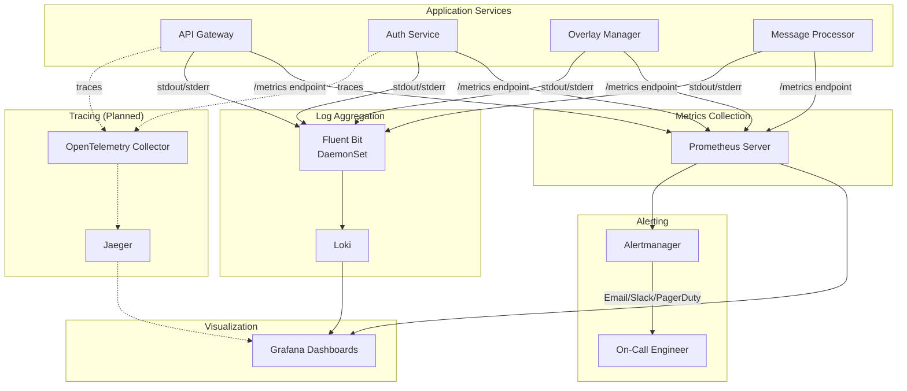
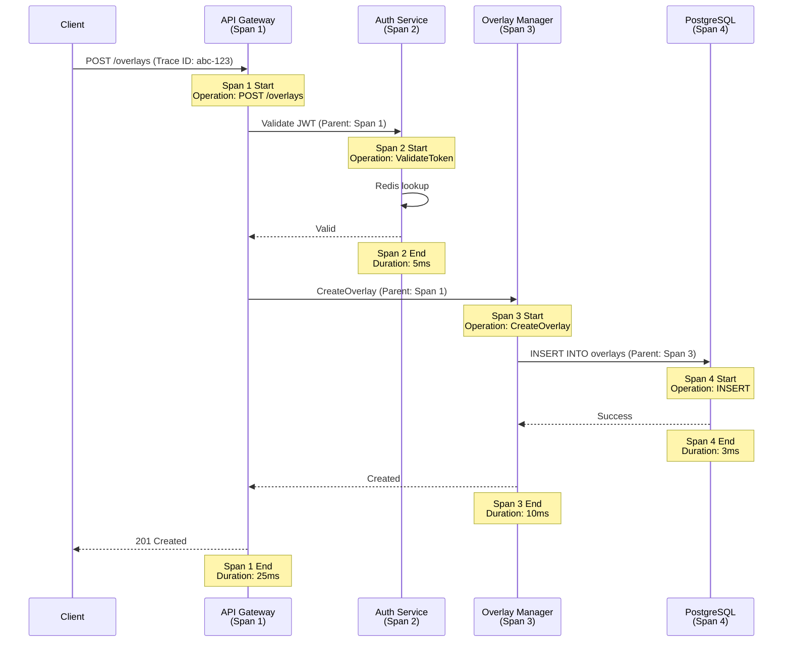

# All-Chat: Observability & Monitoring Architecture

**Version:** 1.0
**Last Updated:** 2025-11-11
**Related Docs**: [Architecture Overview](./ARCHITECTURE_OVERVIEW.md), [Scaling & Performance](./SCALING_PERFORMANCE.md)

---

## Table of Contents

1. [Introduction](#introduction)
2. [Observability Stack](#observability-stack)
3. [Metrics (Prometheus)](#metrics-prometheus)
4. [Logging (Loki/ELK)](#logging-lokilk)
5. [Tracing (OpenTelemetry)](#tracing-opentelemetry)
6. [Dashboards (Grafana)](#dashboards-grafana)
7. [Alerting Rules](#alerting-rules)
8. [SLIs, SLOs, SLAs](#slis-slos-slas)
9. [Runbooks](#runbooks)

---

## Introduction

All-Chat implements comprehensive observability across three pillars:
- **Metrics**: Time-series data (Prometheus)
- **Logs**: Structured event data (Zap → Loki/ELK)
- **Traces**: Request flow tracking (OpenTelemetry planned)

### Observability Goals

| Goal | Target | Current Status |
|------|--------|----------------|
| **Mean Time to Detect (MTTD)** | < 2 minutes | ⏳ Implementing alerts |
| **Mean Time to Resolve (MTTR)** | < 15 minutes | ⏳ Implementing runbooks |
| **Service Availability** | 99.9% (3 nines) | ⏳ Measuring |
| **Metric Collection** | 100% of services | ✅ Health checks exist |
| **Log Aggregation** | 100% of services | ✅ Structured logging |

---

## Observability Stack

### Architecture



### Technology Stack - LGTM (Grafana Labs)

**Decision**: Adopt LGTM stack (Loki + Grafana + Tempo + Mimir) for unified observability.

| Component | Technology | Purpose | Storage | Status |
|-----------|------------|---------|---------|--------|
| **Logs** | Loki | Log aggregation & search | Local PV (Phase 1) | ✅ Deploying |
| **Visualization** | Grafana | Unified dashboards | Local PV | ✅ Deploying |
| **Metrics (short-term)** | Prometheus | 15-day metrics | Local PV | ✅ Deploying |
| **Metrics (long-term)** | Mimir | 90-day metrics | Local PV (Phase 1) | ⏳ Phase 2 |
| **Tracing** | Tempo | Distributed tracing | Local PV (Phase 1) | ⏳ Phase 2 |
| **Alerting** | Alertmanager | Alert routing | N/A | ✅ Deploying |
| **Log Collection** | Promtail | DaemonSet log scraper | N/A | ✅ Deploying |

**Phase 1 (Hetzner VPS)**: Local persistent volumes
**Phase 2+ (Production)**: Migrate to Hetzner Object Storage / S3

---

## Metrics (Prometheus)

### Metric Naming Convention

```
<service>_<subsystem>_<metric>_<unit>

Examples:
- api_gateway_http_requests_total
- message_processor_messages_processed_total
- redis_operations_duration_seconds
```

### Service-Level Metrics

#### API Gateway

```go
// pkg/metrics/api_gateway.go
var (
    // HTTP Metrics
    httpRequestsTotal = prometheus.NewCounterVec(
        prometheus.CounterOpts{
            Name: "api_gateway_http_requests_total",
            Help: "Total number of HTTP requests",
        },
        []string{"method", "path", "status"},
    )

    httpRequestDuration = prometheus.NewHistogramVec(
        prometheus.HistogramOpts{
            Name:    "api_gateway_http_request_duration_seconds",
            Help:    "HTTP request latency",
            Buckets: []float64{.005, .01, .025, .05, .1, .25, .5, 1, 2.5, 5},
        },
        []string{"method", "path"},
    )

    // WebSocket Metrics
    websocketConnectionsActive = prometheus.NewGauge(
        prometheus.GaugeOpts{
            Name: "api_gateway_websocket_connections_active",
            Help: "Number of active WebSocket connections",
        },
    )

    websocketMessagesTotal = prometheus.NewCounterVec(
        prometheus.CounterOpts{
            Name: "api_gateway_websocket_messages_total",
            Help: "Total WebSocket messages sent",
        },
        []string{"overlay_id"},
    )
)
```

**Prometheus Queries**:
```promql
# Request rate (per second)
rate(api_gateway_http_requests_total[5m])

# Average latency (p50)
histogram_quantile(0.50, rate(api_gateway_http_request_duration_seconds_bucket[5m]))

# p95 latency
histogram_quantile(0.95, rate(api_gateway_http_request_duration_seconds_bucket[5m]))

# Error rate
sum(rate(api_gateway_http_requests_total{status=~"5.."}[5m])) / sum(rate(api_gateway_http_requests_total[5m]))
```

---

#### Message Processor

```go
var (
    messagesProcessedTotal = prometheus.NewCounterVec(
        prometheus.CounterOpts{
            Name: "message_processor_messages_processed_total",
            Help: "Total messages processed",
        },
        []string{"platform", "status"},  // status: "success", "error"
    )

    messageProcessingDuration = prometheus.NewHistogram(
        prometheus.HistogramOpts{
            Name:    "message_processor_processing_duration_seconds",
            Help:    "Message processing latency",
            Buckets: []float64{.01, .025, .05, .1, .25, .5, 1},
        },
    )

    streamBacklogSize = prometheus.NewGauge(
        prometheus.GaugeOpts{
            Name: "message_processor_stream_backlog_size",
            Help: "Number of pending messages in Redis Stream",
        },
    )

    emoteEnrichmentCacheHits = prometheus.NewCounter(
        prometheus.CounterOpts{
            Name: "message_processor_emote_cache_hits_total",
            Help: "Emote enrichment cache hits",
        },
    )

    emoteEnrichmentCacheMisses = prometheus.NewCounter(
        prometheus.CounterOpts{
            Name: "message_processor_emote_cache_misses_total",
            Help: "Emote enrichment cache misses",
        },
    )
)
```

**Key Queries**:
```promql
# Processing throughput (messages/second)
rate(message_processor_messages_processed_total[5m])

# Error rate
sum(rate(message_processor_messages_processed_total{status="error"}[5m])) / sum(rate(message_processor_messages_processed_total[5m]))

# Cache hit rate
emote_enrichment_cache_hits / (emote_enrichment_cache_hits + emote_enrichment_cache_misses)

# Backlog alert
message_processor_stream_backlog_size > 5000
```

---

#### Platform Listeners (Twitch, YouTube)

```go
var (
    listenerConnectionsActive = prometheus.NewGaugeVec(
        prometheus.GaugeOpts{
            Name: "platform_listener_connections_active",
            Help: "Active platform connections",
        },
        []string{"platform"},  // "twitch", "youtube"
    )

    listenerMessagesReceivedTotal = prometheus.NewCounterVec(
        prometheus.CounterOpts{
            Name: "platform_listener_messages_received_total",
            Help: "Total messages received from platform",
        },
        []string{"platform", "channel"},
    )

    listenerConnectionErrors = prometheus.NewCounterVec(
        prometheus.CounterOpts{
            Name: "platform_listener_connection_errors_total",
            Help: "Connection errors to platform",
        },
        []string{"platform", "error_type"},
    )

    youtubeAPIQuotaUsed = prometheus.NewGauge(
        prometheus.GaugeOpts{
            Name: "youtube_listener_api_quota_used",
            Help: "YouTube API quota units used today",
        },
    )
)
```

---

#### Database Metrics (pgx)

```go
var (
    dbConnectionsActive = prometheus.NewGauge(
        prometheus.GaugeOpts{
            Name: "database_connections_active",
            Help: "Active database connections",
        },
    )

    dbConnectionsIdle = prometheus.NewGauge(
        prometheus.GaugeOpts{
            Name: "database_connections_idle",
            Help: "Idle database connections",
        },
    )

    dbQueryDuration = prometheus.NewHistogramVec(
        prometheus.HistogramOpts{
            Name:    "database_query_duration_seconds",
            Help:    "Database query latency",
            Buckets: []float64{.001, .005, .01, .025, .05, .1, .25, .5},
        },
        []string{"query_type"},  // "select", "insert", "update", "delete"
    )

    dbErrorsTotal = prometheus.NewCounterVec(
        prometheus.CounterOpts{
            Name: "database_errors_total",
            Help: "Database errors",
        },
        []string{"error_type"},
    )
)
```

---

### Prometheus Service Discovery

**File**: `deployments/k8s/prometheus/configmap.yaml`

```yaml
apiVersion: v1
kind: ConfigMap
metadata:
  name: prometheus-config
  namespace: monitoring
data:
  prometheus.yml: |
    global:
      scrape_interval: 15s
      evaluation_interval: 15s

    scrape_configs:
      # Kubernetes service discovery
      - job_name: 'kubernetes-pods'
        kubernetes_sd_configs:
          - role: pod
            namespaces:
              names:
                - all-chat
        relabel_configs:
          # Only scrape pods with annotation prometheus.io/scrape: "true"
          - source_labels: [__meta_kubernetes_pod_annotation_prometheus_io_scrape]
            action: keep
            regex: true
          # Use custom port if specified
          - source_labels: [__meta_kubernetes_pod_annotation_prometheus_io_port]
            action: replace
            target_label: __address__
            regex: ([^:]+)(?::\d+)?;(\d+)
            replacement: $1:$2
          # Use custom path if specified
          - source_labels: [__meta_kubernetes_pod_annotation_prometheus_io_path]
            action: replace
            target_label: __metrics_path__
            regex: (.+)
          # Add pod labels
          - action: labelmap
            regex: __meta_kubernetes_pod_label_(.+)
```

---

## Logging (Loki/ELK)

### Structured Logging with Zap

All services use **Zap** for structured JSON logging.

#### Log Levels

| Level | Usage | Example |
|-------|-------|---------|
| **DEBUG** | Development debugging | `logger.Debug("cache key not found", zap.String("key", key))` |
| **INFO** | Normal operations | `logger.Info("overlay created", zap.String("overlay_id", id))` |
| **WARN** | Non-critical issues | `logger.Warn("high backlog", zap.Int64("pending", count))` |
| **ERROR** | Errors requiring attention | `logger.Error("database query failed", zap.Error(err))` |
| **FATAL** | Unrecoverable errors | `logger.Fatal("failed to connect to database", zap.Error(err))` |

#### Log Format

```json
{
  "level": "info",
  "ts": "2025-11-11T12:34:56.789Z",
  "caller": "services/overlay_service.go:123",
  "msg": "overlay created",
  "service": "overlay-manager",
  "version": "v1.2.0",
  "user_id": "uuid-123",
  "overlay_id": "uuid-456",
  "name": "My Overlay",
  "duration_ms": 45
}
```

#### Logger Initialization

```go
// pkg/logger/zap.go
func NewLogger(serviceName, level string) *zap.Logger {
    config := zap.NewProductionConfig()
    config.Level = zap.NewAtomicLevelAt(parseLevel(level))
    config.EncoderConfig.TimeKey = "ts"
    config.EncoderConfig.EncodeTime = zapcore.ISO8601TimeEncoder

    logger, _ := config.Build(
        zap.Fields(
            zap.String("service", serviceName),
            zap.String("version", os.Getenv("APP_VERSION")),
        ),
    )

    return logger
}
```

#### Usage Example

```go
logger := logger.NewLogger("message-processor", "info")

// Log with structured fields
logger.Info("processing message",
    zap.String("message_id", msg.ID),
    zap.String("platform", msg.Platform),
    zap.String("channel", msg.ChannelID),
    zap.Duration("duration", time.Since(start)),
)

// Log errors with stack trace
if err != nil {
    logger.Error("failed to enrich message",
        zap.String("message_id", msg.ID),
        zap.Error(err),
        zap.Stack("stack"),
    )
}
```

---

### Log Aggregation (Loki) - Phase 1 Deployment

**Architecture**:
- **Promtail** (DaemonSet): Collects logs from all pods (lighter than Fluent Bit)
- **Loki**: Stores and indexes logs (monolithic mode for Phase 1)
- **Grafana**: Queries and visualizes logs

**Phase 1 Configuration (Hetzner VPS - Local Storage)**:
```yaml
# Loki in monolithic mode (all components in one pod)
# For Phase 1: Simple, easy to operate
# For Phase 2+: Migrate to microservices mode

loki:
  replicas: 1
  persistence:
    enabled: true
    storageClassName: hcloud-volumes
    size: 50Gi  # Stores ~30 days of logs

  # Retention
  limits_config:
    retention_period: 30d

  # Resource limits
  resources:
    requests:
      cpu: 500m
      memory: 1Gi
    limits:
      cpu: 2000m
      memory: 4Gi
```

**Deployment Files**:
- `deployments/k8s/lgtm/loki-statefulset.yaml`
- `deployments/k8s/lgtm/promtail-daemonset.yaml`

```yaml
apiVersion: apps/v1
kind: DaemonSet
metadata:
  name: fluent-bit
  namespace: logging
spec:
  selector:
    matchLabels:
      app: fluent-bit
  template:
    metadata:
      labels:
        app: fluent-bit
    spec:
      serviceAccountName: fluent-bit
      containers:
        - name: fluent-bit
          image: fluent/fluent-bit:2.0
          volumeMounts:
            - name: varlog
              mountPath: /var/log
            - name: varlibdockercontainers
              mountPath: /var/lib/docker/containers
              readOnly: true
            - name: fluent-bit-config
              mountPath: /fluent-bit/etc/
      volumes:
        - name: varlog
          hostPath:
            path: /var/log
        - name: varlibdockercontainers
          hostPath:
            path: /var/lib/docker/containers
        - name: fluent-bit-config
          configMap:
            name: fluent-bit-config
```

**Fluent Bit Config**:
```ini
[SERVICE]
    Flush        5
    Daemon       Off
    Log_Level    info

[INPUT]
    Name              tail
    Path              /var/log/containers/*all-chat*.log
    Parser            docker
    Tag               kube.*
    Refresh_Interval  5

[FILTER]
    Name                kubernetes
    Match               kube.*
    Kube_URL            https://kubernetes.default.svc:443
    Kube_Tag_Prefix     kube.var.log.containers.
    Merge_Log           On
    Keep_Log            Off

[OUTPUT]
    Name   loki
    Match  *
    Host   loki.logging.svc.cluster.local
    Port   3100
    Labels job=fluent-bit
```

---

### LogQL Queries (Loki)

```logql
# All logs from message-processor
{service="message-processor"}

# Error logs across all services
{namespace="all-chat"} |= "level=error"

# Logs for specific overlay
{service="api-gateway"} | json | overlay_id="abc-123"

# High latency queries
{service="message-processor"} | json | duration_ms > 1000

# Rate of errors per service
rate({namespace="all-chat"} |= "level=error" [5m])
```

---

## Tracing (OpenTelemetry)

### Distributed Tracing (Planned)

**Goal**: Track request flow across services



### OpenTelemetry Setup (Future)

```go
// pkg/telemetry/tracer.go
import (
    "go.opentelemetry.io/otel"
    "go.opentelemetry.io/otel/exporters/jaeger"
    "go.opentelemetry.io/otel/sdk/trace"
)

func InitTracer(serviceName string) (*trace.TracerProvider, error) {
    exporter, err := jaeger.New(jaeger.WithCollectorEndpoint(
        jaeger.WithEndpoint("http://jaeger-collector:14268/api/traces"),
    ))
    if err != nil {
        return nil, err
    }

    tp := trace.NewTracerProvider(
        trace.WithBatcher(exporter),
        trace.WithResource(resource.NewWithAttributes(
            semconv.SchemaURL,
            semconv.ServiceNameKey.String(serviceName),
        )),
    )

    otel.SetTracerProvider(tp)
    return tp, nil
}
```

---

## Dashboards (Grafana)

### Dashboard: System Overview

**Panels**:
1. **Service Health**: Up/Down status of all services
2. **Request Rate**: Requests/second per service
3. **Error Rate**: Errors/second per service
4. **Latency (p50, p95, p99)**: Per service
5. **Active WebSocket Connections**: API Gateway
6. **Database Connection Pool**: Active/Idle connections
7. **Redis Operations**: Operations/second
8. **Message Backlog**: Redis Stream pending messages

### Dashboard: Message Pipeline

**Panels**:
1. **Message Ingestion Rate**: Messages/second per platform
2. **Message Processing Rate**: Processed/second
3. **Processing Latency**: p50, p95, p99
4. **Emote Cache Hit Rate**: Percentage
5. **Pipeline Backlog**: Pending messages
6. **Error Rate by Platform**: Twitch vs YouTube errors

### Dashboard: Platform Listeners

**Panels**:
1. **Active Connections**: Per platform
2. **Messages Received**: Rate per platform
3. **Connection Errors**: Errors/second
4. **YouTube API Quota**: Used/Total
5. **Twitch Rate Limit Status**: Remaining capacity

---

## Alerting Rules

### Critical Alerts (PagerDuty)

```yaml
# deployments/k8s/prometheus/alerts.yaml
groups:
  - name: critical
    interval: 30s
    rules:
      # Service Down
      - alert: ServiceDown
        expr: up{job="kubernetes-pods"} == 0
        for: 2m
        labels:
          severity: critical
        annotations:
          summary: "Service {{ $labels.pod }} is down"
          description: "{{ $labels.pod }} in namespace {{ $labels.namespace }} has been down for more than 2 minutes."

      # High Error Rate
      - alert: HighErrorRate
        expr: |
          (
            sum(rate(api_gateway_http_requests_total{status=~"5.."}[5m]))
            /
            sum(rate(api_gateway_http_requests_total[5m]))
          ) > 0.05
        for: 5m
        labels:
          severity: critical
        annotations:
          summary: "High error rate on API Gateway"
          description: "Error rate is {{ $value | humanizePercentage }} (threshold: 5%)"

      # Database Connection Pool Exhausted
      - alert: DatabaseConnectionPoolExhausted
        expr: database_connections_active >= database_connections_max
        for: 2m
        labels:
          severity: critical
        annotations:
          summary: "Database connection pool exhausted"
          description: "All database connections are in use."
```

### Warning Alerts (Slack)

```yaml
  - name: warning
    interval: 1m
    rules:
      # High Latency
      - alert: HighLatency
        expr: |
          histogram_quantile(0.95,
            rate(api_gateway_http_request_duration_seconds_bucket[5m])
          ) > 0.5
        for: 10m
        labels:
          severity: warning
        annotations:
          summary: "High API latency (p95 > 500ms)"
          description: "p95 latency is {{ $value }}s"

      # Message Backlog
      - alert: MessageBacklog
        expr: message_processor_stream_backlog_size > 5000
        for: 5m
        labels:
          severity: warning
        annotations:
          summary: "High message backlog"
          description: "{{ $value }} messages pending in stream"

      # YouTube Quota Warning
      - alert: YouTubeQuotaHigh
        expr: youtube_listener_api_quota_used > 8000
        for: 1m
        labels:
          severity: warning
        annotations:
          summary: "YouTube API quota nearing limit"
          description: "Quota used: {{ $value }}/10000 units"
```

---

## SLIs, SLOs, SLAs

### Service Level Indicators (SLIs)

| SLI | Measurement | Target |
|-----|-------------|--------|
| **Availability** | `up == 1` | 99.9% |
| **Request Success Rate** | `http_requests_total{status!~"5.."} / http_requests_total` | 99.5% |
| **Latency (p95)** | `histogram_quantile(0.95, http_request_duration_seconds)` | < 500ms |
| **Message Delivery** | `messages_delivered / messages_ingested` | 99.9% |
| **Error Budget** | `1 - availability` | 0.1% |

### Service Level Objectives (SLOs)

| Service | SLO | Measurement Window | Error Budget |
|---------|-----|-------------------|--------------|
| **API Gateway** | 99.9% uptime | 30 days | 43 minutes/month |
| **Auth Service** | 99.9% success rate | 30 days | 0.1% failed requests |
| **Message Processor** | p95 < 500ms | 7 days | 5% of requests can exceed |

### Service Level Agreements (SLAs)

| Tier | Availability | Support Response | Compensation |
|------|--------------|------------------|--------------|
| **Free** | Best effort | Community support | N/A |
| **Pro** | 99.9% | 24-hour response | 10% credit per 0.1% below |
| **Enterprise** | 99.95% | 1-hour response | 25% credit per 0.1% below |

---

## Runbooks

### Runbook: Service Down

**Alert**: `ServiceDown`
**Severity**: Critical

**Steps**:
1. Check pod status: `kubectl get pods -n all-chat`
2. View pod events: `kubectl describe pod <pod-name> -n all-chat`
3. Check logs: `kubectl logs <pod-name> -n all-chat --tail=100`
4. Common issues:
   - **ImagePullBackOff**: Check image tag exists
   - **CrashLoopBackOff**: Check logs for startup errors
   - **Pending**: Check node resources (`kubectl describe node`)
5. Restart deployment: `kubectl rollout restart deployment/<name> -n all-chat`

---

### Runbook: High Message Backlog

**Alert**: `MessageBacklog`
**Severity**: Warning

**Steps**:
1. Check current backlog:
   ```bash
   kubectl exec -it redis-0 -n all-chat -- redis-cli XPENDING stream:raw-messages processor-group
   ```
2. Check message processor CPU/memory:
   ```bash
   kubectl top pods -n all-chat -l app=message-processor
   ```
3. Scale message processors:
   ```bash
   kubectl scale deployment/message-processor --replicas=7 -n all-chat
   ```
4. Monitor backlog reduction in Grafana
5. If backlog persists, check for:
   - Emote service latency (cache issues)
   - Database connection pool saturation
   - Redis CPU/memory limits

---

### Runbook: YouTube Quota Exhausted

**Alert**: `YouTubeQuotaHigh`
**Severity**: Warning

**Steps**:
1. Check current quota usage in GCP Console
2. Temporarily increase polling interval:
   ```bash
   kubectl set env deployment/youtube-listener POLLING_INTERVAL=15 -n all-chat
   ```
3. Request quota increase from Google (takes 2-3 business days)
4. Consider:
   - Adding additional GCP projects for quota pooling
   - Disabling YouTube listeners for low-activity streams
5. Monitor quota usage in Grafana

---

## Summary

This document provides comprehensive observability guidance with LGTM stack:

1. **Metrics**: Prometheus (15d) + Mimir (90d) for all services
2. **Logging**: Structured logging with Zap → Promtail → Loki
3. **Tracing**: Tempo + OpenTelemetry (Phase 2)
4. **Dashboards**: Grafana unified visualization
5. **Alerting**: Critical and warning alert rules via Alertmanager
6. **SLIs/SLOs/SLAs**: Service level commitments
7. **Runbooks**: Incident response procedures

### Phase 1 Implementation (Hetzner VPS - Local Storage)

**Components to Deploy**:
- ✅ Loki (monolithic, 50Gi PV, 30-day retention)
- ✅ Promtail (DaemonSet, log collection)
- ✅ Grafana (10Gi PV for dashboards)
- ✅ Prometheus (50Gi PV, 15-day retention)
- ✅ Alertmanager (PagerDuty/Slack integration)

**Storage Requirements**:
- Loki: 50Gi
- Prometheus: 50Gi
- Grafana: 10Gi
- **Total**: ~110Gi

**Cost (Hetzner)**:
- Storage: ~€10/month (110Gi)
- Compute: Already included in cluster nodes

**Phase 2 Migration**:
- Migrate Loki/Mimir/Tempo to Hetzner Object Storage
- Reduce local storage costs
- Increase retention to 90 days

**Next Steps**:
- [SECURITY_ARCHITECTURE.md](./SECURITY_ARCHITECTURE.md) - Security design
- [IMPLEMENTATION_ROADMAP.md](./IMPLEMENTATION_ROADMAP.md) - Implementation plan

---

**Document Maintainers**: SRE Team
**Last Review**: 2025-11-11
**Last Update**: 2025-11-11 - Added LGTM stack with Hetzner local storage configuration
