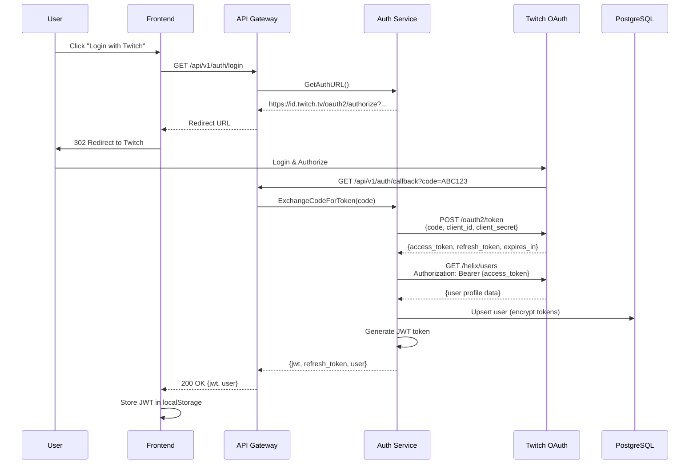
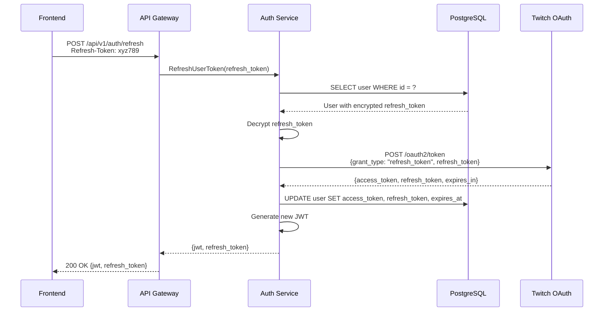
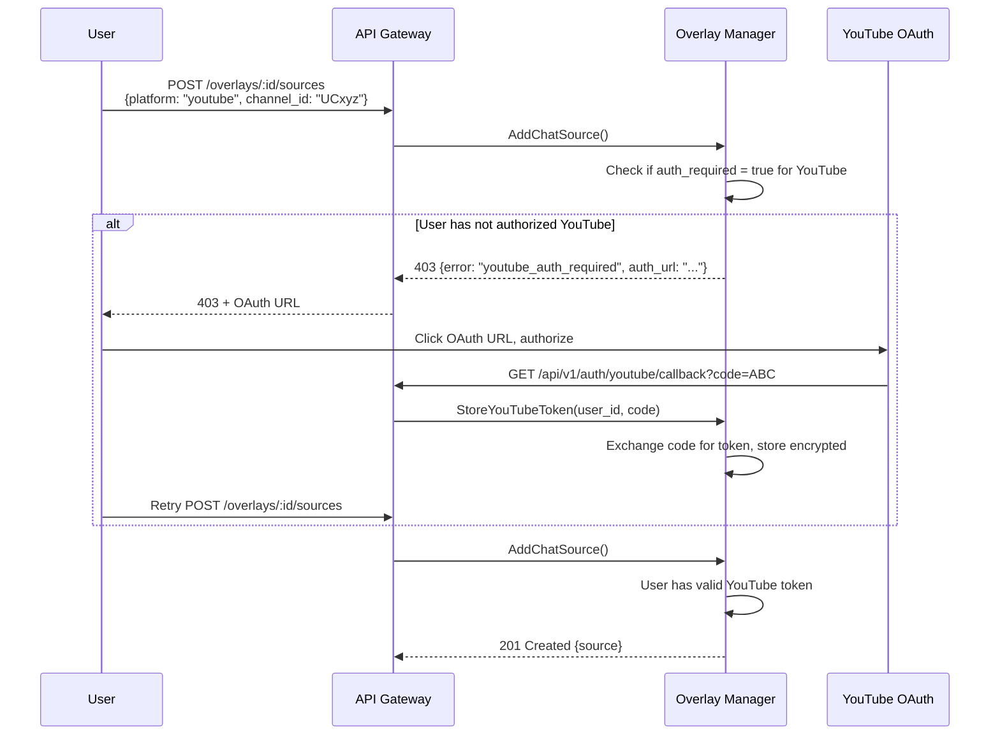

# All-Chat: Security Architecture

**Version:** 1.0
**Last Updated:** 2025-11-11
**Related Docs**: [Architecture Overview](./ARCHITECTURE_OVERVIEW.md), [Component Architecture](./COMPONENT_ARCHITECTURE.md)

---

## Table of Contents

1. [Introduction](#introduction)
2. [Authentication](#authentication)
3. [Authorization](#authorization)
4. [Multi-Platform OAuth](#multi-platform-oauth)
5. [API Security](#api-security)
6. [Data Protection](#data-protection)
7. [Network Security](#network-security)
8. [Secrets Management](#secrets-management)
9. [Security Best Practices](#security-best-practices)
10. [Threat Model](#threat-model)
11. [Compliance](#compliance)

---

## Introduction

All-Chat implements defense-in-depth security across multiple layers:
- **Authentication**: OAuth 2.0 + JWT
- **Authorization**: Role-based access control (RBAC)
- **Data Protection**: Encryption at rest and in transit
- **Network Security**: TLS, network policies, firewalls
- **Secrets Management**: Kubernetes Secrets + external vaults

### Security Principles

1. **Least Privilege**: Grant minimal necessary permissions
2. **Defense in Depth**: Multiple security layers
3. **Zero Trust**: Verify every request
4. **Encryption Everywhere**: Data at rest and in transit
5. **Auditability**: Log all security events

---

## Authentication

### Twitch OAuth 2.0 Flow



### JWT Token Structure

```json
{
  "header": {
    "alg": "HS256",
    "typ": "JWT"
  },
  "payload": {
    "sub": "user-uuid-123",               // Subject (user ID)
    "twitch_id": "12345678",              // Twitch user ID
    "username": "streamer123",            // Username
    "email": "user@example.com",          // Email (optional)
    "roles": ["user"],                    // Roles (future: ["admin", "moderator"])
    "iat": 1699999999,                    // Issued at (Unix timestamp)
    "exp": 1700086399                     // Expires at (24 hours later)
  },
  "signature": "..."
}
```

### JWT Generation

```go
// pkg/auth/jwt.go
func GenerateJWT(user *domain.User, secret string) (string, error) {
    claims := jwt.MapClaims{
        "sub":       user.ID,
        "twitch_id": user.TwitchID,
        "username":  user.Username,
        "email":     user.Email,
        "roles":     []string{"user"},
        "iat":       time.Now().Unix(),
        "exp":       time.Now().Add(24 * time.Hour).Unix(),
    }

    token := jwt.NewWithClaims(jwt.SigningMethodHS256, claims)
    return token.SignedString([]byte(secret))
}
```

### JWT Validation Middleware

```go
// pkg/middleware/auth.go
func JWTAuth(jwtSecret string) gin.HandlerFunc {
    return func(c *gin.Context) {
        authHeader := c.GetHeader("Authorization")
        if authHeader == "" {
            c.AbortWithStatusJSON(401, gin.H{"error": "missing authorization header"})
            return
        }

        // Extract Bearer token
        tokenString := strings.TrimPrefix(authHeader, "Bearer ")

        // Parse and validate JWT
        token, err := jwt.Parse(tokenString, func(token *jwt.Token) (interface{}, error) {
            if _, ok := token.Method.(*jwt.SigningMethodHMAC); !ok {
                return nil, fmt.Errorf("unexpected signing method")
            }
            return []byte(jwtSecret), nil
        })

        if err != nil || !token.Valid {
            c.AbortWithStatusJSON(401, gin.H{"error": "invalid token"})
            return
        }

        // Extract claims
        claims, ok := token.Claims.(jwt.MapClaims)
        if !ok {
            c.AbortWithStatusJSON(401, gin.H{"error": "invalid claims"})
            return
        }

        // Set user context
        c.Set("user_id", claims["sub"])
        c.Set("username", claims["username"])
        c.Set("roles", claims["roles"])

        c.Next()
    }
}
```

### Token Refresh Flow



---

## Authorization

### Role-Based Access Control (RBAC)

| Role | Permissions | Assigned To |
|------|-------------|-------------|
| **user** | Create overlays, manage own resources | All authenticated users |
| **moderator** | Manage user reports, moderate content | Appointed by admins |
| **admin** | Full system access, user management | Platform administrators |

### Resource Ownership

```go
// Check if user owns the overlay
func (s *OverlayService) GetOverlay(ctx context.Context, overlayID string, userID string) (*domain.Overlay, error) {
    overlay, err := s.repo.GetByID(ctx, overlayID)
    if err != nil {
        return nil, err
    }

    // Authorization check
    if overlay.UserID != userID {
        return nil, ErrUnauthorized
    }

    return overlay, nil
}
```

### API Endpoint Authorization

| Endpoint | Auth Required | Authorization Check |
|----------|---------------|---------------------|
| `GET /auth/login` | No | N/A |
| `GET /auth/callback` | No | N/A |
| `POST /auth/refresh` | Yes (refresh token) | Token validity |
| `GET /auth/me` | Yes (JWT) | Valid JWT |
| `GET /overlays` | Yes (JWT) | User's own overlays |
| `POST /overlays` | Yes (JWT) | N/A (creates for authenticated user) |
| `GET /overlays/:id` | Yes (JWT) | Overlay belongs to user |
| `PUT /overlays/:id` | Yes (JWT) | Overlay belongs to user |
| `DELETE /overlays/:id` | Yes (JWT) | Overlay belongs to user |
| `/ws/overlay/:id` | Yes (JWT in query param) | User owns overlay |

---

## Multi-Platform OAuth

### Platform OAuth Strategies

| Platform | OAuth Type | Client Type | Scope Required |
|----------|------------|-------------|----------------|
| **Twitch** | OAuth 2.0 | Confidential | `user:read:email` |
| **YouTube** | OAuth 2.0 | Confidential | `https://www.googleapis.com/auth/youtube.readonly` |
| **Kick** | API Key (unofficial) | N/A | N/A (public chat) |
| **TikTok** | OAuth 2.0 | Confidential | `user.info.basic`, `video.list` |

### YouTube OAuth Flow



### Token Storage (Encrypted)

```go
// Encrypt token before storing
func EncryptToken(plaintext, key string) (string, error) {
    block, err := aes.NewCipher([]byte(key))
    if err != nil {
        return "", err
    }

    gcm, err := cipher.NewGCM(block)
    if err != nil {
        return "", err
    }

    nonce := make([]byte, gcm.NonceSize())
    if _, err := io.ReadFull(rand.Reader, nonce); err != nil {
        return "", err
    }

    ciphertext := gcm.Seal(nonce, nonce, []byte(plaintext), nil)
    return base64.StdEncoding.EncodeToString(ciphertext), nil
}

// Decrypt token when needed
func DecryptToken(ciphertext, key string) (string, error) {
    data, err := base64.StdEncoding.DecodeString(ciphertext)
    if err != nil {
        return "", err
    }

    block, err := aes.NewCipher([]byte(key))
    if err != nil {
        return "", err
    }

    gcm, err := cipher.NewGCM(block)
    if err != nil {
        return "", err
    }

    nonceSize := gcm.NonceSize()
    nonce, ciphertext := data[:nonceSize], data[nonceSize:]

    plaintext, err := gcm.Open(nil, nonce, ciphertext, nil)
    if err != nil {
        return "", err
    }

    return string(plaintext), nil
}
```

**IMPORTANT**: Use a strong encryption key (32 bytes) stored in Kubernetes Secrets:
```bash
kubectl create secret generic encryption-key \
  --from-literal=key=$(openssl rand -base64 32) \
  -n all-chat
```

---

## API Security

### Rate Limiting (Planned)

```go
// pkg/middleware/rate_limit.go
type RateLimiter struct {
    redis  *redis.Client
    limit  int           // Max requests
    window time.Duration // Time window
}

func (rl *RateLimiter) Limit() gin.HandlerFunc {
    return func(c *gin.Context) {
        userID := c.GetString("user_id")
        key := fmt.Sprintf("rate_limit:%s", userID)

        // Increment request count
        count, err := rl.redis.Incr(c.Request.Context(), key).Result()
        if err != nil {
            c.AbortWithStatusJSON(500, gin.H{"error": "rate limit check failed"})
            return
        }

        // Set expiry on first request
        if count == 1 {
            rl.redis.Expire(c.Request.Context(), key, rl.window)
        }

        // Check limit
        if count > int64(rl.limit) {
            c.Header("X-RateLimit-Limit", strconv.Itoa(rl.limit))
            c.Header("X-RateLimit-Remaining", "0")
            c.Header("X-RateLimit-Reset", strconv.FormatInt(time.Now().Add(rl.window).Unix(), 10))
            c.AbortWithStatusJSON(429, gin.H{"error": "rate limit exceeded"})
            return
        }

        c.Header("X-RateLimit-Limit", strconv.Itoa(rl.limit))
        c.Header("X-RateLimit-Remaining", strconv.FormatInt(int64(rl.limit)-count, 10))
        c.Next()
    }
}
```

**Rate Limit Tiers**:
| Endpoint | Free Tier | Pro Tier | Enterprise |
|----------|-----------|----------|------------|
| `/auth/*` | 10 req/min | 100 req/min | Unlimited |
| `/overlays/*` | 60 req/min | 600 req/min | Unlimited |
| `/emotes/*` | 120 req/min | 1200 req/min | Unlimited |

### CORS Configuration

```go
// pkg/middleware/cors.go
func CORS() gin.HandlerFunc {
    return cors.New(cors.Config{
        AllowOrigins:     []string{"https://allchat.io", "https://*.allchat.io"},
        AllowMethods:     []string{"GET", "POST", "PUT", "DELETE", "OPTIONS"},
        AllowHeaders:     []string{"Origin", "Content-Type", "Authorization"},
        ExposeHeaders:    []string{"Content-Length", "X-RateLimit-Limit"},
        AllowCredentials: true,
        MaxAge:           12 * time.Hour,
    })
}
```

### Input Validation

```go
// Validate and sanitize user input
func (h *OverlayHandler) HandleCreateOverlay(c *gin.Context) {
    var req CreateOverlayRequest
    if err := c.ShouldBindJSON(&req); err != nil {
        c.JSON(400, gin.H{"error": "invalid request"})
        return
    }

    // Validate name
    if len(req.Name) < 1 || len(req.Name) > 100 {
        c.JSON(400, gin.H{"error": "name must be 1-100 characters"})
        return
    }

    // Sanitize HTML
    req.Name = html.EscapeString(req.Name)
    req.Description = html.EscapeString(req.Description)

    // Proceed with service call
    overlay, err := h.service.CreateOverlay(c.Request.Context(), req)
    // ...
}
```

### SQL Injection Prevention

```go
// ALWAYS use parameterized queries (pgx automatically handles this)
func (r *PostgresOverlayRepository) GetByID(ctx context.Context, id string) (*domain.Overlay, error) {
    var overlay domain.Overlay
    err := r.pool.QueryRow(ctx,
        "SELECT id, user_id, name, description, is_active, created_at, updated_at FROM overlays WHERE id = $1",
        id, // Parameter (safe)
    ).Scan(&overlay.ID, &overlay.UserID, &overlay.Name, &overlay.Description, &overlay.IsActive, &overlay.CreatedAt, &overlay.UpdatedAt)
    return &overlay, err
}

// NEVER do this (vulnerable to SQL injection):
// query := fmt.Sprintf("SELECT * FROM overlays WHERE id = '%s'", id)  // DANGEROUS!
```

---

## Data Protection

### Encryption at Rest

| Data Type | Encryption Method | Key Management |
|-----------|-------------------|----------------|
| **OAuth Tokens** | AES-256-GCM | Kubernetes Secret (encryption key) |
| **User Passwords** | N/A (OAuth only, no passwords) | N/A |
| **Database** | PostgreSQL TDE (Transparent Data Encryption) | Cloud KMS (AWS RDS encryption) |
| **Redis** | Redis encryption at rest (cloud provider) | Cloud KMS |
| **Backups** | Cloud-provider encryption | Cloud KMS |

### Encryption in Transit

- **External**: TLS 1.3 (Ingress → API Gateway)
- **Internal**: TLS 1.2+ (Service-to-service, planned)
- **Database**: TLS 1.2+ (App → PostgreSQL)
- **Redis**: TLS 1.2+ (App → Redis, optional)

```yaml
# Ingress TLS configuration
spec:
  tls:
    - hosts:
        - api.allchat.io
      secretName: allchat-tls  # Let's Encrypt certificate
```

### Data Retention

| Data Type | Retention Period | Deletion Method |
|-----------|------------------|-----------------|
| **User Accounts** | Until user deletion request | Hard delete (GDPR compliance) |
| **OAuth Tokens** | Until expiry or revocation | Overwrite + hard delete |
| **Logs** | 30 days | Automatic deletion (Loki retention) |
| **Metrics** | 90 days | Automatic deletion (Prometheus retention) |
| **Overlays** | Until user deletion | Cascade delete (FK constraint) |

---

## Network Security

### Kubernetes Network Policies

```yaml
# deployments/k8s/network-policy.yaml
apiVersion: networking.k8s.io/v1
kind: NetworkPolicy
metadata:
  name: api-gateway-policy
  namespace: all-chat
spec:
  podSelector:
    matchLabels:
      app: api-gateway
  policyTypes:
    - Ingress
    - Egress
  ingress:
    - from:
        - namespaceSelector:
            matchLabels:
              name: ingress-nginx
      ports:
        - protocol: TCP
          port: 8080
  egress:
    # Allow to Auth Service
    - to:
        - podSelector:
            matchLabels:
              app: auth-service
      ports:
        - protocol: TCP
          port: 8081
    # Allow to Overlay Manager
    - to:
        - podSelector:
            matchLabels:
              app: overlay-service
      ports:
        - protocol: TCP
          port: 8082
    # Allow DNS
    - to:
        - namespaceSelector: {}
          podSelector:
            matchLabels:
              k8s-app: kube-dns
      ports:
        - protocol: UDP
          port: 53
```

### Firewall Rules (Cloud Provider)

```
# AWS Security Group Rules
Ingress:
  - Port 443 (HTTPS) from 0.0.0.0/0
  - Port 80 (HTTP, redirect to HTTPS) from 0.0.0.0/0

Egress:
  - Port 443 (HTTPS) to 0.0.0.0/0 (external API calls)
  - Port 80 (HTTP) to 0.0.0.0/0 (external API calls)
  - Internal VPC traffic (all ports)
```

---

## Secrets Management

### Kubernetes Secrets

```bash
# Create secrets manually
kubectl create secret generic all-chat-secrets \
  --from-literal=jwt_secret='your-secret-key' \
  --from-literal=database_password='secure-password' \
  --from-literal=twitch_client_secret='your-client-secret' \
  --from-literal=encryption_key='your-32-byte-key' \
  -n all-chat
```

### External Secrets Operator (Recommended)

```yaml
# Use External Secrets Operator with AWS Secrets Manager
apiVersion: external-secrets.io/v1beta1
kind: SecretStore
metadata:
  name: aws-secrets-manager
  namespace: all-chat
spec:
  provider:
    aws:
      service: SecretsManager
      region: us-east-1
      auth:
        jwt:
          serviceAccountRef:
            name: all-chat-sa
---
apiVersion: external-secrets.io/v1beta1
kind: ExternalSecret
metadata:
  name: all-chat-secrets
  namespace: all-chat
spec:
  refreshInterval: 1h
  secretStoreRef:
    name: aws-secrets-manager
    kind: SecretStore
  target:
    name: all-chat-secrets
    creationPolicy: Owner
  data:
    - secretKey: jwt_secret
      remoteRef:
        key: all-chat/jwt-secret
    - secretKey: database_password
      remoteRef:
        key: all-chat/database-password
```

### Secret Rotation

```bash
# Rotate JWT secret
NEW_SECRET=$(openssl rand -base64 32)
kubectl create secret generic all-chat-secrets-new \
  --from-literal=jwt_secret=$NEW_SECRET \
  --dry-run=client -o yaml | kubectl apply -f -

# Update deployments to use new secret
kubectl set env deployment/api-gateway --from=secret/all-chat-secrets-new -n all-chat

# Graceful rollout
kubectl rollout restart deployment/api-gateway -n all-chat
```

---

## Security Best Practices

### 1. Principle of Least Privilege

```yaml
# Run containers as non-root user
spec:
  securityContext:
    runAsNonRoot: true
    runAsUser: 1000
    fsGroup: 1000
  containers:
    - name: api-gateway
      securityContext:
        allowPrivilegeEscalation: false
        readOnlyRootFilesystem: true
        capabilities:
          drop:
            - ALL
```

### 2. Immutable Infrastructure

```yaml
# Use specific image tags, not :latest
spec:
  containers:
    - name: api-gateway
      image: allchat/api-gateway:v1.2.3  # Specific version
      imagePullPolicy: IfNotPresent
```

### 3. Security Scanning

```bash
# Scan Docker images for vulnerabilities (CI/CD)
docker scan allchat/api-gateway:v1.2.3
trivy image allchat/api-gateway:v1.2.3
```

### 4. Dependency Management

```bash
# Keep Go dependencies up to date
go get -u ./...
go mod tidy

# Check for known vulnerabilities
go list -json -m all | nancy sleuth
govulncheck ./...
```

### 5. Secure Defaults

```go
// HTTP server timeouts
srv := &http.Server{
    Addr:           ":8080",
    Handler:        router,
    ReadTimeout:    10 * time.Second,
    WriteTimeout:   30 * time.Second,
    IdleTimeout:    120 * time.Second,
    MaxHeaderBytes: 1 << 20, // 1 MB
}
```

---

## Threat Model

### Threat: Unauthorized Access to Overlays

**Attack Vector**: User attempts to access another user's overlay
**Mitigation**:
- Authorization checks in Overlay Manager
- JWT validation on API Gateway
- Database-level foreign key constraints

### Threat: Token Theft

**Attack Vector**: JWT or OAuth token stolen via XSS or man-in-the-middle
**Mitigation**:
- Short JWT expiry (24 hours)
- HttpOnly cookies for frontend (planned)
- TLS encryption in transit
- Token refresh flow

### Threat: SQL Injection

**Attack Vector**: Malicious input in API requests
**Mitigation**:
- Parameterized queries (pgx)
- Input validation and sanitization
- Web Application Firewall (WAF) (planned)

### Threat: DDoS Attack

**Attack Vector**: Overwhelming system with requests
**Mitigation**:
- Rate limiting per user
- Cloud-provider DDoS protection (AWS Shield, Cloudflare)
- HPA auto-scaling
- Circuit breakers

### Threat: Data Breach (Database)

**Attack Vector**: Direct database access or SQL injection
**Mitigation**:
- Encrypted OAuth tokens at rest
- PostgreSQL network isolation (private subnet)
- Database access auditing
- Regular security patches

---

## Compliance

### GDPR Compliance

| Requirement | Implementation |
|-------------|----------------|
| **Right to Access** | `GET /auth/me` returns user data |
| **Right to Deletion** | `DELETE /auth/me` deletes user + cascades |
| **Data Portability** | `GET /auth/export` returns JSON (planned) |
| **Consent** | OAuth authorization flow |
| **Data Minimization** | Only store necessary user data |
| **Encryption** | Tokens encrypted at rest, TLS in transit |

### CCPA Compliance

| Requirement | Implementation |
|-------------|----------------|
| **Right to Know** | `GET /auth/me` |
| **Right to Delete** | `DELETE /auth/me` |
| **Right to Opt-Out** | Analytics opt-out (planned) |

### SOC 2 (Future)

- Access control logs
- Security incident response plan
- Regular security audits
- Vendor risk management

---

## Summary

This document provides comprehensive security architecture:

1. **Authentication**: OAuth 2.0 + JWT
2. **Authorization**: RBAC + resource ownership
3. **Multi-Platform OAuth**: Twitch, YouTube, Kick, TikTok
4. **API Security**: Rate limiting, CORS, input validation
5. **Data Protection**: Encryption at rest and in transit
6. **Network Security**: Network policies, firewalls
7. **Secrets Management**: Kubernetes Secrets + external vaults
8. **Best Practices**: Least privilege, secure defaults
9. **Threat Model**: Identified threats and mitigations
10. **Compliance**: GDPR, CCPA

**Next Steps**:
- [IMPLEMENTATION_ROADMAP.md](./IMPLEMENTATION_ROADMAP.md) - Implementation plan

---

**Document Maintainers**: Security Team
**Last Review**: 2025-11-11
