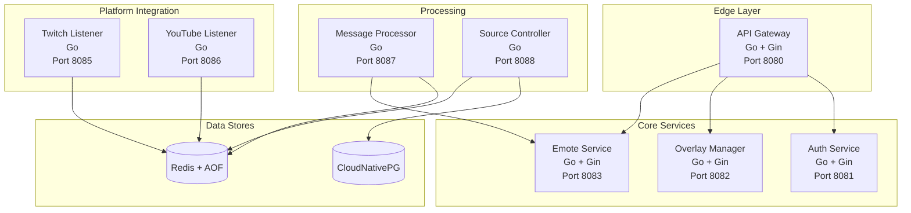
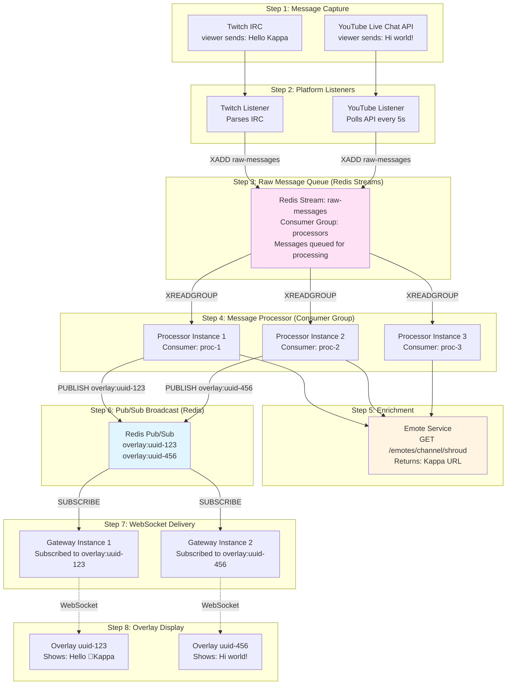
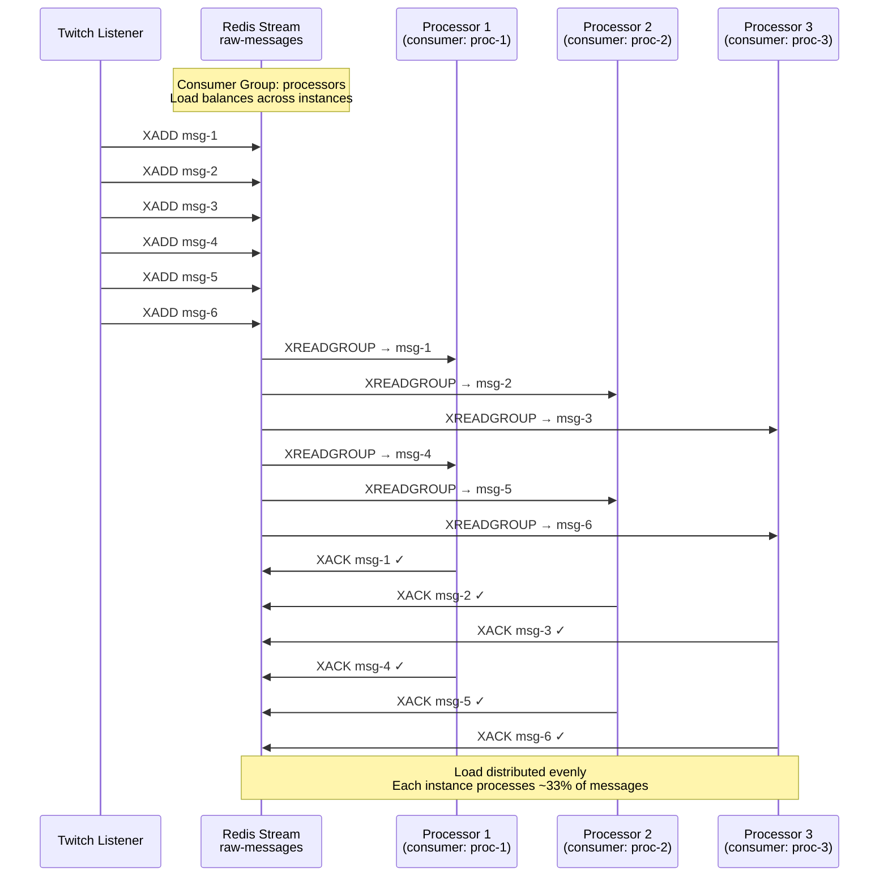
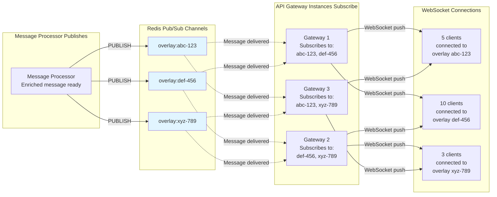
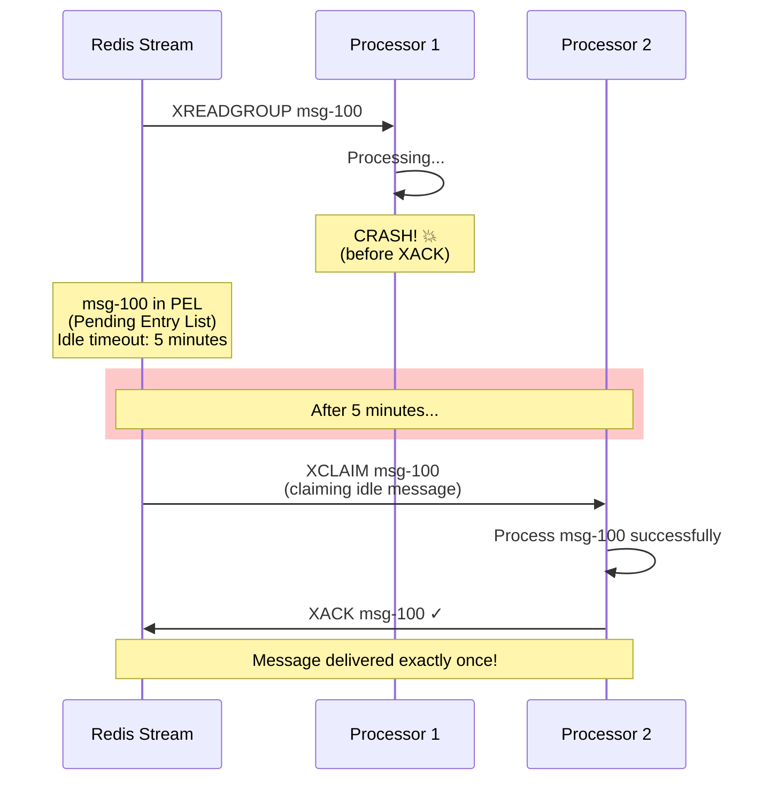
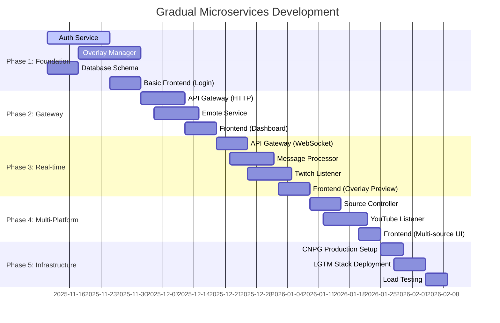

# All-Chat: Tech Stack Re-evaluation for LLM-First Development

**Date**: 2025-11-11
**Status**: Architecture Reset
**Context**: Previous implementation deleted, starting fresh with LLM-first approach

---

## Table of Contents

1. [Requirements & Constraints](#requirements--constraints)
2. [Scale Requirements](#scale-requirements)
3. [Tech Stack Decision Matrix](#tech-stack-decision-matrix)
4. [Recommended Architecture](#recommended-architecture)
5. [Frontend Framework Analysis](#frontend-framework-analysis)
6. [Testing Strategy for LLM Agents](#testing-strategy-for-llm-agents)
7. [Learning Path](#learning-path)

---

## Requirements & Constraints

### Functional Requirements
- ✅ Aggregate chat from Twitch, YouTube, Kick, TikTok
- ✅ Real-time WebSocket delivery to overlays
- ✅ Multi-source per overlay support
- ✅ Emote enrichment (7TV, BTTV, FFZ)

### Non-Functional Requirements
- **Scale**: 100 messages/min (Phase 1) → 10,000 messages/second (Phase 5)
- **Deployment**: Single VPS → Multi-node Kubernetes cluster
- **Infrastructure**: Kubernetes, CNPG, LGTM, Ceph (learning goals)
- **Development**: Most code written by LLMs
- **Testing**: Autonomous testing by LLM agents

### Personal Learning Goals
- ✅ **Learn Go** (production microservices)
- ✅ **Learn Kubernetes ecosystem** (CNPG, LGTM, Ceph)
- ✅ **Learn microservices patterns** (aligns with work)
- ✅ **Minimal frontend work** (not a priority)

### LLM Development Constraints
- LLMs must generate good Go code
- LLMs must write comprehensive tests
- LLMs must understand microservices patterns
- Architecture must be testable autonomously

---

## Scale Requirements Analysis

### Phase 1: MVP (100 messages/minute)
```
100 msg/min = 1.67 msg/s
- Single instance of each service handles this easily
- PostgreSQL: ~2 writes/s, ~20 reads/s
- Redis: ~10 ops/s
- WebSocket: ~10 concurrent connections
```
**Verdict**: ANY tech stack handles this trivially

### Phase 5: Production Scale (10,000 messages/second)
```
10,000 msg/s sustained
- Platform Listeners: 2,000-5,000 msg/s each (need 2-5 instances per platform)
- Message Processor: 2,000 msg/s per instance (need 5-7 instances)
- PostgreSQL: ~200 writes/s, ~2,000 reads/s (need read replicas)
- Redis: ~50,000 ops/s (single instance sufficient, cluster optional)
- WebSocket: 50,000+ concurrent connections (need 20-50 Gateway instances)
```
**Verdict**: Go/Rust handle this well. Node.js possible but requires more instances.

### Scaling Factor: 6,000x growth
This is a **critical insight**: You need a tech stack that scales from nothing to massive load.

**Go is the RIGHT choice** for this scale requirement.

---

## Tech Stack Decision Matrix

### Backend Language: **Go** ✅ CONFIRMED

| Criterion | Go | Node.js/TypeScript | Python | Rust |
|-----------|----|--------------------|--------|------|
| **LLM Familiarity** | ⭐⭐⭐⭐ Excellent | ⭐⭐⭐⭐⭐ Best | ⭐⭐⭐⭐⭐ Best | ⭐⭐ Poor (borrow checker) |
| **Microservices** | ⭐⭐⭐⭐⭐ Built for it | ⭐⭐⭐ Good | ⭐⭐⭐ Good | ⭐⭐⭐⭐ Excellent |
| **Learning Goal** | ⭐⭐⭐⭐⭐ YES | ⭐⭐ Not priority | ⭐⭐⭐ Already know | ⭐⭐ Too complex |
| **100 msg/min → 10K msg/s** | ⭐⭐⭐⭐⭐ Perfect | ⭐⭐⭐ Requires more pods | ⭐⭐ GIL issues | ⭐⭐⭐⭐⭐ Overkill |
| **Testing (LLM)** | ⭐⭐⭐⭐ Good stdlib | ⭐⭐⭐⭐⭐ Excellent | ⭐⭐⭐⭐⭐ Excellent | ⭐⭐ Complex |
| **Kubernetes Fit** | ⭐⭐⭐⭐⭐ Perfect | ⭐⭐⭐⭐ Good | ⭐⭐⭐ Good | ⭐⭐⭐⭐⭐ Perfect |
| **Memory per Pod** | ⭐⭐⭐⭐⭐ Low (~50MB) | ⭐⭐⭐ Medium (~200MB) | ⭐⭐⭐ Medium (~150MB) | ⭐⭐⭐⭐⭐ Lowest (~20MB) |
| **Concurrency** | ⭐⭐⭐⭐⭐ Goroutines | ⭐⭐⭐⭐ Async/await | ⭐⭐ Asyncio/GIL | ⭐⭐⭐⭐⭐ Fearless |

**Decision**: **Go** - Aligns with learning goals, scales perfectly, LLMs generate good code

---

## Recommended Architecture

### Microservices (Keep Them!)

**8 Services** (slightly reduced from original):



**Why Keep Microservices**:
1. ✅ **Learning goal** (aligns with your work)
2. ✅ **Scale independently** (Listeners scale differently than Gateway)
3. ✅ **Team practices** (matches your company's patterns)
4. ✅ **Clear boundaries** (easier for LLMs to reason about small services)
5. ✅ **Failure isolation** (Twitch down ≠ YouTube down)

**Simplifications**:
- ❌ Remove Hexagonal Architecture (too much boilerplate for LLMs)
- ✅ Use **Standard Go Project Layout** (LLMs know this well)
- ✅ Keep services small and focused

---

## ✅ APPROVED: Go Standard Project Layout (Monorepo)

### Repository Structure

```
all-chat/                         # Monorepo root
├── go.work                       # Go workspace (links all modules)
│
├── services/
│   ├── auth-service/
│   │   ├── cmd/main.go           # Entry point
│   │   ├── handlers/             # HTTP handlers (Gin)
│   │   │   ├── auth.go           # Auth endpoints
│   │   │   ├── auth_test.go      # Handler tests
│   │   │   └── health.go         # Health checks
│   │   ├── models/               # Domain models
│   │   │   ├── user.go
│   │   │   └── user_test.go
│   │   ├── repository/           # Database layer
│   │   │   ├── user_repo.go
│   │   │   └── user_repo_test.go
│   │   ├── oauth/                # Twitch OAuth logic
│   │   │   ├── client.go
│   │   │   └── client_test.go
│   │   ├── go.mod                # module: github.com/user/all-chat/services/auth-service
│   │   ├── go.sum
│   │   └── Dockerfile
│   │
│   ├── overlay-manager/          # Phase 1
│   │   ├── cmd/main.go
│   │   ├── handlers/
│   │   ├── models/
│   │   ├── repository/
│   │   ├── go.mod
│   │   └── Dockerfile
│   │
│   ├── api-gateway/              # Phase 2
│   │   ├── cmd/main.go
│   │   ├── handlers/
│   │   ├── websocket/            # WebSocket manager
│   │   ├── proxy/                # HTTP reverse proxy
│   │   ├── go.mod
│   │   └── Dockerfile
│   │
│   ├── emote-service/            # Phase 2
│   │   ├── cmd/main.go
│   │   ├── handlers/
│   │   ├── clients/              # 7TV, BTTV, FFZ clients
│   │   ├── cache/                # Redis caching logic
│   │   ├── go.mod
│   │   └── Dockerfile
│   │
│   ├── message-processor/        # Phase 3
│   │   ├── cmd/main.go
│   │   ├── consumer/             # Redis Streams consumer
│   │   ├── enricher/             # Emote enrichment
│   │   ├── normalizer/           # Platform → Unified format
│   │   ├── publisher/            # Redis Pub/Sub publisher
│   │   ├── go.mod
│   │   └── Dockerfile
│   │
│   ├── twitch-listener/          # Phase 3
│   │   ├── cmd/main.go
│   │   ├── irc/                  # Twitch IRC client
│   │   ├── parser/               # Parse IRC messages
│   │   ├── go.mod
│   │   └── Dockerfile
│   │
│   ├── youtube-listener/         # Phase 4
│   │   ├── cmd/main.go
│   │   ├── api/                  # YouTube API client
│   │   ├── poller/               # Polling logic
│   │   ├── oauth/                # YouTube OAuth
│   │   ├── go.mod
│   │   └── Dockerfile
│   │
│   └── source-controller/        # Phase 4
│       ├── cmd/main.go
│       ├── controller/           # Control loop
│       ├── election/             # Leader election
│       ├── go.mod
│       └── Dockerfile
│
├── shared/                       # Shared Go packages
│   ├── database/                 # PostgreSQL connection (pgx)
│   │   ├── postgres.go
│   │   └── postgres_test.go
│   ├── redis/                    # Redis client wrapper
│   │   ├── client.go
│   │   ├── streams.go            # Streams helpers
│   │   └── pubsub.go             # Pub/Sub helpers
│   ├── logger/                   # Zap structured logging
│   │   └── logger.go
│   ├── middleware/               # Shared HTTP middleware
│   │   ├── auth.go               # JWT validation
│   │   ├── cors.go
│   │   └── logging.go
│   ├── models/                   # Shared domain models
│   │   ├── unified_message.go    # Unified message format
│   │   └── emote.go
│   ├── auth/                     # JWT utilities
│   │   ├── jwt.go
│   │   └── jwt_test.go
│   └── go.mod                    # module: github.com/user/all-chat/shared
│
├── frontend/                     # React + Next.js
│   ├── app/                      # Next.js App Router
│   │   ├── page.tsx              # Landing page
│   │   ├── dashboard/
│   │   │   └── page.tsx          # Dashboard
│   │   ├── overlays/
│   │   │   ├── page.tsx          # List overlays
│   │   │   ├── [id]/
│   │   │   │   └── page.tsx      # Overlay detail
│   │   │   └── new/
│   │   │       └── page.tsx      # Create overlay
│   │   └── auth/
│   │       └── callback/
│   │           └── page.tsx      # OAuth callback
│   ├── components/               # React components
│   │   ├── overlay-card.tsx
│   │   ├── chat-source-form.tsx
│   │   └── overlay-preview.tsx   # WebSocket real-time
│   ├── lib/
│   │   ├── api.ts                # API client
│   │   └── websocket.ts          # WebSocket client
│   ├── package.json
│   ├── tsconfig.json
│   ├── next.config.js
│   └── Dockerfile
│
├── deployments/
│   ├── k8s/
│   │   ├── namespace.yaml
│   │   ├── cnpg/
│   │   │   ├── cluster.yaml      # CloudNativePG cluster
│   │   │   └── pooler.yaml       # PgBouncer pooler
│   │   ├── lgtm/
│   │   │   ├── loki.yaml
│   │   │   ├── grafana.yaml
│   │   │   ├── tempo.yaml
│   │   │   ├── mimir.yaml
│   │   │   └── promtail.yaml
│   │   ├── redis/
│   │   │   └── statefulset.yaml  # Redis with AOF
│   │   └── services/
│   │       ├── auth-service/
│   │       ├── overlay-manager/
│   │       └── ...
│   └── docker-compose.yml        # Local development
│
├── migrations/
│   ├── 001_initial_schema.sql
│   └── 002_multi_source_support.sql
│
├── tests/
│   ├── integration/              # Service integration tests
│   │   └── auth_integration_test.go
│   └── e2e/                      # End-to-end tests
│       └── overlay_e2e_test.go
│
├── scripts/
│   ├── setup.sh                  # Initial setup
│   └── migrate.sh                # Run migrations
│
├── docs/
│   └── architecture/
│       ├── ARCHITECTURE_OVERVIEW.md
│       └── ...
│
├── go.work                       # Go workspace file
├── .env.example
├── Makefile                      # Build commands
└── README.md
```

**Go Workspace Setup** (Monorepo):
```go
// go.work - Links all Go modules
go 1.23

use (
    ./services/auth-service
    ./services/overlay-manager
    ./services/api-gateway
    ./services/emote-service
    ./services/message-processor
    ./services/twitch-listener
    ./services/youtube-listener
    ./services/source-controller
    ./shared
)
```

**Benefits**:
- ✅ Single repo for all code (easier for learning)
- ✅ Shared code via Go modules (clean imports)
- ✅ Each service independently deployable
- ✅ Atomic commits across multiple services
- ✅ Easier for LLM agents (entire context in one repo)

**Why Standard Layout** (NOT Hexagonal):
- ✅ LLMs trained on thousands of Go projects using this structure
- ✅ Less boilerplate (`cmd/`, `handlers/`, `models/`, `repository/`)
- ✅ Clear separation without excessive abstraction
- ✅ Each service is ~500-1000 lines (manageable for LLMs)
- ✅ Testing is straightforward (mock repositories, test handlers)

---

## Frontend Framework Analysis

### Requirement: Minimal frontend interaction

**Current Choice**: Svelte 5

### Svelte 5 Analysis

| Criterion | Svelte 5 | React | Vue 3 | HTMX + Go Templates |
|-----------|----------|-------|-------|---------------------|
| **LLM Familiarity** | ⭐⭐ Limited (new) | ⭐⭐⭐⭐⭐ Excellent | ⭐⭐⭐⭐ Good | ⭐⭐⭐ Good |
| **Learning Curve** | ⭐⭐⭐⭐ Easy | ⭐⭐⭐ Medium | ⭐⭐⭐⭐ Easy | ⭐⭐⭐⭐⭐ Minimal |
| **Your Interaction** | ⭐⭐⭐ Some | ⭐⭐ Complex | ⭐⭐⭐ Some | ⭐⭐⭐⭐⭐ Minimal |
| **SSR Support** | ⭐⭐⭐⭐ SvelteKit | ⭐⭐⭐⭐ Next.js | ⭐⭐⭐⭐ Nuxt | ⭐⭐⭐⭐⭐ Native |
| **WebSocket** | ⭐⭐⭐⭐ Good | ⭐⭐⭐⭐ Good | ⭐⭐⭐⭐ Good | ⭐⭐⭐⭐ Good |
| **Static Gen** | ⭐⭐⭐⭐ Yes | ⭐⭐⭐⭐ Yes | ⭐⭐⭐⭐ Yes | ⭐⭐⭐⭐⭐ Native |

**Problem with Svelte 5**:
- Released Oct 2024 (very recent)
- LLMs trained on Svelte 3/4 patterns
- Runes syntax is new (LLMs will struggle)

### ✅ APPROVED: React + Next.js with SSR

#### **Option 1: React + Next.js** ✅ SELECTED
```typescript
// LLMs generate excellent React code
// Massive training corpus

// Example: Overlay list component
export default function OverlayList() {
  const { data: overlays } = useSWR('/api/overlays')

  return (
    <div>
      {overlays?.map(overlay => (
        <OverlayCard key={overlay.id} overlay={overlay} />
      ))}
    </div>
  )
}
```

**Why React + Next.js SSR**:
- ✅ LLMs know React extremely well
- ✅ Next.js App Router (Server Components)
- ✅ SSR for better performance and SEO
- ✅ TypeScript support excellent
- ✅ API routes if needed (or use Go backend)
- ✅ Huge ecosystem (shadcn/ui, Radix)

**Next.js Configuration**:
```typescript
// next.config.js
module.exports = {
  // Use standalone output for Docker
  output: 'standalone',
  // API calls to Go backend
  async rewrites() {
    return [
      {
        source: '/api/:path*',
        destination: 'http://api-gateway:8080/api/:path*'
      }
    ]
  }
}
```

#### **Option 2: HTMX + Go Templates** ❌ NOT SELECTED
```go
// Render server-side, add HTMX attributes for interactivity
// You write Go, not JavaScript!

func (h *OverlayHandler) ListOverlays(c *gin.Context) {
    overlays, _ := h.service.GetOverlays(c.Request.Context(), userID)

    c.HTML(200, "overlays.html", gin.H{
        "overlays": overlays,
    })
}
```

```html
<!-- templates/overlays.html -->
<div hx-get="/api/overlays" hx-trigger="every 2s">
  {{range .overlays}}
    <div class="overlay-card">{{.Name}}</div>
  {{end}}
</div>
```

**Why HTMX**:
- ✅ Write Go, not JavaScript (your preference!)
- ✅ Simple HTML templates
- ✅ HTMX adds interactivity with attributes
- ✅ No build step for frontend
- ⚠️ Limited for complex UIs

#### **Option 3: Svelte 4 (not 5)** ⭐ IF YOU REALLY WANT SVELTE
- Use Svelte 4 instead of 5 (LLMs know this better)
- Or wait 6 months for LLMs to learn Svelte 5

### ✅ APPROVED DECISION: **React + Next.js with SSR**

**Rationale**:
- ✅ LLMs generate 90% of frontend code autonomously
- ✅ Next.js App Router with Server Components
- ✅ SSR provides better initial load performance
- ✅ Minimal manual intervention required
- ✅ shadcn/ui for beautiful components (LLM-friendly)
- ✅ Industry standard (aligns with modern web practices)

**Frontend Scope - Minimal UI (Phase 1)**:
- Landing page with Twitch OAuth login
- Dashboard (list overlays)
- Create/edit overlay form
- Add chat sources modal
- Overlay preview with live WebSocket messages
- ~7 pages total (LLM generates all components)

---

## Redis Architecture - Detailed Flow Diagrams

### Overall Message Pipeline



### Redis Streams: Consumer Group Load Balancing



### Redis Pub/Sub: Multi-Gateway Broadcast



### Failure Scenario: Consumer Crash & Message Redelivery



---

## Testing Strategy for LLM Agents

### ✅ APPROVED: Test-Driven Development (TDD) - Autonomous Workflow

**LLM Autonomous Testing Workflow**:
```
┌─────────────────────────────────────────┐
│  1. LLM Agent: Generate Test Spec       │
│     "CreateOverlay should validate name" │
└──────────────┬──────────────────────────┘
               ↓
┌─────────────────────────────────────────┐
│  2. LLM Agent: Write Failing Test       │
│     func TestCreateOverlay_EmptyName()   │
└──────────────┬──────────────────────────┘
               ↓
┌─────────────────────────────────────────┐
│  3. Run Test → ❌ FAIL (expected)       │
└──────────────┬──────────────────────────┘
               ↓
┌─────────────────────────────────────────┐
│  4. LLM Agent: Write Minimal Code       │
│     if name == "" { return ErrEmptyName }│
└──────────────┬──────────────────────────┘
               ↓
┌─────────────────────────────────────────┐
│  5. Run Test → ✅ PASS                  │
└──────────────┬──────────────────────────┘
               ↓
┌─────────────────────────────────────────┐
│  6. LLM Agent: Refactor (if needed)     │
└──────────────┬──────────────────────────┘
               ↓
┌─────────────────────────────────────────┐
│  7. Human Review Checkpoint (optional)  │
│     Review PR, approve, merge            │
└─────────────────────────────────────────┘
```

**Human Intervention Points**:
- Initial spec review (30 seconds)
- Final PR review before merge (2 minutes)
- **LLM runs 90% autonomously**

### Go Testing (LLM-Friendly)

**Built-in Testing** (`testing` package):
```go
// LLMs generate excellent Go tests

func TestCreateOverlay(t *testing.T) {
    // Arrange
    repo := &mockRepository{}
    service := NewOverlayService(repo)

    // Act
    overlay, err := service.CreateOverlay(ctx, "user-123", "My Overlay")

    // Assert
    assert.NoError(t, err)
    assert.Equal(t, "My Overlay", overlay.Name)
}
```

**Table-Driven Tests** (LLM-friendly pattern):
```go
func TestNormalizeMessage(t *testing.T) {
    tests := []struct {
        name     string
        input    *TwitchMessage
        expected *UnifiedMessage
    }{
        {
            name: "basic message",
            input: &TwitchMessage{Text: "Hello"},
            expected: &UnifiedMessage{Platform: "twitch", Text: "Hello"},
        },
        // LLMs excel at generating test cases
    }

    for _, tt := range tests {
        t.Run(tt.name, func(t *testing.T) {
            result := normalizeMessage(tt.input)
            assert.Equal(t, tt.expected, result)
        })
    }
}
```

### Integration Testing with Testcontainers

```go
import "github.com/testcontainers/testcontainers-go/modules/postgres"

func TestOverlayRepository(t *testing.T) {
    // Start PostgreSQL container
    ctx := context.Background()
    pgContainer, _ := postgres.RunContainer(ctx)
    defer pgContainer.Terminate(ctx)

    // Get connection string
    connStr, _ := pgContainer.ConnectionString(ctx)

    // Test against real database
    repo := NewPostgresRepository(connStr)
    // ... test database operations
}
```

**Why Testcontainers**:
- ✅ Real database/redis for tests
- ✅ LLMs can generate these tests
- ✅ CI/CD friendly (Docker-based)

### E2E Testing

**Option 1: Go E2E Tests**
```go
func TestOverlayCreationE2E(t *testing.T) {
    // Start all services
    // Make HTTP requests
    // Verify responses
}
```

**Option 2: Playwright (if using React)**
```typescript
test('create overlay', async ({ page }) => {
  await page.goto('/overlays')
  await page.click('text=Create Overlay')
  await page.fill('input[name=name]', 'Test Overlay')
  await page.click('button:has-text("Save")')
  await expect(page.locator('text=Test Overlay')).toBeVisible()
})
```

---

## ✅ APPROVED: Gradual Service Implementation

### Service Implementation Phases



### Phase 1: Foundation (Weeks 1-4)

**Services to Build**:
1. ✅ **Auth Service** (Week 1-2)
   - Twitch OAuth flow
   - JWT generation/validation
   - User CRUD
   - PostgreSQL integration
   - Redis session cache

2. ✅ **Overlay Manager** (Week 3-4)
   - Overlay CRUD
   - Multi-source configuration
   - PostgreSQL integration
   - Depends on: Auth Service (JWT validation)

**Frontend**:
- Landing page
- Twitch login button
- OAuth callback handler

**Infrastructure**:
- Docker Compose (PostgreSQL + Redis)
- Basic Makefile

**Learning Focus**:
- Go HTTP servers (Gin)
- PostgreSQL with pgx
- Redis with go-redis
- Table-driven tests
- Testcontainers

**Deliverable**:
- Users can log in with Twitch
- Users can create/list/delete overlays
- All code has ≥80% test coverage
- Runs locally with Docker Compose

---

### Phase 2: Gateway & Emotes (Weeks 5-7)

**Services to Build**:
3. ✅ **API Gateway** (HTTP only) (Week 5-6)
   - Reverse proxy to Auth + Overlay services
   - JWT middleware
   - CORS handling
   - Health checks

4. ✅ **Emote Service** (Week 6-7)
   - 7TV, BTTV, FFZ API clients
   - Redis caching (1-hour TTL)
   - Concurrent API fetching

**Frontend**:
- Dashboard page (list overlays)
- Create/edit overlay forms
- Add chat source modal

**Learning Focus**:
- Service-to-service communication
- Caching strategies
- Concurrent HTTP requests (goroutines)
- Kubernetes deployment basics

**Deliverable**:
- Single API Gateway routes to backend services
- Emotes cached efficiently
- Basic frontend UI functional
- Deployed to single-node Kubernetes

---

### Phase 3: Real-Time Messaging (Weeks 8-12)

**Services to Build**:
5. ✅ **API Gateway** (WebSocket) (Week 8)
   - WebSocket connection manager
   - Redis Pub/Sub integration
   - Connection limits (2,500/pod)

6. ✅ **Message Processor** (Week 9-10)
   - Redis Streams consumer
   - Message normalization
   - Emote enrichment
   - Pub/Sub publisher

7. ✅ **Twitch Listener** (Week 11-12)
   - IRC client (gempir/go-twitch-irc)
   - Channel join/part
   - Message parsing
   - Redis Streams producer

**Frontend**:
- Overlay preview page
- WebSocket connection
- Real-time message rendering
- Emote image display

**Learning Focus**:
- WebSocket servers in Go
- Redis Streams (XADD, XREADGROUP, XACK)
- Redis Pub/Sub (PUBLISH, SUBSCRIBE)
- Consumer groups and load balancing
- IRC protocol

**Deliverable**:
- End-to-end message flow: Twitch → Overlay
- Real-time chat display with emotes
- Handles 1,000 messages/minute

---

### Phase 4: Multi-Platform (Weeks 13-16)

**Services to Build**:
8. ✅ **Source Controller** (Week 13)
   - Redis leader election
   - Poll database for active sources
   - Publish control commands

9. ✅ **YouTube Listener** (Week 14-16)
   - YouTube Live Chat API client
   - OAuth integration
   - Adaptive polling
   - Quota monitoring

**Frontend**:
- Multi-source selection UI
- Platform-specific configuration

**Learning Focus**:
- Leader election patterns
- External API rate limiting
- Quota management
- Multi-platform normalization

**Deliverable**:
- Support Twitch + YouTube simultaneously
- Dynamic source management
- Handles 10,000 messages/minute

---

### Phase 5: Production Infrastructure (Weeks 17-20)

**Infrastructure**:
- Deploy CloudNativePG (1 primary + 2 replicas)
- Deploy LGTM Stack (Loki, Grafana, Mimir, Tempo)
- Set up Prometheus alerts
- Multi-node Kubernetes cluster

**Learning Focus**:
- CNPG backup/restore
- PITR (Point-in-time recovery)
- Loki LogQL queries
- Grafana dashboards
- Alertmanager configuration

**Deliverable**:
- Production-grade observability
- Automated failover tested
- Handles 100,000 messages/minute (load tested)

---

## Learning Path
- [ ] Go basics (Tour of Go)
- [ ] Go HTTP servers (net/http, Gin framework)
- [ ] Go testing (table-driven tests)
- [ ] Docker basics (if not already known)

### Phase 1: Single Service (Week 3-4)
- [ ] Build Auth Service (simplest service)
- [ ] Learn: PostgreSQL with `pgx`
- [ ] Learn: Redis with `go-redis`
- [ ] Write tests with Testcontainers
- [ ] Deploy to single VPS with Docker Compose

### Phase 2: Add Services (Week 5-8)
- [ ] Build Overlay Manager
- [ ] Build Emote Service
- [ ] Learn: Service-to-service communication
- [ ] Learn: Kubernetes basics
- [ ] Deploy to Kubernetes (single node)

### Phase 3: Real-time Features (Week 9-12)
- [ ] Build API Gateway with WebSocket
- [ ] Build Twitch Listener
- [ ] Build Message Processor
- [ ] Learn: Redis Streams and Pub/Sub
- [ ] End-to-end message flow working

### Phase 4: Infrastructure (Week 13-16)
- [ ] Deploy CloudNativePG
- [ ] Deploy LGTM stack (Loki, Grafana, Tempo, Mimir)
- [ ] Set up monitoring and alerts
- [ ] Learn: CNPG backup/restore

### Phase 5: Scale (Week 17-20)
- [ ] Add YouTube Listener
- [ ] Multi-node Kubernetes
- [ ] Horizontal Pod Autoscaling
- [ ] Load testing (100 msg/min → 10K msg/s)

---

## ✅ APPROVED ARCHITECTURE - Final Stack

### Backend: **Go Microservices**
- ✅ 8 services (gradual implementation)
- ✅ Standard Go project layout (NO hexagonal architecture)
- ✅ Monorepo with Go workspace
- ✅ Each service: ~500-1000 lines of code
- ✅ Table-driven tests + Testcontainers
- ✅ Gin framework (HTTP) + gorilla/websocket

### Frontend: **React + Next.js with SSR**
- ✅ Next.js App Router (Server Components)
- ✅ TypeScript for type safety
- ✅ shadcn/ui for components
- ✅ Minimal UI scope (~7 pages)
- ✅ LLMs generate 90% of code
- ✅ Server-side rendering for performance

### Infrastructure: **Production-Grade from Start**
- ✅ **Kubernetes** (Hetzner VPS → multi-node)
- ✅ **CloudNativePG** (immediate adoption, team has experience)
  - 1 primary + 2 replicas
  - Local volume snapshots (Phase 1)
  - Object storage backups (Phase 5)
- ✅ **LGTM Stack** (Loki, Grafana, Tempo, Mimir)
  - Local persistent volumes (Phase 1)
  - Object storage (Phase 5)
- ✅ **Redis with AOF** (appendfsync everysec)
- ✅ **Ceph** (later, when multi-node storage needed)

### Testing: **TDD with Autonomous LLM Agents**
- ✅ Test-first development (write tests before code)
- ✅ LLMs run autonomously (human checkpoints only)
- ✅ Unit tests (Go `testing` stdlib)
- ✅ Integration tests (Testcontainers)
- ✅ E2E tests (Playwright for frontend, Go for backend)
- ✅ Target: ≥80% code coverage

### Scaling Strategy: **100 msg/min → 10,000 msg/s**
- ✅ Phase 1: 100 msg/min (1.67/s) - Single instance
- ✅ Phase 2: 1,000 msg/min (16.7/s) - Single instance
- ✅ Phase 3: 10,000 msg/min (166/s) - 2-3 replicas
- ✅ Phase 4: 100,000 msg/min (1,666/s) - HPA enabled
- ✅ Phase 5: 600,000 msg/min (10,000/s) - Full scale

---

## Implementation Start - Phase 1 Tasks

### Week 1-2: Auth Service (LLM-Generated with TDD)

**LLM Prompt Sequence**:
```
1. "Generate Go project structure for auth-service with standard layout"
2. "Write tests for Twitch OAuth flow (TDD)"
3. "Implement Twitch OAuth client to pass tests"
4. "Write tests for JWT generation/validation"
5. "Implement JWT utilities to pass tests"
6. "Write tests for user repository (PostgreSQL)"
7. "Implement user repository with pgx"
8. "Write integration tests with Testcontainers"
9. "Generate Dockerfile and Kubernetes manifests"
```

**Human Checkpoints**:
- Review test specs (5 min)
- Review final PR (10 min)
- Deploy to Docker Compose (5 min)

### Week 3-4: Overlay Manager (LLM-Generated)

**LLM Prompt Sequence**:
```
1. "Generate overlay-manager service structure"
2. "Write tests for overlay CRUD operations"
3. "Implement overlay handlers and repository"
4. "Write tests for multi-source chat configuration"
5. "Implement chat source management"
6. "Write integration tests"
7. "Generate Kubernetes manifests"
```

### Week 5+: Continue with Phase 2-5

---

## Critical Decisions Locked In

| Decision | Choice | Rationale |
|----------|--------|-----------|
| **Backend Language** | Go | Scales 6000x (100 msg/min → 10K msg/s), learning goal, microservices-friendly |
| **Architecture Style** | Standard Go Layout | LLM-friendly, less boilerplate than hexagonal |
| **Frontend** | React + Next.js SSR | LLM generates 90%, minimal manual work, SSR performance |
| **Repo Structure** | Monorepo + Go Workspace | Easier learning, atomic commits, LLM context |
| **Testing Approach** | TDD with Autonomous LLMs | Write tests first, LLMs implement, high coverage |
| **Deployment** | Gradual (2→4→6→8 services) | Learn patterns, avoid overwhelm |
| **Database** | CloudNativePG (immediate) | Team has experience, production-grade failover |
| **Observability** | LGTM Stack (immediate) | Cost-effective, unified, cloud-native |
| **Message Queue** | Redis Streams (keep) | Sufficient for 10K msg/s, simpler than Kafka |
| **Storage** | Hetzner Cloud Volumes | Local volumes Phase 1, object storage Phase 5 |

---

## Next Steps

✅ Architecture approved - ready to start implementation

**Immediate Actions**:
1. Create project structure (monorepo with Go workspace)
2. Set up Docker Compose (PostgreSQL + Redis)
3. Create database migrations
4. Generate Auth Service with LLM agent (TDD approach)
5. Deploy to local Kubernetes (single node)

**Timeline**: 20 weeks to production-ready with full learning

---

**Document Owner**: Development Team
**Status**: ✅ APPROVED
**Last Updated**: 2025-11-11
**Approved By**: Project Lead
