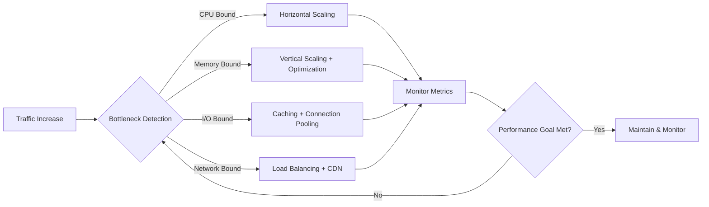
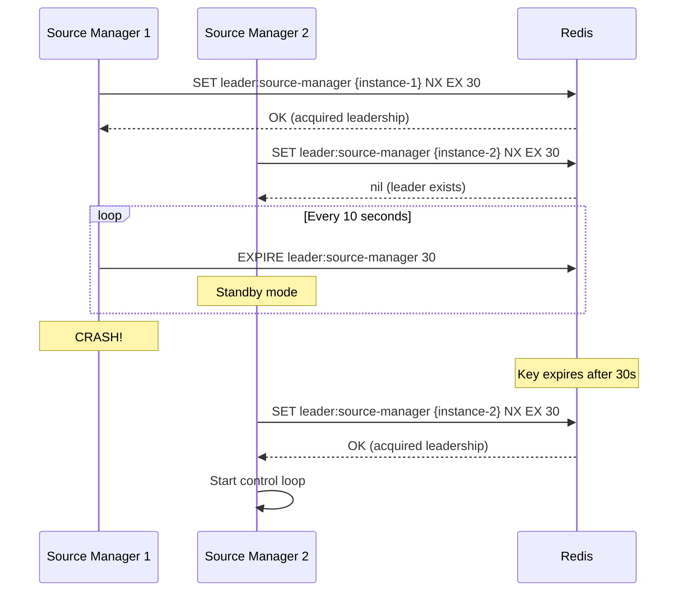
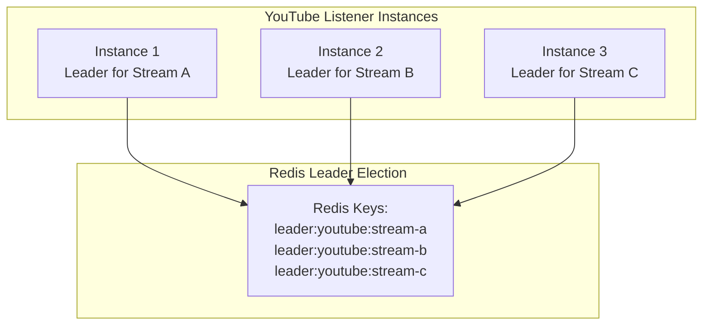
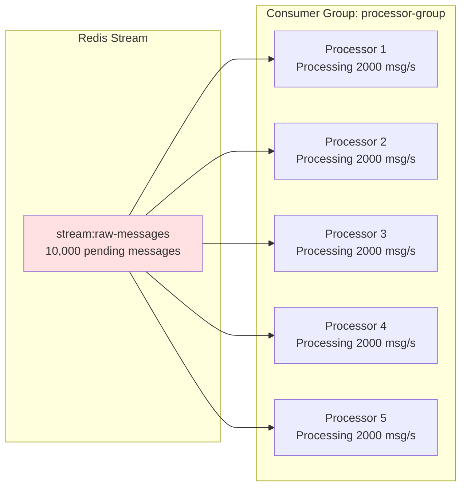
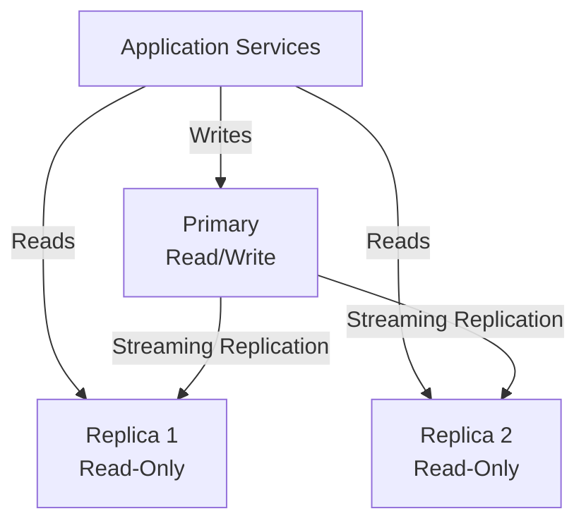
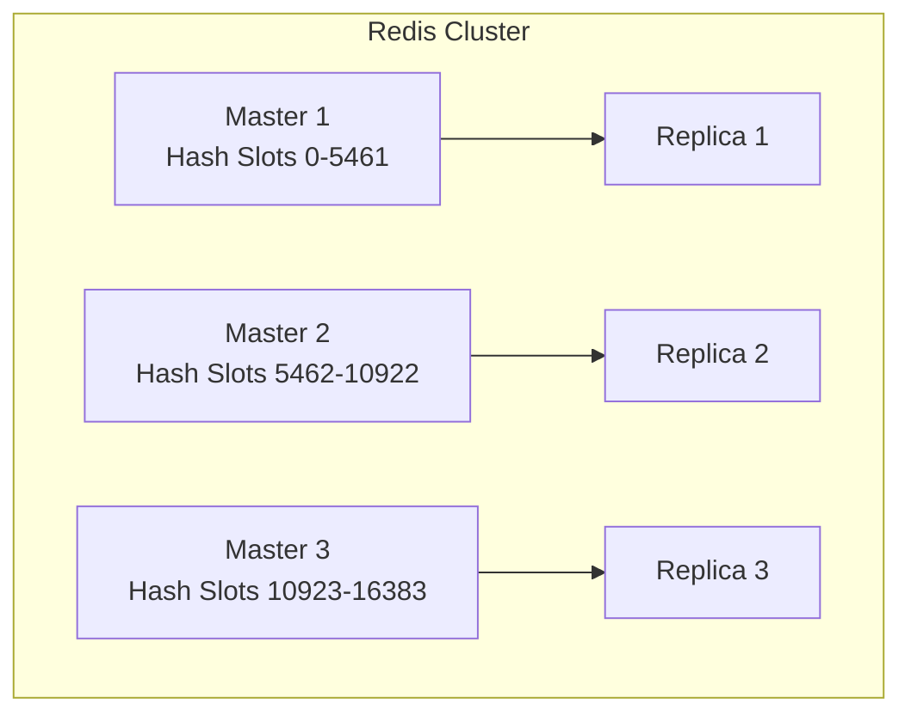

# All-Chat: Scaling & Performance Architecture

**Version:** 1.0
**Last Updated:** 2025-11-11
**Related Docs**: [Approved Architecture](./APPROVED_ARCHITECTURE.md), [Deployment](./DEPLOYMENT_KUBERNETES.md)

---

## Table of Contents

1. [Introduction](#introduction)
2. [Scaling Strategies by Service](#scaling-strategies-by-service)
3. [Performance Bottlenecks](#performance-bottlenecks)
4. [Capacity Planning](#capacity-planning)
5. [Load Testing](#load-testing)
6. [Optimization Techniques](#optimization-techniques)
7. [Cost Optimization](#cost-optimization)

---

## Introduction

All-Chat is designed to scale horizontally across all components. This document provides detailed scaling strategies, performance optimization techniques, and capacity planning guidance.

### Scaling Principles



---

## Scaling Strategies by Service

### API Gateway

**REVISED Capacity**: 2,500 concurrent WebSocket connections per instance (safe limit)

**Capacity Calculation**:
- Memory per connection: ~128KB (goroutine stack + buffers)
- Pod memory limit: 512Mi
- Theoretical max: 512Mi / 128KB = 4,000 connections
- **Safe limit with headroom: 2,500 connections**
- Additional limits: 1,000 connections max per single overlay

**Scaling Triggers**:
- CPU > 60% (more conservative)
- Memory > 70% (more conservative)
- Active WebSocket connections > 2,000 (scale before hitting 2,500 limit)

**HPA Configuration**:
```yaml
minReplicas: 2
maxReplicas: 20                         # REVISED from 10
metrics:
  - type: Resource
    resource:
      name: cpu
      target: {averageUtilization: 60}  # REVISED from 70
  - type: Resource
    resource:
      name: memory
      target: {averageUtilization: 70}  # REVISED from 80
  - type: Pods
    pods:
      metric:
        name: websocket_connections_active
      target:
        type: AverageValue
        averageValue: "2000"            # NEW: Scale before hitting 2,500
```

**REVISED Scaling Formula**:
```
Required Instances = ceil(Total WebSocket Connections / 2000) + 1

Examples:
- 5,000 connections  → 3 instances (2.5 → 3 + buffer)
- 10,000 connections → 6 instances (5 → 6 + buffer)
- 50,000 connections → 26 instances (25 → 26 + buffer)
```

**Example Scenarios**:
| Concurrent Overlays | Instances Required | Total Memory | Total CPU |
|---------------------|-------------------|--------------|-----------|
| 1,000 | 2 (min) | 1Gi | 200m |
| 5,000 | 3 | 1.5Gi | 300m |
| 10,000 | 6 | 3Gi | 600m |
| 50,000 | 26 | 13Gi | 2.6 CPU |

**State Management**:
- WebSocket connections are stateful
- Use **Redis Pub/Sub** for cross-instance broadcasting
- No sticky sessions required (pub/sub handles fan-out)

```mermaid
graph TB
    subgraph "Multiple API Gateway Instances"
        GW1[Gateway Instance 1<br/>5000 connections]
        GW2[Gateway Instance 2<br/>5000 connections]
        GW3[Gateway Instance 3<br/>5000 connections]
    end

    subgraph "Redis Pub/Sub"
        REDIS[Redis<br/>overlay:{id} channels]
    end

    subgraph "Message Processor"
        MP[Message Processor]
    end

    MP -->|PUBLISH overlay:abc-123| REDIS
    REDIS -->|SUBSCRIBE| GW1
    REDIS -->|SUBSCRIBE| GW2
    REDIS -->|SUBSCRIBE| GW3
    GW1 --> CLIENT1[1000 overlay:abc-123 clients]
    GW2 --> CLIENT2[800 overlay:abc-123 clients]
    GW3 --> CLIENT3[200 overlay:abc-123 clients]
```

---

### Auth Service

**Current Capacity**: 1,000 requests/second per instance

**Scaling Triggers**:
- CPU > 60%
- Request latency > 200ms (p95)

**HPA Configuration**:
```yaml
minReplicas: 2
maxReplicas: 5
metrics:
  - type: Resource
    resource:
      name: cpu
      target: {averageUtilization: 60}
```

**Optimization**:
- Redis session caching (reduces DB queries)
- JWT token validation is CPU-intensive → scale horizontally
- Database connection pooling (20 connections per instance)

---

### Overlay Manager

**Current Capacity**: 500 requests/second per instance

**Scaling Triggers**:
- CPU > 60%
- Database connection pool saturation

**HPA Configuration**:
```yaml
minReplicas: 2
maxReplicas: 5
```

**Database Query Optimization**:
```sql
-- Index optimization
CREATE INDEX CONCURRENTLY idx_overlays_user_id_is_active
  ON overlays(user_id, is_active);

CREATE INDEX CONCURRENTLY idx_overlay_chat_sources_overlay_platform
  ON overlay_chat_sources(overlay_id, platform, is_active);
```

---

### Emote Service

**Current Capacity**: 2,000 requests/second per instance (95% cache hit rate)

**Scaling Triggers**:
- Cache miss rate > 10%
- CPU > 70%

**HPA Configuration**:
```yaml
minReplicas: 2
maxReplicas: 5
```

**Caching Strategy**:
```
Cache Key: emotes:all:{channel}
TTL: 1 hour
Eviction: LRU (Least Recently Used)
```

**Cache Warming** (planned):
```go
func (e *EmoteService) WarmCache(popularChannels []string) {
    for _, channel := range popularChannels {
        go func(ch string) {
            e.GetChannelEmotes(context.Background(), ch)
        }(channel)
    }
}
```

---

### Source Manager

**Scaling**: **Leader Election** (only 1 active instance)

**Configuration**:
```yaml
replicas: 2  # 1 leader + 1 standby
```

**Failover Time**: ~10-15 seconds (Redis leader TTL + detection)

**Leader Election Flow**:


---

### Platform Listeners (Twitch, YouTube)

#### Twitch Listener

**Current Capacity**: ~500 channels per instance (IRC connection limit)

**Scaling Formula**:
```
Required Instances = ceil(Active Channels / 500)
```

**Scaling Strategy**: **Horizontal (stateless consumer group)**

```yaml
replicas: 2-5 (dynamic based on active channels)
```

**Connection Pooling**:
```go
type TwitchListenerPool struct {
    clients map[string]*twitch.Client  // channel → IRC client
    mu      sync.RWMutex
}

func (p *TwitchListenerPool) JoinChannel(channel string) {
    p.mu.Lock()
    defer p.mu.Unlock()

    if _, exists := p.clients[channel]; !exists {
        client := twitch.NewClient(username, oauth)
        client.Join(channel)
        client.OnPrivateMessage(p.handleMessage)
        p.clients[channel] = client
        go client.Connect()
    }
}
```

#### YouTube Listener

**Current Capacity**: Variable (depends on API quota)

**Quota Management**:
- **Quota**: 10,000 units/day per project
- **liveChatMessages.list**: 5 units/request
- **Max requests/day**: 2,000
- **Polling interval**: 5-10 seconds

**Scaling Strategy**: **Leader per live stream**



**Leadership per Stream**:
```go
func (y *YouTubeListener) AcquireStreamLeadership(streamID string) bool {
    key := fmt.Sprintf("leader:youtube:%s", streamID)
    result, _ := y.redis.SetNX(ctx, key, y.instanceID, 30*time.Second).Result()
    return result
}
```

---

### Message Processor

**Current Capacity**: ~2,000 messages/second per instance

**Scaling Triggers**:
- Redis Stream `XPENDING` length > 1000
- CPU > 80%

**HPA Configuration**:
```yaml
minReplicas: 3
maxReplicas: 10
metrics:
  - type: Resource
    resource:
      name: cpu
      target: {averageUtilization: 80}
```

**Consumer Group Scaling**:


**Backpressure Handling**:
```go
func (p *MessageProcessor) MonitorBacklog() {
    pendingInfo, _ := p.redis.XPending(ctx, "stream:raw-messages", "processor-group").Result()

    if pendingInfo.Count > 5000 {
        // Alert: High backlog, consider scaling up
        logger.Warn("High message backlog", zap.Int64("pending", pendingInfo.Count))
    }
}
```

---

### PostgreSQL

**Scaling Strategy**: **Vertical scaling → Replication → Sharding (future)**

#### Phase 1: Single Primary (Current)
```
Capacity: 1,000 writes/s, 10,000 reads/s
```

#### Phase 2: Primary + Read Replicas


**Connection Pooling**:
```go
// pgx connection pool
config.MaxConns = 20        // Max connections per service instance
config.MinConns = 5         // Keep warm connections
config.MaxConnLifetime = 1 * time.Hour
config.MaxConnIdleTime = 10 * time.Minute
```

#### Phase 3: Sharding (Future)
- Shard by `user_id` (users, overlays, overlay_configs)
- Separate database per service (microservices pattern)

---

### Redis

**Scaling Strategy**: **Vertical → Redis Cluster**

#### Phase 1: Single Instance (Current)
```
Capacity: 100,000 ops/s
```

#### Phase 2: Redis Cluster (6 nodes)


**Capacity**: ~500,000 ops/s (5x improvement)

**Redis Streams in Cluster**:
- Streams are assigned to slots based on key hash
- Consumer groups work across cluster nodes
- Pub/Sub requires all nodes to be subscribed

---

## Performance Bottlenecks

### Identified Bottlenecks

| Component | Bottleneck | Impact | Mitigation |
|-----------|------------|--------|------------|
| **Emote Fetching** | External API latency (50-200ms) | Message processing delay | Redis caching (1-hour TTL), prefetch popular channels |
| **YouTube API Quota** | 10,000 units/day limit | Max ~400 concurrent streams | Multiple API projects, efficient polling |
| **Database Writes** | Overlay config updates | Lock contention | Optimistic locking, read replicas |
| **WebSocket Fan-Out** | Large overlay with many viewers | Gateway CPU usage | Redis pub/sub, multi-instance load balancing |
| **Twitch IRC** | Rate limits (20 joins/10s) | Slow channel join | Batch joins, persistent connections |

### Mitigation Strategies

#### 1. Emote Caching
```go
// Cache with TTL
func (e *EmoteService) GetChannelEmotes(channel string) ([]Emote, error) {
    cacheKey := fmt.Sprintf("emotes:all:%s", channel)

    // Try cache first
    cached, err := e.redis.Get(ctx, cacheKey).Result()
    if err == nil {
        return parseEmotes(cached), nil
    }

    // Cache miss - fetch from APIs
    emotes := e.fetchFromAllProviders(channel)

    // Cache for 1 hour
    e.redis.Set(ctx, cacheKey, serializeEmotes(emotes), 1*time.Hour)

    return emotes, nil
}
```

#### 2. Database Connection Pooling
```go
// Per-service connection pool
pool, _ := pgxpool.NewWithConfig(ctx, &pgxpool.Config{
    MaxConns:          20,
    MinConns:          5,
    MaxConnLifetime:   1 * time.Hour,
    MaxConnIdleTime:   10 * time.Minute,
    HealthCheckPeriod: 1 * time.Minute,
})
```

#### 3. Batch Processing
```go
// Batch Redis Stream reads
streams, _ := redis.XReadGroup(ctx, &redis.XReadGroupArgs{
    Streams: []string{"stream:raw-messages", ">"},
    Count:   10,  // Read up to 10 messages at once
    Block:   1 * time.Second,
})
```

---

## Capacity Planning

### Traffic Projections

| Metric | Current | 6 Months | 12 Months | 24 Months |
|--------|---------|----------|-----------|-----------|
| **Active Users** | 100 | 1,000 | 10,000 | 100,000 |
| **Active Overlays** | 50 | 500 | 5,000 | 50,000 |
| **Messages/Second** | 100 | 1,000 | 10,000 | 100,000 |
| **API Requests/Second** | 50 | 500 | 5,000 | 50,000 |
| **WebSocket Connections** | 50 | 500 | 5,000 | 50,000 |

### Resource Requirements

#### 6-Month Projection (1,000 users)

| Service | Instances | CPU (total) | Memory (total) | Cost (AWS) |
|---------|-----------|-------------|----------------|------------|
| API Gateway | 2 | 200m | 256Mi | $20/mo |
| Auth Service | 2 | 100m | 128Mi | $10/mo |
| Overlay Manager | 2 | 100m | 128Mi | $10/mo |
| Emote Service | 2 | 100m | 128Mi | $10/mo |
| Source Manager | 2 | 100m | 128Mi | $10/mo |
| Twitch Listener | 2 | 200m | 256Mi | $20/mo |
| YouTube Listener | 2 | 200m | 256Mi | $20/mo |
| Message Processor | 3 | 600m | 768Mi | $60/mo |
| PostgreSQL | 1 | 1000m | 2Gi | $100/mo |
| Redis | 1 | 200m | 512Mi | $30/mo |
| **Total** | **19** | **2.9 CPU** | **5.4Gi** | **$290/mo** |

#### 12-Month Projection (10,000 users)

| Service | Instances | CPU (total) | Memory (total) | Cost (AWS) |
|---------|-----------|-------------|----------------|------------|
| API Gateway | 5 | 500m | 640Mi | $50/mo |
| Auth Service | 3 | 150m | 192Mi | $15/mo |
| Overlay Manager | 3 | 150m | 192Mi | $15/mo |
| Emote Service | 3 | 150m | 192Mi | $15/mo |
| Source Manager | 2 | 100m | 128Mi | $10/mo |
| Twitch Listener | 5 | 500m | 640Mi | $50/mo |
| YouTube Listener | 5 | 500m | 640Mi | $50/mo |
| Message Processor | 7 | 1400m | 1792Mi | $140/mo |
| PostgreSQL | 3 (1 primary + 2 replicas) | 3000m | 8Gi | $400/mo |
| Redis | 6 (cluster) | 600m | 1536Mi | $120/mo |
| **Total** | **42** | **7.05 CPU** | **14Gi** | **$865/mo** |

---

## Load Testing

### Test Scenarios

#### Scenario 1: Overlay Connection Surge
```bash
# Simulate 1,000 concurrent WebSocket connections
artillery run test/load/websocket-surge.yaml
```

```yaml
# test/load/websocket-surge.yaml
config:
  target: "wss://overlays.allch.at"
  phases:
    - duration: 60
      arrivalRate: 100  # 100 connections/second
      name: "Ramp up to 1000 connections"
scenarios:
  - engine: ws
    flow:
      - connect:
          url: "/ws/overlay/test-overlay-id?token={{token}}"
      - think: 300  # Stay connected for 5 minutes
```

#### Scenario 2: Message Processing Load
```bash
# Simulate 10,000 messages/second
redis-cli XADD stream:raw-messages '*' platform twitch channel_id shroud ...
```

#### Scenario 3: API Throughput
```bash
# Simulate 1,000 req/s to overlay API
artillery run test/load/api-throughput.yaml
```

### Performance Targets

| Metric | Target | Current | Status |
|--------|--------|---------|--------|
| **API Latency (p50)** | < 50ms | 30ms | ✅ |
| **API Latency (p95)** | < 200ms | 120ms | ✅ |
| **API Latency (p99)** | < 500ms | 300ms | ✅ |
| **WebSocket Latency** | < 100ms | 50ms | ✅ |
| **Message Processing** | < 1s (ingestion → overlay) | 500ms | ✅ |
| **Database Query (p95)** | < 10ms | 5ms | ✅ |
| **Redis Operation (p95)** | < 5ms | 2ms | ✅ |

---

## Optimization Techniques

### 1. Connection Pooling

```go
// HTTP client with connection pooling
client := &http.Client{
    Transport: &http.Transport{
        MaxIdleConns:        100,
        MaxIdleConnsPerHost: 10,
        IdleConnTimeout:     90 * time.Second,
    },
    Timeout: 10 * time.Second,
}
```

### 2. Goroutine Pooling

```go
// Worker pool for message processing
type WorkerPool struct {
    workers   int
    taskQueue chan Task
}

func (p *WorkerPool) Start() {
    for i := 0; i < p.workers; i++ {
        go p.worker()
    }
}

func (p *WorkerPool) worker() {
    for task := range p.taskQueue {
        task.Execute()
    }
}
```

### 3. Batch Operations

```go
// Batch Redis pipeline
pipe := redis.Pipeline()
for _, msg := range messages {
    pipe.Publish(ctx, fmt.Sprintf("overlay:%s", msg.OverlayID), msg)
}
pipe.Exec(ctx)
```

### 4. Indexing Strategies

```sql
-- Composite index for common query
CREATE INDEX CONCURRENTLY idx_overlay_sources_active
  ON overlay_chat_sources(overlay_id, is_active, platform)
  WHERE is_active = true;

-- Partial index for active overlays only
CREATE INDEX CONCURRENTLY idx_overlays_active
  ON overlays(user_id, created_at)
  WHERE is_active = true;
```

---

## Cost Optimization

### 1. Right-Sizing

```yaml
# Before: Over-provisioned
resources:
  requests: {cpu: "500m", memory: "512Mi"}
  limits: {cpu: "2000m", memory: "2Gi"}

# After: Right-sized
resources:
  requests: {cpu: "100m", memory: "128Mi"}
  limits: {cpu: "500m", memory: "512Mi"}
```

### 2. Spot Instances for Listeners

```yaml
# Use AWS Spot Instances for non-critical listeners
nodeSelector:
  node.kubernetes.io/instance-type: spot
tolerations:
  - key: "spot"
    operator: "Equal"
    value: "true"
    effect: "NoSchedule"
```

### 3. Auto-Scaling Down

```yaml
# Aggressive scale-down during low traffic
behavior:
  scaleDown:
    stabilizationWindowSeconds: 300
    policies:
      - type: Percent
        value: 50  # Scale down by 50%
        periodSeconds: 60
```

---

## Summary

This document provides comprehensive scaling and performance guidance:

1. **Service-Specific Strategies**: HPA configs, capacity formulas
2. **Bottleneck Identification**: Known bottlenecks and mitigations
3. **Capacity Planning**: 6/12/24-month projections
4. **Load Testing**: Scenarios and performance targets
5. **Optimization**: Connection pooling, batching, indexing
6. **Cost Optimization**: Right-sizing, spot instances

**Next Steps**:
- [OBSERVABILITY_MONITORING.md](./OBSERVABILITY_MONITORING.md) - Metrics and monitoring
- [SECURITY_ARCHITECTURE.md](./SECURITY_ARCHITECTURE.md) - Security hardening

---

**Document Maintainers**: Performance Engineering Team
**Last Review**: 2025-11-11
