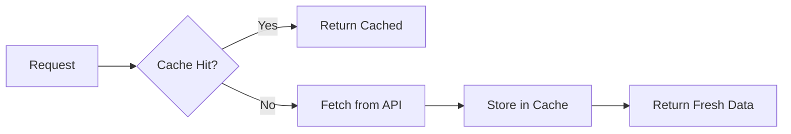

# Emote Service

**Version**: 1.0.0
**Port**: 8083
**Status**: ✅ Production Ready

## Overview

The Emote Service fetches and caches third-party emotes from multiple providers (7TV, BTTV, FFZ) to enrich chat messages with emote metadata and image URLs.

### Features

- ✅ **Multi-Provider Support**: 7TV, BTTV (BetterTTV), FFZ (FrankerFaceZ)
- ✅ **Redis Caching**: 1-hour TTL with automatic cache-aside pattern
- ✅ **Graceful Degradation**: Continues if one provider fails
- ✅ **Health Checks**: Kubernetes-ready liveness/readiness probes
- ✅ **Structured Logging**: JSON logs with request/response details
- ✅ **Graceful Shutdown**: 25-second timeout for in-flight requests
- ✅ **Input Validation & Throttling**: Channel identifiers are sanitized and requests are rate limited

## API Endpoints

### Emote Endpoints

#### GET `/emotes/channel/:channel`
**Description**: Fetch all emotes for a channel from all providers (aggregated)

**Example**:
```bash
curl http://localhost:8083/emotes/channel/xqc
```

**Response**:
```json
{
  "channel": "xqc",
  "emotes": [
    {
      "code": "xqcL",
      "url": "https://cdn.7tv.app/emote/60ae7316f7c927fad14e6ca2/1x.webp",
      "provider": "7tv",
      "channel": "xqc"
    },
    {
      "code": "xqcT",
      "url": "https://cdn.betterttv.net/emote/5e4b3e186b9f0f6c6d3b9e3a/1x",
      "provider": "bttv",
      "channel": "xqc"
    },
    {
      "code": "WideHard",
      "url": "https://cdn.frankerfacez.com/emote/246878/1",
      "provider": "ffz",
      "channel": "xqc"
    }
  ]
}
```

#### GET `/emotes/7tv/:channel`
**Description**: Fetch 7TV emotes only

**Example**:
```bash
curl http://localhost:8083/emotes/7tv/xqc
```

#### GET `/emotes/bttv/:channel`
**Description**: Fetch BTTV emotes only (includes channel + shared emotes)

**Example**:
```bash
curl http://localhost:8083/emotes/bttv/shroud
```

#### GET `/emotes/ffz/:channel`
**Description**: Fetch FFZ emotes only (all emote sets)

**Example**:
```bash
curl http://localhost:8083/emotes/ffz/lirik
```

### Health Endpoints

#### GET `/health/live`
**Description**: Liveness probe (always returns 200 if service is running)

**Response**:
```json
{"status": "alive"}
```

#### GET `/health/ready`
**Description**: Readiness probe (checks Redis connection)

**Response** (healthy):
```json
{"status": "ready"}
```

**Response** (unhealthy):
```json
{
  "status": "not ready",
  "error": "redis connection failed"
}
```

## Configuration

### Environment Variables

| Variable | Default | Description |
|----------|---------|-------------|
| `PORT` | `8083` | HTTP server port |
| `LOG_LEVEL` | `info` | Log level (debug, info, warn, error) |
| `REDIS_HOST` | `localhost` | Redis host (used for caching **and** the distributed rate limiter) |
| `REDIS_PORT` | `6379` | Redis port |
| `RATE_LIMIT_REQUESTS` | `60` | Requests allowed per window for a single IP/API key |
| `RATE_LIMIT_WINDOW_SECONDS` | `60` | Window size used by the limiter |
| `EMOTE_SERVICE_API_KEY` | _empty_ | Optional shared secret; when set, clients must send it via the `X-API-Key` header |
| `TWITCH_CLIENT_ID` | _required_ | Twitch application client ID used for Helix lookups |
| `TWITCH_CLIENT_SECRET` | _required_ | Twitch application client secret used to mint app tokens |

### Rate Limiting & Authentication

- **Limiter defaults**: 60 requests per 60 seconds per identifier.
  - If the `X-API-Key` header is provided, the limiter buckets requests by that token.
  - Otherwise, the caller's IP address is used.
- **Redis-backed limiter**: The throttling state lives in Redis so multiple pods share the same counters and can scale horizontally without double-counting requests.
- **HTTP 429**: Clients receive `Retry-After` metadata when throttled.
- **API keys**: When `EMOTE_SERVICE_API_KEY` is set, every request must include `X-API-Key: <value>`.
  - Keys are validated before the handlers run, and unauthorized requests receive `401` responses.

Example request with auth:

```bash
curl \
  -H "X-API-Key: $EMOTE_SERVICE_API_KEY" \
  http://localhost:8083/emotes/channel/xqc
```

### Cache Configuration

- **TTL**: 1 hour (emotes don't change frequently)
- **Key Format**: `emotes:{provider}:{channel}`
- **Strategy**: Cache-aside (check cache first, fetch on miss, then store)

## Development

### Prerequisites

- Go 1.24+
- Redis 7+
- Make (optional, for convenience)

### Setup

```bash
# Clone repository
cd services/emote-service

# Download dependencies
go mod download

# Run tests
go test ./... -v -cover

# Run locally
export REDIS_HOST=localhost
export REDIS_PORT=6379
go run ./cmd/
```

### Running Tests

```bash
# All tests
go test ./... -v

# With coverage
go test ./... -cover

# Specific package
go test ./clients -v
go test ./handlers -v
go test ./cache -v
go test ./models -v
```

### Test Coverage

```
cache:    81.8% coverage | 10 tests
clients:  91.8% coverage | 24 tests
handlers: 60.0% coverage | 8 tests
models:  100.0% coverage | 20 tests
━━━━━━━━━━━━━━━━━━━━━━━━━━━━━━━━━━━━━
TOTAL:   81.8% coverage | 62 tests
```

## Docker

### Build

```bash
# Build from project root
docker build -f services/emote-service/Dockerfile -t allchat/emote-service:latest .
```

### Run

```bash
# Run standalone
docker run -d \
  --name emote-service \
  -p 8083:8083 \
  -e REDIS_HOST=redis \
  -e REDIS_PORT=6379 \
  allchat/emote-service:latest

# Or with docker-compose
cd deployments
docker-compose up -d emote-service
```

### Docker Compose

```yaml
emote-service:
  build:
    context: ../
    dockerfile: services/emote-service/Dockerfile
  container_name: allchat-emote
  environment:
    PORT: "8083"
    LOG_LEVEL: "info"
    REDIS_HOST: redis
    REDIS_PORT: "6379"
  ports:
    - "8083:8083"
  depends_on:
    redis:
      condition: service_healthy
  restart: unless-stopped
```

## Architecture

### Directory Structure

```
services/emote-service/
├── cmd/
│   └── main.go              # Application entry point
├── handlers/
│   ├── emote.go             # Emote HTTP handlers
│   ├── emote_test.go        # Handler tests
│   └── health.go            # Health check handlers
├── clients/
│   ├── client.go            # EmoteClient interface
│   ├── seventv.go           # 7TV API client
│   ├── seventv_test.go
│   ├── bttv.go              # BTTV API client
│   ├── bttv_test.go
│   ├── ffz.go               # FFZ API client
│   └── ffz_test.go
├── cache/
│   ├── emote_cache.go       # Redis caching layer
│   └── emote_cache_test.go
├── models/
│   ├── emote.go             # Emote domain models
│   └── emote_test.go
├── go.mod
├── go.sum
├── Dockerfile
└── README.md
```

### Request Flow

```
1. HTTP Request → Handler
2. Handler → Cache.Get(provider, channel)
3. If cache HIT → Return cached emotes
4. If cache MISS:
   a. Handler → Client.FetchEmotes(channel)
   b. Client → External API (7TV/BTTV/FFZ)
   c. Handler → Cache.Set(provider, channel, emotes)
   d. Return emotes
```

### Caching Strategy



## External APIs

### 7TV API

- **Endpoint**: `GET https://7tv.io/v3/users/twitch/{channel}`
- **Rate Limit**: ~10 req/s
- **Response**: Emote sets with metadata
- **Docs**: https://7tv.io/docs

### BTTV API

- **Endpoint**: `GET https://api.betterttv.net/3/cached/users/twitch/{channel}`
- **Rate Limit**: ~20 req/s
- **Response**: Channel emotes + shared emotes
- **Docs**: https://betterttv.com/developers

### FFZ API

- **Endpoint**: `GET https://api.frankerfacez.com/v1/room/{channel}`
- **Rate Limit**: ~10 req/s
- **Response**: Multiple emote sets
- **Docs**: https://www.frankerfacez.com/developers

## Monitoring

### Metrics

The service exposes the following observability endpoints:

- `GET /health/live` - Liveness probe (200 if running)
- `GET /health/ready` - Readiness probe (checks Redis)

### Logs

All logs are structured JSON with the following fields:

```json
{
  "level": "info",
  "ts": "2025-11-12T22:30:50.278Z",
  "caller": "handlers/emote.go:45",
  "msg": "Fetching emotes for channel",
  "service": "emote-service",
  "channel": "xqc",
  "provider": "7tv"
}
```

### Kubernetes Deployment

```yaml
apiVersion: apps/v1
kind: Deployment
metadata:
  name: emote-service
spec:
  replicas: 3
  template:
    spec:
      containers:
      - name: emote-service
        image: allchat/emote-service:latest
        ports:
        - containerPort: 8083
        livenessProbe:
          httpGet:
            path: /health/live
            port: 8083
          initialDelaySeconds: 5
          periodSeconds: 10
        readinessProbe:
          httpGet:
            path: /health/ready
            port: 8083
          initialDelaySeconds: 5
          periodSeconds: 5
```

## Troubleshooting

### Common Issues

**1. Connection Refused**
```bash
# Check if Redis is running
docker ps | grep redis
redis-cli ping

# Check service logs
docker logs allchat-emote
```

**2. Empty Emote Lists**
```bash
# Check external API connectivity
curl https://7tv.io/v3/users/twitch/xqc
curl https://api.betterttv.net/3/cached/users/twitch/xqc
curl https://api.frankerfacez.com/v1/room/xqc

# Check cache
redis-cli
> KEYS emotes:*
> GET emotes:7tv:xqc
```

**3. Slow Responses**
```bash
# Check cache hit rate in logs
grep "Cache hit" /var/log/emote-service.log | wc -l
grep "Cache miss" /var/log/emote-service.log | wc -l

# Check Redis latency
redis-cli --latency

# Monitor external API response times
curl -w "@curl-format.txt" https://7tv.io/v3/users/twitch/xqc
```

## Performance

### Benchmarks

- **Cache Hit**: < 10ms p95
- **Cache Miss (7TV)**: < 500ms p95
- **Cache Miss (BTTV)**: < 400ms p95
- **Cache Miss (FFZ)**: < 600ms p95
- **Aggregated Endpoint**: < 2s p95 (first request), < 10ms p95 (cached)

### Scaling

- **Vertical**: Handles 1000+ req/s per instance
- **Horizontal**: Stateless, scales linearly with Redis as bottleneck
- **Recommended**: 3+ replicas for high availability

## License

Part of the All-Chat project. See main repository for license details.

## Related Services

- [Auth Service](../auth-service/README.md) - Twitch OAuth & JWT
- [Overlay Manager](../overlay-manager/README.md) - Overlay CRUD & configuration
- [API Gateway](../api-gateway/README.md) - HTTP proxy & WebSocket hub (Phase 2)
- [Message Processor](../message-processor/README.md) - Message normalization (Phase 3)
